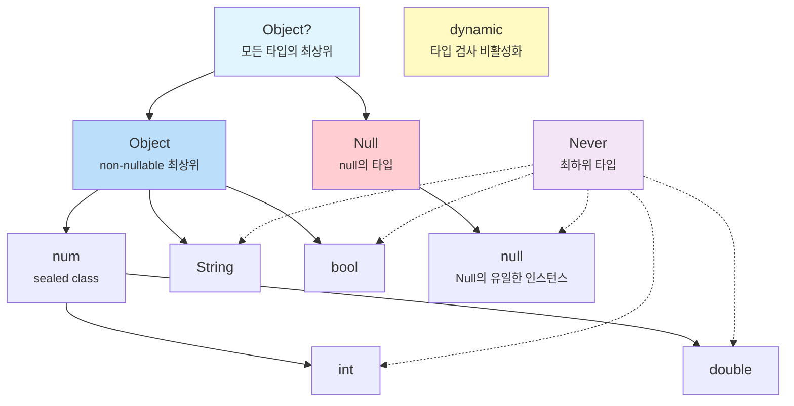

# Ch 01. Dart 타입 시스템과 Null Safety

## 1.1 모든 것은 객체다

Dart에서는 숫자, 문자열, 함수, `null`까지 **모든 것이 객체**다. JavaScript도 비슷하지만 Dart는 여기에 **정적 타입 시스템**을 결합했다. 이 설계 결정이 Dart의 타입 계층 전체를 결정짓는다.

```dart
// Dart: 모든 값은 객체
int age = 25;          // int도 객체
String name = 'Dart';  // String도 객체
bool isTrue = true;    // bool도 객체

// 증거: 모든 값에 메서드 호출이 가능하다
print(25.isEven);      // true
print('hello'.length); // 5
print(true.toString()); // "true"
```

## 1.2 다른 언어와 비교

| 특성            | JavaScript                | TypeScript                   | Kotlin               | Swift                    | Dart                                      |
| --------------- | ------------------------- | ---------------------------- | -------------------- | ------------------------ | ----------------------------------------- |
| 타입 검사 시점  | 런타임만                  | 컴파일 타임                  | 컴파일 타임          | 컴파일 타임              | **컴파일 + 런타임**                 |
| `null` 처리   | 별도 처리 없음            | `strictNullChecks`         | Nullable 타입        | Optional (`T?`)          | **Sound Null Safety**               |
| 제네릭          | ❌ 없음                   | 컴파일 타임만 (type erasure) | type erasure         | **Reified (런타임 보존)** | **Reified (런타임 보존)**           |
| 프리미티브 타입 | `number`, `string` 등 | JS와 동일                    | `Int`, `Long` 등 | `Int`, `Double` (값 타입) | `int`, `double` (**모두 객체**) |

> **핵심 차이**: TypeScript의 타입은 컴파일 후 사라지지만(type erasure), Dart와 Swift의 타입은 **런타임에도 살아있다(reified)**. 이것이 `is` 연산자와 제네릭의 동작을 근본적으로 다르게 만든다.

## 1.3 `var`, `final`, `const`의 차이

`var`, `final`, `const`는 타입이 아니라 **선언 키워드**다. 각각의 설계 의도가 다르다.

```dart
var name = 'Dart';      // 타입 추론 → String. 재할당 가능
final city = 'Seoul';   // 타입 추론 → String. 재할당 불가 (런타임 상수)
const pi = 3.14;        // 타입 추론 → double. 재할당 불가 (컴파일 타임 상수)

name = 'Flutter';       // ✅ OK
// city = 'Busan';      // ❌ 컴파일 에러: final 변수는 재할당 불가
// pi = 3.15;           // ❌ 컴파일 에러: const 변수는 재할당 불가
```

#### `final` vs `const` — 진짜 차이

```dart
// final: 런타임에 값이 결정됨
final now = DateTime.now();  // ✅ 실행 시점에 결정

// const: 컴파일 타임에 값이 결정되어야 함
// const now2 = DateTime.now(); // ❌ 에러! DateTime.now()는 컴파일 타임에 모름

const maxRetries = 3;         // ✅ 3은 컴파일 타임에 알 수 있음
const greeting = 'Hello';    // ✅ 문자열 리터럴도 OK
```

`const`는 "프로그램이 실행되기 전에 이미 알 수 있는 값"이고, `final`은 "한번 정해지면 바꿀 수 없는 값"이다. Flutter에서 `const` 위젯이 성능에 중요한 이유는 Ch05에서 다룬다.

---

## 1.4 Dart의 타입 계층도

Dart의 타입 시스템을 이해하려면, 먼저 이 계층도를 봐야 한다:

```
            Object?
           /       \
        Object      Null
       /  |   \       |
    num  String bool  null (유일한 인스턴스)
   /   \
 int  double
```



## 1.5 `Object`와 `Null`은 형제다

Dart Null Safety의 타입 이론적 기반이 여기에 있다. `Object`와 `Null`을 **별도의 가지**로 분리한 설계다.

- `Object` = 모든 non-nullable 타입의 최상위
- `Null` = `null` 값의 타입 (`Object`를 **구현하지 않음**)
- `Object?` = `Object | Null` (이 둘의 합집합)

### 소스코드로 확인

> 📁 `_sources/dart-sdk/sdk/lib/core/object.dart`
> 📁 `_sources/dart-sdk/sdk/lib/core/null.dart`

**object.dart** (7~11행):

```dart
/// The base class for all Dart objects except `null`.
///
/// Because `Object` is a root of the non-nullable Dart class hierarchy,
/// every other non-`Null` Dart class is a subclass of `Object`.
class Object {
  const Object();

  external bool operator ==(Object other);
  external int get hashCode;
  external String toString();
  external dynamic noSuchMethod(Invocation invocation);
  external Type get runtimeType;
}
```

**null.dart** (7~12행):

```dart
/// The reserved word `null` denotes an object that is the sole instance of
/// this class.
///
/// The `Null` class is the only class which does not implement `Object`.
/// It is a compile-time error for a class to attempt to extend or implement
/// [Null].
final class Null {
  factory Null._uninstantiable() {
    throw UnsupportedError('class Null cannot be instantiated');
  }
  external int get hashCode;
  String toString() => "null";
}
```

`Null` 클래스는 `Object`를 **상속하지 않는다**. 우연이 아니라 의도적인 설계다. 이 분리 덕분에 `String`과 `String?`이 타입 수준에서 완전히 다른 것이 된다.

## 1.6 `dynamic` vs `Object` vs `Object?`

이 세 가지는 모두 "어떤 값이든 담을 수 있다"는 점에서 비슷해 보이지만, 타입 시스템에서의 역할이 근본적으로 다르다:

```dart
// Object: non-nullable 최상위. 모든 메서드를 안전하게 호출 가능
Object obj = 'hello';
print(obj.toString());     // ✅ 항상 안전
// print(obj.length);       // ❌ 컴파일 에러: Object에 length 없음

// Object?: nullable 최상위. null 체크 필요
Object? maybeObj = null;
// print(maybeObj.toString()); // ❌ 경고: null일 수 있음
print(maybeObj?.toString());   // ✅ null-safe 호출

// dynamic: 타입 검사 자체를 꺼버림
dynamic anything = 'hello';
print(anything.length);    // ✅ 컴파일 OK (런타임에 검사)
print(anything.foo());     // ✅ 컴파일 OK, 런타임에 NoSuchMethodError!
```

### 컴파일러는 `dynamic`을 어떻게 처리하는가?

"타입 검사를 끈다"는 것이 정확히 무엇인지, Dart analyzer 소스코드에서 확인할 수 있다.

> 📁 `_sources/dart-sdk/pkg/analyzer/lib/src/dart/resolver/method_invocation_resolver.dart`

`MethodInvocationResolver.resolve()`에서 receiver의 타입에 따라 분기하는 부분이다:

```dart
// method_invocation_resolver.dart — resolve() 메서드 (182~192행)
TypeImpl receiverType = receiver.typeOrThrow;

if (_typeSystem.isDynamicBounded(receiverType)) {
  _resolveReceiverDynamicBounded(    // ← dynamic이면 여기로 빠진다
    node, receiverType, whyNotPromotedArguments,
    contextType: contextType,
  );
  return;                            // 일반 타입 해석 경로를 건너뜀
}

// ... Object, String 등 일반 타입이면 아래의 _resolveReceiverType()으로
```

**핵심은 `_resolveReceiverDynamicBounded()`가 하는 일이다.** 일반 타입이면 `_resolveReceiverType()`에서 메서드가 실제로 존재하는지 검사하고, 없으면 컴파일 에러를 낸다. 하지만 `dynamic`이면?

```dart
// method_invocation_resolver.dart — _resolveReceiverDynamicBounded() (630~671행)
void _resolveReceiverDynamicBounded(
  MethodInvocationImpl node,
  DartType receiverType,
  List<WhyNotPromotedGetter> whyNotPromotedArguments, {
  required TypeImpl contextType,
}) {
  var nameNode = node.methodName;

  var objectElement = _typeSystem.typeProvider.objectElement;
  var targetElement = objectElement.getMethod(nameNode.name);  // ①

  if (targetElement != null &&
      !targetElement.isStatic &&
      _hasMatchingObjectMethod(targetElement, node.argumentList.arguments)) {
    // ② Object에 있는 메서드(toString, hashCode 등)면 → Object 멤버로 해석
    nameNode.element = targetElement;
    node.staticInvokeType = targetElement.type;
    node.recordStaticType(targetElement.returnType, resolver: _resolver);
  } else {
    // ③ Object에 없는 메서드면 → 에러 없이 dynamic으로 통과!
    nameNode.element = null;                                   // 멤버 해석 안 함
    nameNode.setPseudoExpressionStaticType(DynamicTypeImpl.instance);
    node.staticInvokeType = DynamicTypeImpl.instance;          // 호출 타입 = dynamic
    node.recordStaticType(DynamicTypeImpl.instance, ...);      // 반환 타입 = dynamic
  }
}
```

세 단계로 정리된다:

1. **①** 먼저 `Object`의 메서드 목록에서 찾는다 (`toString`, `hashCode`, `==` 등)
2. **②** `Object`에 있으면 → 정적 타입 정보를 사용한다 (반환 타입이 `String`, `int` 등으로 정확히 추론됨)
3. **③** `Object`에 없으면 → **에러를 내지 않고**, 모든 것을 `DynamicTypeImpl.instance`로 채운다

③이 "타입 검사를 끈다"의 실체다. `nameNode.element = null` — 멤버를 아예 해석하지 않는다. 존재 여부를 확인하지 않는다. 반환 타입도 `dynamic`이므로, 그 결과에 대해서도 어떤 연산이든 허용된다. **에러가 발생할 수 있는 모든 지점을 런타임으로 미루는 것**이다.

> 📁 `_sources/dart-sdk/pkg/front_end/lib/src/type_inference/object_access_target.dart`

```dart
// object_access_target.dart (317~322행)
/// Target type that accepts all shapes of the arguments.
///
/// For example: `foo(1)`, `bar(2, "3")`, where `foo` has static type `dynamic`
class InvocationTargetDynamicType extends InvocationTargetNonFunctionType {
  const InvocationTargetDynamicType();

  @override
  DartType get returnType => const DynamicType();  // 항상 dynamic 반환
}
```

`InvocationTargetDynamicType`의 주석이 이 설계를 명확히 말해준다: _"accepts all shapes of the arguments"_ — 인자의 개수, 타입, 이름 관계없이 전부 받아들인다.

이것이 `Object`와의 결정적 차이다. `Object obj`에 `.length`를 호출하면 컴파일러가 `_resolveReceiverType()`에서 "Object에 length 멤버가 없다"는 에러를 낸다. `dynamic d`에 `.length`를 호출하면 `_resolveReceiverDynamicBounded()`에서 그냥 `dynamic`으로 통과시킨다.

`dynamic`을 쓰는 것은 타입 시스템의 보호를 **자발적으로 포기**하는 것이다. JSON 파싱 등 불가피한 경우를 제외하면 `Object` 또는 `Object?`를 써야 한다.

## 1.7 `Never` — 타입 계층의 바닥

`Never`는 "절대 값을 반환하지 않는" 타입이다. 모든 타입의 하위 타입(`bottom type`)이다.

```dart
// Never를 반환하는 함수: 항상 예외를 던지거나 무한 루프
Never throwError(String message) {
  throw Exception(message);
  // 이 줄에 도달할 수 없으므로 return 불필요
}

// 타입 추론에서 유용하게 쓰인다
int value = condition ? 42 : throwError('failed');
// throwError의 반환 타입이 Never이므로, 전체 표현식은 int로 추론됨
```

---

## 1.8 Null Safety의 세 가지 원칙

1. **기본이 non-nullable**: `String` 타입의 변수에는 절대 `null`이 들어갈 수 없다
2. **Nullable은 명시적**: `String?`으로 선언해야만 `null` 가능
3. **Sound (건전함)**: 컴파일러가 **100% 보장**. TypeScript의 `strictNullChecks`와 달리 런타임에 뚫리지 않음

## 1.9 흐름 분석 (Flow Analysis)

Dart 컴파일러는 코드의 흐름을 분석하여 null 체크 이후의 타입을 **자동으로 승격(promote)**한다. 이 방식을 흐름 분석(flow analysis)이라고 부른다:

```dart
void process(String? name) {
  // 여기서 name은 String? 타입
  if (name == null) return;

  // ✅ 여기서 name은 자동으로 String으로 승격됨 (promotion)
  print(name.length);  // null 체크 불필요
}
```

#### 흐름 분석이 작동하지 않는 경우

```dart
class User {
  String? name;

  void printName() {
    if (name != null) {
      // ❌ 여전히 String? — 왜?
      // 다른 스레드가 name을 null로 바꿀 수 있기 때문
      // print(name.length); // 에러!

      // ✅ 해결: 로컬 변수에 복사
      final localName = name;
      if (localName != null) {
        print(localName.length); // OK!
      }

      // ✅ 또는 bang operator (확신이 있을 때만)
      print(name!.length);
    }
  }
}
```

인스턴스 필드에서 흐름 분석이 작동하지 않는 이유가 여기 있다. 필드는 getter로 구현될 수 있고, 호출할 때마다 다른 값을 반환할 수 있다. 컴파일러는 이를 보수적으로 판단한다. 로컬 변수는 이런 문제가 없으므로 승격이 가능하다.

## 1.10 `late` 키워드의 진짜 의미

`late`는 "나중에 초기화하겠다"가 아니다. **"초기화 검사를 런타임으로 미루겠다"**는 선언이다:

```dart
// 사용법 1: 지연 초기화
late String description;

void init() {
  description = 'Hello';
}

void use() {
  print(description); // init()이 먼저 호출되지 않으면 LateInitializationError!
}

// 사용법 2: 게으른 (lazy) 초기화
late final heavyObject = _computeExpensiveValue();
// _computeExpensiveValue()는 heavyObject에 처음 접근할 때만 실행됨
```

### 컴파일러는 `late`를 어떻게 구현하는가?

`late` 변수를 선언하면, Dart 컴파일러(front_end)는 이를 **getter/setter로 변환(lowering)**한다. 원래의 필드는 숨겨지고, 접근할 때마다 "초기화되었는가?"를 검사하는 코드가 자동 삽입된다.

> 📁 `_sources/dart-sdk/pkg/front_end/lib/src/kernel/late_lowering.dart`

먼저, 숨겨진 필드의 이름 규칙이다:

```dart
// late_lowering.dart (10~14행)
const String lateFieldPrefix = '_#';           // 필드: _#originalName
const String lateIsSetSuffix = '#isSet';       // 플래그: _#originalName#isSet
const String lateLocalPrefix = '#';            // 지역 변수: #originalName
const String lateLocalGetterSuffix = '#get';   // getter: #originalName#get
const String lateLocalSetterSuffix = '#set';   // setter: #originalName#set
```

즉, `late String description;`을 선언하면 실제로는 `_#description`이라는 숨겨진 필드와 합성된 getter/setter가 생성된다.

**핵심은 "초기화 여부를 어떻게 추적하는가"에 세 가지 전략이 존재한다는 것이다:**

```dart
// late_lowering.dart (512~522행)
/// Strategies for encoding whether a late field/local has been initialized.
enum IsSetEncoding {
  /// Use a boolean `isSet` field/local.
  useIsSetField,

  /// Use `null` as sentinel value to signal an uninitialized field/locals.
  useNull,

  /// Use `createSentinel` and `isSentinel` from `dart:_internal` to generate
  /// and check a sentinel value to signal an uninitialized field/local.
  useSentinel,
}
```

**왜 세 가지인가?** 타입이 nullable이면 `null`로는 "아직 초기화 안 됨"과 "null이 대입됨"을 구분할 수 없기 때문이다:

```dart
// late_lowering.dart — computeIsSetEncoding() (559~573행)
IsSetEncoding computeIsSetEncoding(DartType type, IsSetStrategy isSetStrategy) {
  switch (isSetStrategy) {
    // ...
    case IsSetStrategy.useSentinelOrNull:
      return type.isPotentiallyNullable       // ← 타입이 nullable인가?
          ? IsSetEncoding.useSentinel          //   → sentinel 사용 (null이 정상 값일 수 있으므로)
          : IsSetEncoding.useNull;             //   → null을 sentinel로 사용 (non-nullable이면 안전)
  }
}
```

이제 각 전략이 어떤 코드를 생성하는지 보자. 아래의 의사 코드는 `late_lowering.dart` 원본에서 각 함수가 AST 노드를 조립하기 전에 "이 함수가 만들어내는 결과물"을 설명하는 주석이다. 실제 구현은 `new Block(new IfStatement(...))` 같은 AST 빌드 코드이지만, 결과물을 보는 것이 동작을 이해하기에 훨씬 직관적이다.

**이니셜라이저가 없는 late 필드**를 읽을 때의 getter:

> 📁 `late_lowering.dart` — `createGetterBodyWithoutInitializer()` (268~351행)

**전략 1: useIsSetField** (nullable 타입용 — boolean 플래그 사용)

```dart
return _#isSet#field ? _#field : throw LateError.fieldNI('field');
```

**전략 2: useSentinel** (nullable 타입용 — sentinel 객체 사용)

```dart
return let # = _#field in isSentinel(#) ? throw LateError.fieldNI('field') : #;
```

**전략 3: useNull** (non-nullable 타입용 — null을 sentinel으로)

```dart
return let # = _#field in # == null ? throw LateError.fieldNI('field') : #;
```

**이니셜라이저가 있는 late 필드**(lazy initialization)는 더 정교하다:

> 📁 `late_lowering.dart` — `createGetterWithInitializer()` (21~109행)

**전략 1: useIsSetField**

```dart
if (!_#isSet#field) {
  _#field = <init>;           // ← 처음 접근 시 초기화 실행
  _#isSet#field = true;       // ← 플래그 갱신
}
return _#field;
```

**전략 2: useSentinel**

```dart
return let # = _#field in isSentinel(#) ? _#field = <init> : #;
```

**전략 3: useNull**

```dart
return let # = _#field in # == null ? _#field = <init> : #;
```

`late final`은 여기에 **이중 초기화 방지** 로직이 추가된다. 초기화 도중에 같은 필드에 값을 대입하면 에러를 낸다:

> 📁 `late_lowering.dart` — `createGetterWithInitializerWithRecheck()` (186~192행, sentinel 전략)

```dart
return let #1 = _#field in isSentinel(#1)
    ? let #2 = <init> in isSentinel(_#field)    // ← init 실행 후 다시 확인!
        ? _#field = #2 : throw LateError.fieldADI('field')  // ← init 도중 대입되었으면 에러
    : #1;
```

이 에러들은 전부 `LateError` 클래스로 통합된다:

> 📁 `_sources/dart-sdk/sdk/lib/internal/errors.dart`

```dart
// errors.dart (7~48행)
/// Error thrown when a `late` variable is accessed inappropriately.
class LateError extends Error {
  LateError.fieldNI(String fieldName)                    // 읽기 전 초기화 안 됨
    : _message = "Field '$fieldName' has not been initialized.";

  LateError.fieldAI(String fieldName)                    // final인데 두 번 대입
    : _message = "Field '$fieldName' has already been initialized.";

  LateError.fieldADI(String fieldName)                   // 초기화 도중 대입됨
    : _message = "Field '$fieldName' has been assigned during initialization.";

  // local 버전도 동일: localNI, localAI, localADI
}
```

정리하면, `late String name;`이라고 쓰면 컴파일러가 실제로 생성하는 것은:

```dart
// 개발자가 작성한 코드:
late String name;

// 컴파일러가 실제로 생성하는 코드 (useNull 전략, non-nullable이므로):
String? _#name = null;                          // 숨겨진 필드 (null = 미초기화)

String get name {                               // 합성된 getter
  return let # = _#name in # == null
    ? throw LateError.fieldNI('name')           // 미초기화 → 에러
    : #;                                        // 초기화됨 → 값 반환
}

set name(String value) {                        // 합성된 setter
  _#name = value;
}
```

이것이 `late`의 실체다. **선언 하나가 숨겨진 필드 + getter + setter + 초기화 검사 로직**으로 변환된다. "나중에 초기화"가 아니라 "매 접근마다 런타임 검사를 삽입"하는 것이다.

#### `late`의 함정

```dart
late final value = DateTime.now().toString();

// 아래 코드는 매번 같은 값을 반환
print(value); // "2026-02-12 17:05:48.123"
print(value); // "2026-02-12 17:05:48.123" (같은 값!)
// getter가 첫 호출에서 초기화 후 isSet=true → 이후로는 캐시된 값을 반환
```

이것도 위의 lowering을 이해하면 자명하다. `createGetterWithInitializer`의 `if (!_#isSet#field)` 분기가 두 번째 접근부터는 `false`이므로, 초기화 코드(`<init>`)를 건너뛰고 이미 저장된 값을 반환한다.

#### `late`의 런타임 성능 영향

lowering 과정이 추가적인 검사 코드를 삽입한다는 것은, 런타임 비용이 존재한다는 뜻이다. 그렇다면 실제로 얼마나 비용이 드는가? VM 컴파일러의 중간 언어(IL) 생성 코드에서 정확한 답을 찾을 수 있다:

> 📁 `runtime/vm/compiler/backend/il.cc` — `LoadFieldInstr::EmitNativeCodeForInitializerCall()` (4757~4810행)

```cpp
// late 인스턴스 필드 접근 시 VM이 생성하는 실제 머신 코드 패턴:

// 1. 필드 값을 레지스터에 로드
__ LoadFromSlot(result_reg, instance_reg, slot());

// 2. sentinel 객체와 포인터 비교 (핵심 오버헤드)
__ CompareObject(result_reg, Object::sentinel());

// 3. 이미 초기화되었다면 → 바로 리턴 (branch not taken)
__ BranchIf(NOT_EQUAL, &no_call);

// 4. 미초기화 → slow path로 분기 (초기화 함수 호출 또는 LateError)
//    이 코드는 out-of-line slow path에 배치됨
```

일반 필드 접근은 `Load` 명령 하나로 끝나지만, `late` 필드는 `Load` + `Compare` + `BranchIf`가 추가된다. **매 접근마다 포인터 비교 1회와 조건 분기 1회**가 들어가는 것이다.

다만 이 비용은 대부분의 경우 무시할 수 있다:

- **분기 예측(branch prediction)**: 초기화 이후에는 분기가 항상 "not taken"이므로 CPU의 분기 예측기가 거의 100% 정확하게 예측한다. 예측이 맞으면 파이프라인 스톨 없이 실행된다.
- **Slow path 분리**: 에러를 던지거나 초기화 함수를 호출하는 코드는 `LateInitializationErrorSlowPath`로 out-of-line에 배치된다. 핫 패스(정상 접근 경로)의 코드 크기를 최소화하여 명령 캐시 효율을 유지한다.

**백엔드별 처리 방식의 차이**도 주목할 만하다. `targets.dart`의 `LateLowering` 클래스는 `late` 변수를 16가지 카테고리(nullable/non-nullable × initialized/uninitialized × final/non-final × local/static/instance)로 분류하고, 각 백엔드가 비트마스크(`enabledLateLowerings`)로 "CFE가 lowering할 것"과 "백엔드(VM)가 자체적으로 직접 처리할 것"을 선택하게 한다:

> 📁 `pkg/kernel/lib/target/targets.dart` — `LateLowering` (627~717행)

```dart
class LateLowering {
  static const int nullableUninitializedNonFinalLocal = 1 << 0;
  static const int nonNullableUninitializedNonFinalLocal = 1 << 1;
  // ...총 16개 카테고리
  static const int none = 0;
  static const int all = (1 << 16) - 1;
}
```

Dart VM은 `late` 필드를 **VM 수준에서 직접 내장 처리**한다(`enabledLateLowerings`에서 필드 관련 비트를 켜지 않음). 즉 CFE가 getter/setter Dart 코드를 합성하는 대신, VM 컴파일러가 IL → 기계어 변환 단계에서 `CompareObject(result, Object::sentinel())` 명령을 직접 삽입한다. 이 방식이 CFE lowering보다 효율적인 이유는 VM이 필드 테이블에서 바로 sentinel을 비교하므로 중간 함수 호출 오버헤드가 없기 때문이다.

**AOT 컴파일러의 추가 최적화**도 있다. VM의 최적화 파이프라인에는 sentinel 관련 최적화 패스가 포함된다:

- **상수 전파(Constant Propagation)**: sentinel 비교가 상수 폴딩 가능하면 제거 (`constant_propagator.cc`)
- **타입 전파(Type Propagation)**: `CompileType`이 `can_be_sentinel()` 플래그를 추적하여 "이 값은 sentinel일 수 없음"이 증명되면 검사 자체를 제거 (`type_propagator.cc`)
- **중복 제거(Redundancy Elimination)**: 같은 필드를 연속으로 접근할 때 두 번째 sentinel 검사를 제거 (`redundancy_elimination.cc`)

따라서 AOT 빌드(`-O4`)에서는 초기화가 정적으로 증명 가능한 경우 sentinel 검사가 **완전히 제거**될 수 있다.

실용적 판단 기준은 다음과 같다:

| 상황 | `late` 적절성 | 이유 |
|---|---|---|
| `initState`에서 초기화하는 위젯 필드 | ✅ 적절 | 접근 빈도 낮음, 비용 무시 가능 |
| 비싼 초기화를 지연시키고 싶을 때 | ✅ 적절 | 이것이 `late`의 존재 이유 |
| 타이트 루프 안에서 반복 접근하는 필드 | ⚠️ 주의 | 지역 변수에 캐싱 권장 |
| 생성자에서 반드시 초기화되는 필드 | ❌ 불필요 | 생성자 이니셜라이저 리스트 사용 |

---

## 1.11 `num`, `int`, `double`의 관계

> 📁 `_sources/dart-sdk/sdk/lib/core/num.dart`

```dart
/// An integer or floating-point number.
///
/// It is a compile-time error for any type other than [int] or [double]
/// to attempt to extend or implement `num`.
sealed class num implements Comparable<num> {
  // ...
}
```

`num`이 `sealed class`로 선언된 것은 의도적인 설계다. `int`와 `double`만이 `num`을 상속할 수 있고, 제3의 숫자 타입은 만들 수 없다. 그 이유는 두 가지다:

1. **VM 최적화**: Dart VM은 숫자를 unboxed(객체 래핑 없이 원시 값으로) 처리한다. 특히 `int`는 SMI(Small Integer) 태깅으로 힙 할당 없이 포인터 자체에 값을 인코딩하고, `double`은 64비트 부동소수점 레지스터에 직접 배치한다. 이런 최적화가 가능한 이유는 VM이 "숫자 타입은 `int` 또는 `double` 둘 중 하나"라고 확신할 수 있기 때문이다. 제3의 숫자 타입이 존재한다면, VM은 모든 `num` 연산에서 "어떤 숫자 타입인지" 동적 디스패치를 해야 하므로 성능이 크게 저하된다.

2. **패턴 매칭의 완전성(exhaustiveness)**: Dart 3의 `switch` 패턴에서 `num`을 `int`와 `double`로만 분기하면 컴파일러가 "모든 경우를 다뤘다"고 보장할 수 있다. `sealed`가 아니면 이 완전성 보장이 불가능하다.

#### int의 내부 표현: SMI와 Mint 2계층 시스템

VM 최적화를 더 구체적으로 살펴보면, Dart VM은 정수를 **두 가지 표현**으로 나눈다:

> 📁 `runtime/vm/object.h` — `Smi` 클래스 (10303~10360행)

```cpp
class Smi : public Integer {
 public:
  static constexpr intptr_t kBits = kSmiBits;      // 62비트 (64비트 VM 기준)
  static constexpr intptr_t kMaxValue = kSmiMax;
  static constexpr intptr_t kMinValue = kSmiMin;

  intptr_t Value() const { return RawSmiValue(ptr()); }

  static intptr_t InstanceSize() { return 0; }     // ← 힙 크기 = 0!

  static SmiPtr New(intptr_t value) {
    SmiPtr raw_smi = static_cast<SmiPtr>(
        (static_cast<uintptr_t>(value) << kSmiTagShift) | kSmiTag);
    //  ^^^^^^^^^^^^^^^^^^^^^^^^^^^^^^^^^^^^^^^^^^^^^^^^
    //  값을 왼쪽으로 1비트 시프트하고 태그 비트(0)를 OR
    ASSERT(RawSmiValue(raw_smi) == value);
    return raw_smi;
  }
};
```

`InstanceSize()`가 **0**이다. 즉 SMI는 힙에 객체를 할당하지 않는다. 포인터 자체가 값이다:

```
// 64비트 VM에서의 포인터 구조:
//
// SMI:  [62비트 정수값 ] [0]   ← 최하위 비트가 0이면 SMI (즉, 짝수 주소)
// 객체: [63비트 힙 주소] [1]   ← 최하위 비트가 1이면 힙 객체 포인터
```

> 📁 `runtime/vm/compiler/runtime_api.h` (298~300행)

```cpp
// The number of bits in the _magnitude_ of a Smi, not counting the sign bit.
constexpr intptr_t kSmiBits = kCompressedWordSize * kBitsPerByte - 2;
constexpr word kSmiMax = (static_cast<uword>(1) << kSmiBits) - 1;
constexpr word kSmiMin = -(static_cast<uword>(1) << kSmiBits);
```

64비트 VM에서 `kSmiBits`는 62, 즉 SMI는 약 ±4.6 × 10^18 범위를 커버한다. 대부분의 실무 정수(인덱스, 카운터, ID 등)는 이 범위 안에 들어므로 힙 할당 없이 처리된다.

하지만 이 범위를 넘으면? **자동으로 Mint(Medium Integer)**로 승격된다:

> 📁 `runtime/vm/object.cc` — `Integer::New()` (24045~24051행)

```cpp
IntegerPtr Integer::New(int64_t value, Heap::Space space) {
  const bool is_smi = Smi::IsValid(value);   // kSmiBits 범위 내인지 확인
  if (is_smi) {
    return Smi::New(static_cast<intptr_t>(value));   // → 태그만 붙여서 반환
  }
  return Mint::New(value, space);                     // → 힙에 객체 할당
}
```

> 📁 `runtime/vm/object.h` — `Mint` 클래스 (10374~10408행)

```cpp
class Mint : public Integer {
 public:
  static constexpr intptr_t kBits = 63;   // 64번째 비트는 부호
  static constexpr int64_t kMaxValue = 0x7FFFFFFFFFFFFFFF;
  static constexpr int64_t kMinValue = 0x8000000000000000;

  int64_t Value() const { return untag()->value_; }   // 힙 객체에서 값을 읽음

  static intptr_t InstanceSize() {                     // ← 힙에 할당됨!
    return RoundedAllocationSize(sizeof(UntaggedMint));
  }
};
```

정리하면:

| 표현 | 범위 (64비트 VM) | 힙 할당 | 접근 비용 |
|---|---|---|---|
| **SMI** | ±2^62 (약 ±4.6 × 10^18) | ❌ 없음 — 포인터 = 값 | 비트 시프트 1회 |
| **Mint** | ±2^63 (전체 int64 범위) | ✅ 힙에 객체 할당 | 포인터 역참조 + 필드 읽기 |

이 전환은 `Integer::New()` 내부에서 **자동으로** 일어나므로, 개발자가 SMI와 Mint를 구분해서 사용할 필요는 없다. 다만, 성능에 민감한 코드에서 정수가 SMI 범위 안에 있으면 힙 할당이 전혀 일어나지 않는다는 것을 아는 것은 유용하다.

### 플랫폼에 따른 int의 차이

```dart
// 네이티브 (VM): 64비트 정수, 임의 정밀도(BigInt 아님)
// 웹 (JS): JavaScript의 Number로 매핑 → 실질적으로 53비트 정수

int big = 9007199254740992; // 2^53
print(big + 1);
// 네이티브: 9007199254740993 ✅
// 웹:      9007199254740992 ❌ (정밀도 손실!)
```

서버-클라이언트 간 큰 ID 값을 주고받을 때, 웹에서는 `String`으로 전달하는 것이 안전하다. 이 플랫폼 차이 때문에 발생하는 버그가 실무에서 종종 보인다.

---

## 1.12 Type Erasure vs Reified Generics

```dart
// Dart: Reified Generics — 런타임에 타입 정보가 보존됨
List<int> numbers = [1, 2, 3];
print(numbers is List<int>);    // true
print(numbers is List<String>); // false ← 런타임에 구분 가능!

// Java/TypeScript에서는 이것이 불가능 (type erasure)
// Java: List<Integer>와 List<String>은 런타임에 구분 불가
```

이 차이는 단순한 편의가 아니라, VM 아키텍처 수준의 근본적인 설계 차이에서 비롯된다.

### Java의 Type Erasure: 왜 지우는가?

Java는 JDK 5에서 제네릭을 **후방 호환성**을 유지하며 추가했다. 기존 바이트코드와의 호환을 위해, `List<Integer>`와 `List<String>` 모두 컴파일 후에는 동일한 `List`(raw type)가 된다. 타입 인자 정보는 **컴파일 타임에 소거(erase)**된다.

```java
// Java: 컴파일 후 바이트코드
List<Integer> a = new ArrayList<>();
List<String>  b = new ArrayList<>();

// ↓ 컴파일러가 타입 인자를 소거
ArrayList a = new ArrayList();   // 런타임: 둘 다 그냥 ArrayList
ArrayList b = new ArrayList();
a instanceof List<Integer>       // ❌ 컴파일 에러! 타입 인자 없음
```

TypeScript도 마찬가지다. JavaScript로 트랜스파일할 때 모든 타입이 제거된다.

### Dart의 Reified Generics: VM이 타입 인자를 보존하는 방법

Dart는 제네릭을 **언어 설계 초기부터** 포함했으므로, 후방 호환성 걱정 없이 타입 인자를 런타임에 보존할 수 있었다. 그 구현을 살펴보자:

#### 1단계: TypeArguments — 타입 인자를 담는 힙 객체

> 📁 `runtime/vm/raw_object.h` — `UntaggedTypeArguments` (2899~2916행)

```cpp
class UntaggedTypeArguments : public UntaggedInstance {
  // 이미 인스턴스화된 타입 인자에는 instantiations_가 비어 있음
  // 3-tuple: 2개의 인스턴시에이터 + 결과
  COMPRESSED_POINTER_FIELD(ArrayPtr, instantiations)
  COMPRESSED_SMI_FIELD(SmiPtr, length)
  COMPRESSED_SMI_FIELD(SmiPtr, hash)
  COMPRESSED_SMI_FIELD(SmiPtr, nullability)
  // 가변 길이 데이터가 여기 뒤에 이어짐
  COMPRESSED_VARIABLE_POINTER_FIELDS(AbstractTypePtr, element, types)
  //                                 ^^^^^^^^^^^^^^^^
  //                                 각 타입 인자가 AbstractType 포인터로 저장됨
};
```

`List<int>`의 `<int>` 부분이 바로 이 `TypeArguments` 객체에 담긴다. `types` 배열에 `int` 타입을 가리키는 포인터가 들어간다.

#### 2단계: 인스턴스마다 타입 인자 슬롯이 존재

> 📁 `runtime/vm/raw_object.h` — `UntaggedClass` (1300행)

```cpp
int32_t host_type_arguments_field_offset_in_words_;
//      ^^^^^^^^^^^^^^^^^^^^^^^^^^^^^^^^^^^^^^^^^^
//      이 오프셋이 -1이 아니면, 인스턴스에 타입 인자 포인터 필드가 존재
```

> 📁 `runtime/vm/object.h` — `Class` (1488~1497행)

```cpp
// If this class is parameterized, each instance has a type_arguments field.
static constexpr intptr_t kNoTypeArguments = -1;
intptr_t host_type_arguments_field_offset() const {
  if (untag()->host_type_arguments_field_offset_in_words_ == kNoTypeArguments) {
    return kNoTypeArguments;        // 제네릭이 아닌 클래스
  }
  return untag()->host_type_arguments_field_offset_in_words_ *
         kCompressedWordSize;       // 인스턴스 내 TypeArguments 필드의 바이트 오프셋
}
```

다시 말해, `List<int>`의 **모든 인스턴스**는 내부에 `TypeArguments` 포인터를 하나 갖고 있다. `is List<int>` 체크 시 VM은 이 포인터를 따라가서 타입 인자를 비교한다.

#### 3단계: 런타임 타입 체크 (`is` 연산자)

> 📁 `runtime/vm/object.h` — `SubtypeTestCache` (8005~8011행)

```cpp
enum Inputs {
  kInstanceCidOrSignature = 0,     // 인스턴스의 Class ID
  kInstanceTypeArguments = 1,       // ← 인스턴스가 가진 타입 인자 (핵심!)
  kInstantiatorTypeArguments = 2,
  kFunctionTypeArguments = 3,
  // ...
};
```

`is` 연산자가 실행되면, VM은 `SubtypeTestCache`를 통해:
1. 인스턴스의 **Class ID** (e.g., `List`)와
2. 인스턴스에 저장된 **TypeArguments** (e.g., `<int>`)를

모두 확인한다. 캐시 히트 시 O(1), 미스 시 전체 서브타입 검사를 수행한다.

#### 성능 비용과 최적화

Reified Generics는 **공짜가 아니다**:

| 비용 항목 | 상세 |
|---|---|
| **메모리** | 제네릭 인스턴스마다 `TypeArguments` 포인터(1워드) 추가 |
| **타입 체크** | `is`/`as` 연산 시 타입 인자까지 비교해야 함 |
| **인스턴스 생성** | 생성자에서 타입 인자를 전달·저장하는 오버헤드 |

하지만 VM은 이를 적극적으로 최적화한다:
- **동일 타입 인자 공유**: 같은 `<int>`는 같은 `TypeArguments` 객체를 가리킴 (정규화/캐노니컬라이즈)
- **SubtypeTestCache**: 반복적인 `is` 검사를 캐싱
- **AOT 시 static 제거**: 컴파일 타임에 타입이 확정되면 런타임 체크를 완전히 제거

#### Java와의 비교 정리

| 항목 | Java (Type Erasure) | Dart (Reified Generics) | Swift (Reified Generics) |
|---|---|---|---|
| `list is List<int>` | ❌ 불가능 | ✅ 가능 | ✅ 가능 |
| 런타임 타입 인자 접근 | 리플렉션 (느림) | 직접 접근 (인스턴스 필드) | 직접 접근 (메타데이터) |
| 제네릭 인스턴스 메모리 | 타입 인자 없음 (절약) | 타입 인자 포인터 1워드 추가 | witness table 포인터 추가 |
| 후방 호환성 | ✅ JDK 1.4 이전 코드 호환 | N/A (초기 설계에 포함) | N/A (초기 설계에 포함) |
| `T` 타입으로 new | ❌ `new T()` 불가 | ✅ 가능 (팩토리 패턴) | ✅ 프로토콜 제약 |

---

## 1.13 제네릭 타입의 공변성과 반변성

```dart
// Dart의 제네릭은 공변(covariant)
List<int> ints = [1, 2, 3];
List<num> nums = ints;  // ✅ int <: num 이므로 List<int> <: List<num>

// 이것은 타입 안전성을 깨뜨릴 수 있음 (알려진 문제)
nums.add(3.14);  // 컴파일 OK, 런타임에 TypeError!
// ints에 double이 추가되는 셈이므로
```

### 왜 Dart는 unsound covariance를 허용하는가?

이론적으로 안전한 방식은 **불변(invariant)** 제네릭이다 (C#의 기본, Java의 와일드카드 없는 경우). 그런데 Dart 팀은 의도적으로 공변(covariant)을 선택했다:

1. **실용성 우선**: 불변 제네릭은 `List<int>`를 `List<num>`에 할당할 수 없어 API 작성이 번거롭다. 실제로 대부분의 코드에서 `List<int>`를 `List<num>`으로 넘기는 것은 읽기 전용으로 사용하므로 안전하다.

2. **런타임 안전망**: 컴파일 타임에는 허용하되, **런타임에 타입 체크를 삽입**하여 실제 위반 시 즉시 `TypeError`를 던진다. 이것이 가능한 이유가 바로 **Reified Generics** — 런타임에 타입 인자를 알고 있기 때문이다.

### 런타임 체크의 실체: `AssertAssignable`

컴파일러는 공변 타입이 위반될 수 있는 지점(예: `List.add()` 호출)에 **`AssertAssignableInstr`**를 자동으로 삽입한다:

> 📁 `runtime/vm/compiler/backend/il.cc` (6083~6084행)

```cpp
void AssertAssignableInstr::EmitNativeCode(FlowGraphCompiler* compiler) {
  compiler->GenerateAssertAssignable(value()->Type(), source(), deopt_id(),
                                     dst_name(), dst_type(), ...);
  // 값의 타입이 기대 타입에 할당 가능한지 런타임 검사
}
```

이 검사는 `SubtypeTestCache`를 통해 캐싱되므로, 같은 타입 조합에 대해 **한 번만 전체 검사를 수행**한다.

### `covariant` 키워드의 역할

```dart
class Animal {
  void chase(Animal other) { /* ... */ }
}

class Cat extends Animal {
  @override
  void chase(covariant Cat other) { /* ... */ }
  //         ^^^^^^^^^ 이것 없이는 컴파일 에러
}
```

`covariant`는 개발자가 **"이 파라미터의 타입을 서브타입으로 좁히겠다, 런타임 체크를 삽입해달라"**고 컴파일러에 명시하는 것이다. 이 키워드 없이 파라미터 타입을 좁히면 `invalid_override` 에러가 발생한다.

내부적으로 `covariant`가 붙은 파라미터에는 추가 `AssertAssignable` 체크가 생성된다:

```
// 컴파일러가 생성하는 pseudo-IL:
Cat.chase(other) {
  // other 파라미터에 대한 런타임 타입 체크
  AssertAssignable(other, Cat);   // ← covariant 키워드가 이 체크를 유발
  // ... 실제 메서드 본문 ...
}
```

### 다른 언어와의 비교

| 언어 | 제네릭 분산성 | 안전성 | 접근 방식 |
|---|---|---|---|
| **Dart** | 공변 (covariant) | 런타임 체크 | 실용적, Reified |
| **Java** | 불변 + 와일드카드 | 컴파일 타임 | `? extends T`, `? super T` |
| **Kotlin** | 선언 위치 분산 | 컴파일 타임 | `out T`, `in T` |
| **TypeScript** | 공변 (bivariant) | unsafe | 타입 소거 |
| **Swift** | 불변 (invariant) | 컴파일 타임 (sound) | 프로토콜 + 연관 타입 |

---

## 1.14 `Type` 클래스와 `runtimeType`

> 📁 `_sources/dart-sdk/sdk/lib/core/type.dart`

```dart
/// Runtime representation of a type.
abstract interface class Type {
  int get hashCode;
  bool operator ==(Object other);
  String toString();
}
```

`Type`은 **인터페이스**다. 실제 구현은 VM 내부에 있으며, `runtimeType` 프로퍼티를 통해 접근한다. VM이 타입 정보를 런타임에 보존하는(reified) Dart의 특성이 여기에서도 드러난다.

### VM 내부 구현: `runtimeType`이 실제로 하는 일

#### `runtimeType` getter — 네이티브 함수

> 📁 `sdk/lib/_internal/vm/lib/object_patch.dart` (41~45행)

```dart
@patch
@pragma("vm:recognized", "asm-intrinsic")
// Result type is either "dart:core#_Type" or "dart:core#_FunctionType".
@pragma("vm:external-name", "Object_runtimeType")
external Type get runtimeType;
```

`runtimeType`은 **Dart 코드로 작성된 것이 아니다**. `@pragma("vm:external-name", "Object_runtimeType")`에 의해 VM의 C++ 네이티브 함수가 호출된다. 이 함수는:

1. 인스턴스의 **Class ID**를 읽고
2. 해당 클래스의 **Type 객체**를 생성하거나 캐시에서 가져온다
3. 제네릭 클래스면 인스턴스의 **TypeArguments**까지 읽어서 완전한 타입을 구성한다

즉 `runtimeType` 호출 한 번에 **Type 객체 생성(또는 캐시 룩업) + 타입 인자 결합**이 필요하다.

#### `_Type` 클래스 계층 — 공용 인터페이스의 실체

> 📁 `sdk/lib/_internal/vm/lib/type_patch.dart`

```dart
// 이 Dart 클래스들은 VM 내부 구현 클래스에 대응된다
abstract class _AbstractType implements Type {
  @pragma("vm:external-name", "AbstractType_toString")
  external String toString();     // ← C++ 네이티브

  @pragma("vm:external-name", "AbstractType_getHashCode")
  external int get hashCode;      // ← C++ 네이티브

  @pragma("vm:external-name", "AbstractType_equality")
  external bool operator ==(other); // ← C++ 네이티브
}

@pragma("vm:entry-point")
class _Type extends _AbstractType { ... }         // 일반 타입 (int, String, List<int>)

@pragma("vm:entry-point")
class _FunctionType extends _AbstractType { ... }  // 함수 타입 (void Function(int))

@pragma("vm:entry-point")
class _RecordType extends _AbstractType { ... }    // 레코드 타입 ((int, String))

@pragma("vm:entry-point")
class _TypeParameter extends _AbstractType { ... } // 타입 매개변수 (T)
```

`toString()`, `hashCode`, `==` 모두 **C++ 네이티브 함수**다. Dart 레벨의 최적화가 전혀 적용되지 않으므로, `runtimeType.toString()`은 일반적인 문자열 연산보다 비용이 높다.

#### `is` 연산자 — 완전히 다른 경로

> 📁 `sdk/lib/_internal/vm/lib/object_patch.dart` (56~66행)

```dart
// instanceof의 인라인 대신 이 함수를 호출하여
// 타입 피드백을 수집하고 비최적화 코드 크기를 줄임
@pragma("vm:external-name", "Object_instanceOf")
external bool _instanceOf(
  instantiatorTypeArguments,
  functionTypeArguments,
  type,
);

// 빠른 단순 instanceof 구현
@pragma("vm:external-name", "Object_simpleInstanceOf")
external bool _simpleInstanceOf(type);
```

`is` 연산자는 `runtimeType`을 **거치지 않는다**. `_instanceOf`(복잡한 경우) 또는 `_simpleInstanceOf`(단순한 경우)를 통해 **Type 객체 생성 없이** 직접 Class ID와 TypeArguments를 비교한다. 1.12에서 본 `SubtypeTestCache`가 여기서 사용된다.

```dart
void printType<T>(T value) {
  print(value.runtimeType); // 런타임 타입 출력
  print(T);                 // 제네릭 타입 파라미터 출력

  // 이 둘은 다를 수 있다!
  Object obj = 42;
  printType(obj); // runtimeType: int, T: Object
}
```

### `runtimeType` vs `is`: 왜 `is`를 써야 하는가

```dart
void process(Object obj) {
  // ❌ Bad: runtimeType 비교
  if (obj.runtimeType == int) {
    // 1. 상속 관계를 무시: int의 서브클래스가 있다면 매칭 실패
    // 2. 느림: Type 객체 생성 + C++ 네이티브 == 호출
    // 3. AOT에서 tree-shaking 방해
  }

  // ✅ Good: is 연산자
  if (obj is int) {
    // 1. 서브타입도 매칭
    // 2. _simpleInstanceOf → SubtypeTestCache로 O(1)
    // 3. 자동 타입 승격 (smart cast)
    print(obj.isEven);  // ← obj가 자동으로 int로 승격됨
  }
}
```

| 비교 항목 | `runtimeType == Type` | `is` 연산자 |
|---|---|---|
| 내부 경로 | `Object_runtimeType` → `_Type` 생성 → `Type_equality` | `_simpleInstanceOf` → `SubtypeTestCache` |
| 서브타입 매칭 | ❌ 정확한 타입만 | ✅ 서브타입 포함 |
| 캐싱 | Type 객체 자체만 캐싱 | SubtypeTestCache (전체 검사 결과 캐싱) |
| 스마트 캐스트 | ❌ | ✅ 자동 타입 승격 |
| AOT 최적화 | tree-shaking 방해 | tree-shaking 호환 |
| 적합한 용도 | 디버깅, 로깅 | Production 타입 체크 |

### AOT tree-shaking 영향

```dart
// runtimeType 사용이 AOT를 방해하는 이유:
class Animal { }
class Cat extends Animal { }
class Dog extends Animal { }

void check(Animal a) {
  // ❌ runtimeType을 사용하면, AOT 컴파일러는
  //    "어떤 타입이 비교될지 모름" → Cat, Dog의 Type 메타데이터를 모두 보존
  if (a.runtimeType == Cat) { }

  // ✅ is를 사용하면, AOT 컴파일러는
  //    "Cat인지만 확인" → Dog의 메타데이터는 사용 안 되면 제거 가능
  if (a is Cat) { }
}
```

`runtimeType`은 반환값이 `Type` 객체이므로, 어떤 타입이든 비교 대상이 될 수 있다. AOT 컴파일러는 **어느 타입 메타데이터가 필요할지 예측할 수 없어**, 모든 관련 타입 정보를 보존해야 한다. 이는 바이너리 크기와 직결된다.

### Dart 3 패턴 매칭: 더 좋은 대안

Dart 3부터 `is` + 스마트 캐스트를 넘어 **패턴 매칭**이 가능해졌다:

```dart
// ❌ runtimeType
String describe(Object obj) {
  if (obj.runtimeType == int) return '정수: $obj';
  if (obj.runtimeType == String) return '문자열: $obj';
  return '기타';
}

// ✅ Dart 3 switch 패턴 매칭
String describe(Object obj) => switch (obj) {
  int n    => '정수: $n',        // 타입 체크 + 바인딩 + 스마트 캐스트
  String s => '문자열: $s',
  _        => '기타',
};
```

패턴 매칭은 `is` 연산자와 동일한 경로(`_instanceOf`)를 사용하면서, **변수 바인딩까지 자동으로 처리**한다. `runtimeType`이 필요한 유일한 합법적 용도는 `toString()` 오버라이드뿐이다:

```dart
class MyWidget {
  @override
  String toString() => '$runtimeType(name: $name)';
  //                     ^^^^^^^^^^^
  //                     디버깅용 — 서브클래스 이름이 자동으로 반영됨
}
```

> **실무 규칙**: `runtimeType`은 **`toString()` 오버라이드와 디버깅 전용**. Production 코드의 분기 조건에는 반드시 `is`/`as` 또는 패턴 매칭을 사용한다.

---

## 1.15 안티패턴

### `dynamic` 남용

```dart
// ❌ Bad: dynamic으로 타입 안전성 포기
dynamic parseResponse(String json) {
  return jsonDecode(json);
}
var name = parseResponse('{"name":"dart"}')['name'];
name.foo(); // 컴파일 OK, 런타임 크래시

// ✅ Good: 명시적 타입
Map<String, dynamic> parseResponse(String json) {
  return jsonDecode(json) as Map<String, dynamic>;
}
String name = parseResponse('{"name":"dart"}')['name'] as String;
```

### 불필요한 bang operator (`!`)

```dart
// ❌ Bad: 무분별한 ! 사용 — NullPointerException의 Dart 버전
String getName(Map<String, String> data) {
  return data['name']!; // key가 없으면 런타임 에러!
}

// ✅ Good: 기본값 제공 또는 명시적 처리
String getName(Map<String, String> data) {
  return data['name'] ?? 'Unknown';
}

// ✅ Better: 에러 상황을 명확하게
String getNameOrThrow(Map<String, String> data) {
  final name = data['name'];
  if (name == null) {
    throw ArgumentError('name key is required');
  }
  return name; // 자동 승격됨
}
```

### `is` 체크 후 캐스팅 중복

```dart
// ❌ Bad: 이미 is로 확인했는데 또 as로 캐스팅
if (animal is Dog) {
  (animal as Dog).bark(); // 불필요한 캐스팅
}

// ✅ Good: 자동 타입 승격 활용
if (animal is Dog) {
  animal.bark(); // 자동으로 Dog 타입으로 승격됨
}
```

---

## 1.16 실무 패턴

### JSON 파싱에서의 타입 전략

```dart
// 실무에서 가장 많이 만나는 타입 문제: API 응답 파싱
// freezed + json_serializable 조합이 이 문제의 표준적 해결책이다

@freezed
class User with _$User {
  const factory User({
    required String name,
    required int age,
    String? email,  // nullable 필드는 명시적으로
  }) = _User;

  factory User.fromJson(Map<String, dynamic> json) =>
      _$UserFromJson(json);
}

// 이렇게 하면:
// 1. name과 age가 null이면 파싱 에러 (안전)
// 2. email은 null 허용 (유연)
// 3. 컴파일 타입에서 타입 안전성 보장
```

### Flutter에서의 타입 패턴

```dart
// Widget에서 제네릭 활용
class DataList<T> extends StatelessWidget {
  final List<T> items;
  final Widget Function(T item) itemBuilder;

  const DataList({
    required this.items,
    required this.itemBuilder,
  });

  @override
  Widget build(BuildContext context) {
    return ListView.builder(
      itemCount: items.length,
      itemBuilder: (_, index) => itemBuilder(items[index]),
      // T가 reified이므로 런타임에도 타입 안전
    );
  }
}
```

---

## 1.17 면접 Q&A

### Q1. `dynamic`과 `Object`의 차이는?

**모범 답변**: `Object`는 Dart의 non-nullable 타입 계층의 최상위 클래스로, `toString()`, `hashCode`, `==` 같은 메서드만 호출할 수 있다. 컴파일러가 **정적 디스패치(static dispatch)**를 수행하므로, 존재하지 않는 메서드를 호출하면 **컴파일 에러**가 난다. 반면 `dynamic`은 정적 타입 검사 자체를 꺼서 모든 호출이 **동적 디스패치(dynamic dispatch)**로 전환된다. VM은 `noSuchMethod` 검사를 런타임에 수행해야 하므로 성능 오버헤드가 있고, 존재하지 않는 메서드 호출 시 **런타임 `NoSuchMethodError`**가 발생한다. AOT 컴파일에서는 `dynamic` 호출이 인라인 최적화를 방해하므로, JSON 파싱 등 불가피한 경우 외에는 지양해야 한다.

> **꼬리질문**: `dynamic`과 `Object?`는 모두 모든 값을 담을 수 있는데, 타입 계층 상 위치가 어떻게 다른가요?
>
> **답변**: `Object?`는 `Object | Null`의 유니온으로 타입 계층 **안에** 존재한다. 타입 체크(`is`, `as`)가 정상 작동하고 컴파일러가 flow analysis를 적용할 수 있다. 반면 `dynamic`은 타입 계층 **밖의** 특수 타입으로, 컴파일러가 아무런 정적 분석을 수행하지 않는다. 실질적으로 `dynamic`은 "모든 타입"이 아니라 "타입 검사를 포기한 상태"이다.

### Q2. Dart의 Null Safety가 다른 언어의 nullable 처리와 다른 점은?

**모범 답변**: Dart의 Null Safety는 **sound(건전)**하다. 컴파일러가 "이 변수는 null이 아니다"라고 판단하면 런타임에 절대 null이 될 수 없다. 이것이 가능한 이유는 타입 시스템에서 `Object`와 `Null`을 **별개의 최상위 타입**으로 분리했기 때문이다. `String`과 `String?`은 진짜 다른 타입이며, VM 레벨에서도 다르게 처리된다 — non-nullable 변수는 null 체크 코드가 아예 생성되지 않아 성능상 이점이 있다. TypeScript의 `strictNullChecks`는 `any` 타입이나 type assertion(`as`)으로 우회할 수 있어 unsound하고, Kotlin도 Java interop(`!`) 시 nullable 보장이 깨질 수 있다. Dart에서 soundness를 깨뜨리는 유일한 방법은 `!` 연산자로 명시적으로 선언하는 것뿐이고, 이 경우에도 위반 시 즉시 `TypeError`가 발생한다.

> **꼬리질문**: `late` 변수는 Null Safety와 어떤 관계인가요? 사실상 null 체크를 런타임으로 미루는 것 아닌가요?
>
> **답변**: `late`는 null 체크가 아니라 **초기화 체크**를 런타임으로 미루는 것이다. VM 내부에서 `late` 변수는 `_SentinelValue`라는 특수 sentinel 객체로 초기화되며, 접근 시 sentinel인지 확인하여 미초기화면 `LateInitializationError`를 던진다. null이 아닌 **초기화 여부**를 체크하는 것이므로, Null Safety의 건전성은 유지된다. 다만 `late`를 남용하면 sentinel 체크 오버헤드(매 접근 시 1회 비교)가 발생하므로, 생성자에서 초기화가 불가능한 경우에만 사용해야 한다.

### Q3. `final`과 `const`의 차이를 VM 내부 관점에서 설명하세요.

**모범 답변**: `final`은 **런타임 불변**이다. 변수 바인딩이 한 번만 이루어지지만, 값 자체는 런타임에 결정될 수 있다(`DateTime.now()` 등). `const`는 **컴파일 타임 상수**로, 두 가지 VM 최적화가 적용된다. 첫째, **정규화(canonicalization)** — 동일한 `const` 값은 힙에 단 하나의 인스턴스만 존재하므로, `identical(const Text('A'), const Text('A'))`이 `true`다. 둘째, Flutter의 `Widget.canUpdate()`에서 `identical()` 비교로 **O(1) 스킵**이 가능해 위젯 트리 reconciliation 성능이 크게 향상된다. 또한 `const` 객체는 AOT 스냅샷에 직접 포함되어 런타임 생성 비용이 0이다.

> **꼬리질문**: `const` 생성자가 있는 클래스에서 모든 필드가 `final`이어야 하는 이유는?
>
> **답변**: `const` 객체는 컴파일 타임에 완전히 결정되어야 하므로, 이후 변경 가능한(mutable) 필드가 있으면 정규화가 불가능하다. 만약 두 개의 `const MyClass(1)` 인스턴스를 정규화해서 동일 객체로 만들었는데, 한쪽에서 필드를 변경하면 다른 쪽도 영향받기 때문이다. `final`이어야 immutability가 보장되고, 그래야 정규화가 안전하다.

### Q4. Dart의 `int`가 VM 내부에서 어떻게 표현되는지 설명하세요.

**모범 답변**: Dart VM은 정수를 **2계층 시스템**으로 표현한다. **SMI(Small Integer)**는 포인터의 LSB를 태그 비트(0)로 사용하여 포인터 자체에 값을 인코딩한다. 64비트 VM에서 ±2^62 범위의 정수를 힙 할당 없이 저장할 수 있으며, `Smi::InstanceSize()`는 0을 반환한다. 이 범위를 초과하면 **Mint(Medium Integer)**로 자동 프로모션되어 힙에 `int64_t` 값을 가진 객체가 할당된다. `Integer::New()`가 이 분기를 담당하며, `Smi::IsValid(value)` 결과에 따라 `Smi::New()` 또는 `Mint::New()`를 호출한다. 실용적으로 대부분의 정수 연산은 SMI 범위 내에서 이루어지므로, GC 부담 없이 원시 타입 수준의 성능을 달성한다.

> **꼬리질문**: JavaScript (Dart 웹)에서는 정수가 어떻게 다른가요?
>
> **답변**: JavaScript는 모든 숫자를 IEEE 754 double(64비트 부동소수점)로 표현하므로, 정수의 안전 범위가 2^53(약 ±9×10^15)으로 제한된다. Dart VM의 SMI가 2^62까지 커버하는 것과 큰 차이가 있다. 실무에서 백엔드 API의 `int64` ID를 다룰 때, 웹에서는 정밀도 손실이 발생할 수 있으므로 큰 ID는 `String`으로 전달하는 것이 안전하다.

### Q5. Dart의 Reified Generics가 Java의 Type Erasure와 다른 점을 VM 내부 구현까지 설명하세요.

**모범 답변**: Dart는 제네릭 타입 인자를 런타임에 **실체(reify)**로 보존한다. 내부적으로 VM은 `TypeArguments`라는 힙 객체를 생성하여 `AbstractTypePtr` 배열에 타입 인자를 저장하고, 제네릭 클래스의 모든 인스턴스는 `host_type_arguments_field_offset_in_words_` 오프셋에 이 `TypeArguments` 포인터를 갖는다. `is List<int>` 체크 시 VM은 인스턴스의 Class ID와 TypeArguments를 `SubtypeTestCache`를 통해 비교하며, 캐시 히트 시 O(1)이다. Java는 JDK 5에서 후방 호환성을 위해 Type Erasure를 채택했으므로, 컴파일 후 바이트코드에 타입 인자가 없다. `list instanceof List<Integer>`는 컴파일 에러이고, 런타임에 `List<Integer>`와 `List<String>`을 구분할 수 없다.

> **꼬리질문**: Reified Generics의 성능 비용은 무엇인가요?
>
> **답변**: 세 가지 비용이 있다. 첫째, 제네릭 인스턴스마다 `TypeArguments` 포인터 1워드가 추가된다(메모리). 둘째, `is`/`as` 연산 시 타입 인자까지 비교해야 한다(CPU). 셋째, 인스턴스 생성 시 타입 인자를 전달·저장해야 한다(생성 비용). 하지만 VM은 동일한 타입 인자를 하나의 `TypeArguments` 객체로 공유(캐노니컬라이즈)하고, `SubtypeTestCache`로 반복 검사를 캐싱하며, AOT에서 컴파일 타임에 타입이 확정되면 런타임 체크를 완전히 제거하여 최적화한다.

### Q6. Dart의 제네릭 공변성(covariance)이 unsound한 이유와 이를 허용한 설계 의도를 설명하세요.

**모범 답변**: Dart 제네릭은 공변이므로 `List<int>`를 `List<num>`에 할당할 수 있다. 하지만 `nums.add(3.14)` 시, 원래 `List<int>`인 객체에 `double`이 들어가 런타임 `TypeError`가 발생한다 — 이것이 unsoundness다. Dart 팀이 이를 허용한 이유는 실용성이다: 대부분의 코드에서 제네릭 컬렉션을 상위 타입으로 전달할 때 읽기 전용으로 사용하며, 실제 위반 사례는 극히 드물다. 안전성은 Reified Generics 덕분에 **런타임 체크**로 보장한다 — 컴파일러가 공변 위반 가능 지점에 `AssertAssignableInstr`을 자동 삽입하여, 위반 시 즉시 명확한 에러를 던진다.

> **꼬리질문**: `covariant` 키워드는 구체적으로 무엇을 하나요?
>
> **답변**: 메서드 오버라이드 시 파라미터 타입을 서브타입으로 좁히면 이론적으로 안전하지 않다(파라미터는 반변이어야 함). `covariant`는 개발자가 "이 위험을 인지하고 런타임 체크를 맡기겠다"고 명시하는 것이다. 컴파일러는 해당 파라미터에 추가 `AssertAssignable` 체크를 생성하여, 실제 호출 시 인자가 좁혀진 타입에 맞는지 검사한다. `covariant` 없이 파라미터 타입을 좁히면 `invalid_override` 컴파일 에러가 발생한다.

### Q7. `runtimeType`을 프로덕션 코드에서 타입 체크에 사용하면 안 되는 이유를 설명하세요.

**모범 답변**: 세 가지 이유가 있다. 첫째, `runtimeType`은 **정확한 타입만 매칭**하므로 서브타입 관계를 무시한다. `is`는 상속 계층을 따라 서브타입도 매칭한다. 둘째, **성능 차이**가 크다. `runtimeType`은 VM 내부에서 `Object_runtimeType` C++ 네이티브 함수를 호출하여 `_Type` 객체를 생성/룩업하고, 비교는 `Type_equality` 네이티브 함수를 거친다. 반면 `is`는 `_simpleInstanceOf` → `SubtypeTestCache`를 통해 Type 객체 생성 없이 Class ID와 TypeArguments를 직접 비교하며 캐시 히트 시 O(1)이다. 셋째, **AOT tree-shaking을 방해**한다. `runtimeType`은 어떤 타입이든 비교 대상이 될 수 있어 AOT 컴파일러가 필요한 타입 메타데이터를 예측할 수 없고, 모든 관련 타입 정보를 보존해야 한다. 이는 바이너리 크기 증가로 이어진다.

> **꼬리질문**: `runtimeType`의 합법적인 사용 사례는 무엇인가요?
>
> **답변**: `toString()` 오버라이드에서 `'$runtimeType(name: $name)'` 형태로 사용하는 것이 대표적이다. 서브클래스 이름이 자동으로 반영되어 디버깅 메시지가 유용해진다. Flutter의 `Diagnosticable.toString()`도 이 패턴을 사용한다. 그 외 디버깅, 로깅 등 개발 시점의 정보 출력 용도로는 적합하다.

### Q8. Dart 3의 패턴 매칭이 기존 `is` + `as` 조합보다 나은 점은?

**모범 답변**: 패턴 매칭은 세 가지 작업 — **타입 체크, 타입 캐스트, 변수 바인딩** — 을 하나의 구문으로 통합한다. 기존에는 `if (obj is int) { final n = obj; }` 처럼 스마트 캐스트에 의존하거나:  `final n = obj as int;`로 명시적 캐스트를 해야 했다. 패턴 매칭은 `switch (obj) { int n => n.isEven }` 하나로 해결되며, 내부적으로 `is`와 동일한 `_instanceOf` 경로를 사용하므로 성능 손실이 없다. 또한 `sealed class`와 결합하면 컴파일러가 **exhaustiveness check(완전성 검사)**를 수행하여 누락된 케이스를 컴파일 에러로 잡아준다. 1.11에서 본 `num`이 `sealed class`인 이유가 바로 이것이다 — `int`와 `double`만 존재함을 컴파일 타임에 보장하므로, `switch (value) { int n => ..., double d => ... }`에서 `default` 없이도 완전성이 보장된다.

> **꼬리질문**: `sealed class`는 `abstract class`와 어떻게 다른가요?
>
> **답변**: `abstract class`는 어디서든 상속할 수 있지만, `sealed class`는 **같은 라이브러리 내에서만** 직접 서브클래스를 정의할 수 있다. 이로 인해 컴파일러가 가능한 서브타입의 집합을 **완전히 파악**할 수 있으므로 exhaustiveness check가 가능해진다. 런타임 의미는 동일하지만(둘 다 인스턴스화 불가), 컴파일 타임 정적 분석 능력이 근본적으로 다르다.

---

## 1.18 핵심 정리

| 개념        | 핵심 포인트                                           |
| ----------- | ----------------------------------------------------- |
| `Object`  | non-nullable 최상위.`null`을 포함하지 않음          |
| `Null`    | `null`의 타입. `Object`를 **상속하지 않음** |
| `Object?` | `Object \| Null`. 모든 값을 담을 수 있는 진짜 최상위 |
| `dynamic` | 타입 검사 꺼버림. 최대한 피할 것                      |
| `Never`   | 절대 반환하지 않는 타입. 모든 타입의 하위             |
| `var`     | 선언 키워드 (타입 추론). 타입이 아님                  |
| `final`   | 런타임 상수. 한 번만 할당                             |
| `const`   | 컴파일 타임 상수. 정규화됨                            |
| Null Safety | Sound. 컴파일러 보장이 런타임에도 유지                |
| 제네릭      | Reified. 런타임에 타입 정보 보존                      |
