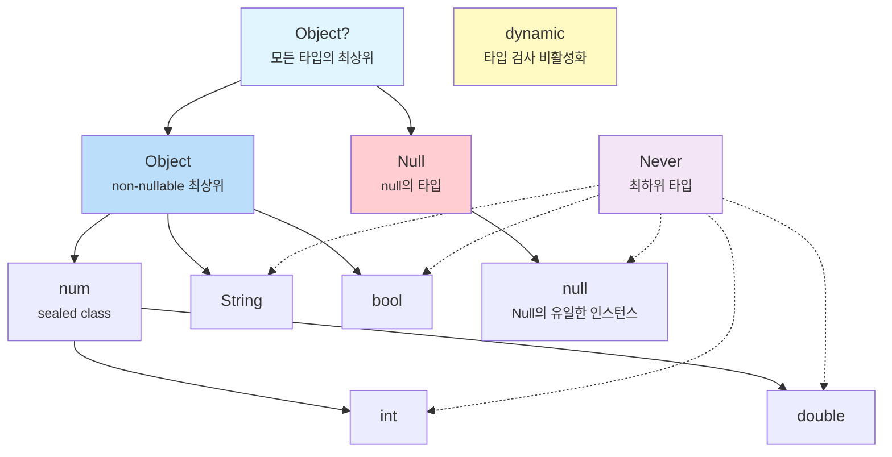

# Ch 01. Dart 타입 시스템과 Null Safety

## 이 챕터에서 배울 것

- Dart의 타입 계층 구조는 어떻게 생겼는가?
- `Object`와 `Null`은 왜 분리되어 있는가?
- Null Safety는 단순히 `?`를 붙이는 것이 아니다 — 타입 이론적 의미
- `dynamic`, `var`, `Object`, `Object?`는 각각 무엇이 다른가?
- 제네릭은 Dart에서 어떻게 동작하는가? (reified generics)

---

## 🟢 기본 — Dart의 타입을 이해하는 첫 걸음

### 모든 것은 객체다

Dart에서는 숫자, 문자열, 함수, `null`까지 **모든 것이 객체**입니다. JavaScript와 비슷해 보이지만 결정적인 차이가 있습니다: Dart는 **정적 타입 시스템**을 갖고 있습니다.

```dart
// Dart: 모든 값은 객체
int age = 25;          // int도 객체
String name = 'Dart';  // String도 객체
bool isTrue = true;    // bool도 객체

// 증거: 모든 값에 메서드를 호출할 수 있다
print(25.isEven);      // true
print('hello'.length); // 5
print(true.toString()); // "true"
```

### 🔗 다른 언어와 비교

| 특성 | JavaScript | TypeScript | Kotlin | Dart |
|------|------------|------------|--------|------|
| 타입 검사 시점 | 런타임만 | 컴파일 타임 | 컴파일 타임 | **컴파일 + 런타임** |
| `null` 처리 | 별도 처리 없음 | `strictNullChecks` | Nullable 타입 | **Sound Null Safety** |
| 제네릭 | ❌ 없음 | 컴파일 타임만 (type erasure) | type erasure | **Reified (런타임 보존)** |
| 프리미티브 타입 | `number`, `string` 등 | JS와 동일 | `Int`, `Long` 등 | `int`, `double` (**모두 객체**) |

> **핵심 차이**: TypeScript의 타입은 컴파일 후 사라지지만(type erasure), Dart의 타입은 **런타임에도 살아있습니다(reified)**. 이것이 `is` 연산자와 제네릭의 동작을 근본적으로 다르게 만듭니다.

### `var`, `final`, `const`의 차이

많은 입문자가 혼동하는 부분입니다. 이들은 **타입이 아니라 선언 키워드**입니다.

```dart
var name = 'Dart';      // 타입 추론 → String. 재할당 가능
final city = 'Seoul';   // 타입 추론 → String. 재할당 불가 (런타임 상수)
const pi = 3.14;        // 타입 추론 → double. 재할당 불가 (컴파일 타임 상수)

name = 'Flutter';       // ✅ OK
// city = 'Busan';      // ❌ 컴파일 에러: final 변수는 재할당 불가
// pi = 3.15;           // ❌ 컴파일 에러: const 변수는 재할당 불가
```

#### `final` vs `const` — 진짜 차이

```dart
// final: 런타임에 값이 결정됨
final now = DateTime.now();  // ✅ 실행 시점에 결정

// const: 컴파일 타임에 값이 결정되어야 함
// const now2 = DateTime.now(); // ❌ 에러! DateTime.now()는 컴파일 타임에 모름

const maxRetries = 3;         // ✅ 3은 컴파일 타임에 알 수 있음
const greeting = 'Hello';    // ✅ 문자열 리터럴도 OK
```

> **정리**: `const`는 "프로그램이 실행되기 전에 이미 알 수 있는 값", `final`은 "한번 정해지면 바꿀 수 없는 값"입니다. Flutter에서 `const` 위젯이 성능에 중요한 이유를 Ch05에서 다룹니다.

---

## 🟡 중급 — 타입 계층 구조의 비밀

### Dart의 타입 계층도

Dart의 타입 시스템을 이해하려면 이 계층도를 반드시 머릿속에 그릴 수 있어야 합니다:

```
            Object?
           /       \
        Object      Null
       /  |   \       |
    num  String bool  null (유일한 인스턴스)
   /   \
 int  double
```



### 핵심 포인트: `Object`와 `Null`은 **형제**다

이것이 Dart Null Safety의 **타입 이론적 기반**입니다.

- `Object` = 모든 non-nullable 타입의 최상위
- `Null` = `null` 값의 타입 (`Object`를 **구현하지 않음**)
- `Object?` = `Object | Null` (이 둘의 합집합)

### 📁 소스코드로 확인

> 📁 `_sources/dart-sdk/sdk/lib/core/object.dart`
> 📁 `_sources/dart-sdk/sdk/lib/core/null.dart`

**object.dart** (7~11행):
```dart
/// The base class for all Dart objects except `null`.
///
/// Because `Object` is a root of the non-nullable Dart class hierarchy,
/// every other non-`Null` Dart class is a subclass of `Object`.
class Object {
  const Object();

  external bool operator ==(Object other);
  external int get hashCode;
  external String toString();
  external dynamic noSuchMethod(Invocation invocation);
  external Type get runtimeType;
}
```

**null.dart** (7~12행):
```dart
/// The reserved word `null` denotes an object that is the sole instance of
/// this class.
///
/// The `Null` class is the only class which does not implement `Object`.
/// It is a compile-time error for a class to attempt to extend or implement
/// [Null].
final class Null {
  factory Null._uninstantiable() {
    throw UnsupportedError('class Null cannot be instantiated');
  }
  external int get hashCode;
  String toString() => "null";
}
```

> **주목할 점**: `Null` 클래스는 `Object`를 **상속하지 않습니다**. 이것은 우연이 아닙니다. 이 설계 덕분에 `String`과 `String?`이 완전히 다른 타입이 될 수 있습니다.

### `dynamic` vs `Object` vs `Object?`

이 세 가지는 자주 혼동되지만 근본적으로 다릅니다:

```dart
// Object: non-nullable 최상위. 모든 메서드를 안전하게 호출 가능
Object obj = 'hello';
print(obj.toString());     // ✅ 항상 안전
// print(obj.length);       // ❌ 컴파일 에러: Object에 length 없음

// Object?: nullable 최상위. null 체크 필요
Object? maybeObj = null;
// print(maybeObj.toString()); // ❌ 경고: null일 수 있음
print(maybeObj?.toString());   // ✅ null-safe 호출

// dynamic: 타입 검사 자체를 **비활성화**
dynamic anything = 'hello';
print(anything.length);    // ✅ 컴파일 OK (런타임에 검사)
print(anything.foo());     // ✅ 컴파일 OK, 런타임에 NoSuchMethodError!
```

> **실무 규칙**: `dynamic`을 쓰는 것은 타입 시스템의 보호를 **자발적으로 포기**하는 것입니다. JSON 파싱 등 불가피한 경우를 제외하면 `Object` 또는 `Object?`를 사용하세요.

### `Never` — 타입 계층의 바닥

`Never`는 "절대 값을 반환하지 않는" 타입입니다. 모든 타입의 하위 타입(`bottom type`)입니다.

```dart
// Never를 반환하는 함수: 항상 예외를 던지거나 무한 루프
Never throwError(String message) {
  throw Exception(message);
  // 이 줄에 도달할 수 없으므로 return 불필요
}

// 활용: 타입 추론에서 유용
int value = condition ? 42 : throwError('failed');
// throwError의 반환 타입이 Never이므로, 전체 표현식은 int로 추론됨
```

---

## 🟡 중급 — Null Safety 심화

### Null Safety의 세 가지 원칙

1. **기본이 non-nullable**: `String` 타입의 변수에는 절대 `null`이 들어갈 수 없다
2. **Nullable은 명시적**: `String?`으로 선언해야만 `null` 가능
3. **Sound (건전함)**: 컴파일러가 **100% 보장**. TypeScript의 `strictNullChecks`와 달리 런타임에 뚫리지 않음

### 흐름 분석 (Flow Analysis)

Dart 컴파일러는 코드의 흐름을 분석하여 null 체크 이후의 타입을 **자동으로 승격(promote)** 합니다:

```dart
void process(String? name) {
  // 여기서 name은 String? 타입
  if (name == null) return;

  // ✅ 여기서 name은 자동으로 String으로 승격됨 (promotion)
  print(name.length);  // null 체크 불필요
}
```

#### 흐름 분석이 작동하지 않는 경우

```dart
class User {
  String? name;

  void printName() {
    if (name != null) {
      // ❌ 여전히 String? — 왜?
      // 다른 스레드가 name을 null로 바꿀 수 있기 때문
      // print(name.length); // 에러!

      // ✅ 해결: 로컬 변수에 복사
      final localName = name;
      if (localName != null) {
        print(localName.length); // OK!
      }

      // ✅ 또는 bang operator (확신이 있을 때만)
      print(name!.length);
    }
  }
}
```

> **왜?**: 인스턴스 필드는 getter로 구현될 수 있고, 호출할 때마다 다른 값을 반환할 수 있습니다. 컴파일러는 이를 보수적으로 판단합니다. 로컬 변수는 이런 문제가 없으므로 승격이 가능합니다.

### `late` 키워드의 진짜 의미

`late`는 "나중에 초기화하겠다"가 아닙니다. 정확히는 **"초기화 검사를 런타임으로 미루겠다"**는 선언입니다.

```dart
// 사용법 1: 지연 초기화
late String description;

void init() {
  description = 'Hello';
}

void use() {
  print(description); // init()이 먼저 호출되지 않으면 LateInitializationError!
}

// 사용법 2: 게으른 (lazy) 초기화
late final heavyObject = _computeExpensiveValue();
// _computeExpensiveValue()는 heavyObject에 처음 접근할 때만 실행됨
```

#### `late`의 함정

```dart
late final value = DateTime.now().toString();

// 아래 코드는 매번 같은 값을 반환
print(value); // "2026-02-12 17:05:48.123"
print(value); // "2026-02-12 17:05:48.123" (같은 값!)
// 처음 접근할 때 한 번만 계산되고 캐시됨
```

---

## 🟡 중급 — `num`, `int`, `double`의 관계

### 📁 소스코드로 보는 `num`

> 📁 `_sources/dart-sdk/sdk/lib/core/num.dart`

```dart
/// An integer or floating-point number.
///
/// It is a compile-time error for any type other than [int] or [double]
/// to attempt to extend or implement `num`.
sealed class num implements Comparable<num> {
  // ...
}
```

**`sealed class`**: `num`은 봉인 클래스입니다. `int`와 `double`만이 `num`을 상속할 수 있습니다. 제3의 숫자 타입을 만들 수 없습니다.

### 플랫폼에 따른 `int`의 차이

```dart
// 네이티브 (VM): 64비트 정수, 임의 정밀도(BigInt 아님)
// 웹 (JS): JavaScript의 Number로 매핑 → 실질적으로 53비트 정수

int big = 9007199254740992; // 2^53
print(big + 1);
// 네이티브: 9007199254740993 ✅
// 웹:      9007199254740992 ❌ (정밀도 손실!)
```

> **실무 팁**: 서버-클라이언트 간 큰 ID 값을 주고받을 때, 웹에서는 `String`으로 전달하는 것이 안전합니다.

---

## 🔴 심화 — 제네릭의 Reified 특성

### Type Erasure vs Reified Generics

```dart
// Dart: Reified Generics — 런타임에 타입 정보가 보존됨
List<int> numbers = [1, 2, 3];
print(numbers is List<int>);    // true
print(numbers is List<String>); // false ← 런타임에 구분 가능!

// Java/TypeScript에서는 이것이 불가능 (type erasure)
// Java: List<Integer>와 List<String>은 런타임에 구분 불가
```

### 제네릭 타입의 공변성과 반변성

```dart
// Dart의 제네릭은 공변(covariant)
List<int> ints = [1, 2, 3];
List<num> nums = ints;  // ✅ int <: num 이므로 List<int> <: List<num>

// 이것은 타입 안전성을 깨뜨릴 수 있음 (알려진 문제)
nums.add(3.14);  // 컴파일 OK, 런타임에 TypeError!
// ints에 double이 추가되는 셈이므로

// 해결: covariant 키워드로 명시
class Box<T> {
  void put(covariant T item) { /* ... */ }
}
```

### 🔴 심화 — `Type` 클래스와 `runtimeType`

> 📁 `_sources/dart-sdk/sdk/lib/core/type.dart`

```dart
/// Runtime representation of a type.
abstract interface class Type {
  int get hashCode;
  bool operator ==(Object other);
  String toString();
}
```

`Type`은 **인터페이스**입니다. 실제 구현은 VM 내부에 있으며, `runtimeType`을 통해 접근합니다.

```dart
void printType<T>(T value) {
  print(value.runtimeType); // 런타임 타입 출력
  print(T);                 // 제네릭 타입 파라미터 출력

  // 이 둘은 다를 수 있다!
  Object obj = 42;
  printType(obj); // runtimeType: int, T: Object
}
```

> **실무 주의**: `runtimeType` 비교는 `is` 연산자보다 느리고, 상속 관계를 무시합니다. 타입 체크에는 항상 `is`를 사용하세요.

---

## ❌→✅ 안티패턴

### 1. `dynamic` 남용

```dart
// ❌ Bad: dynamic으로 타입 안전성 포기
dynamic parseResponse(String json) {
  return jsonDecode(json);
}
var name = parseResponse('{"name":"dart"}')['name'];
name.foo(); // 컴파일 OK, 런타임 크래시

// ✅ Good: 명시적 타입
Map<String, dynamic> parseResponse(String json) {
  return jsonDecode(json) as Map<String, dynamic>;
}
String name = parseResponse('{"name":"dart"}')['name'] as String;
```

### 2. 불필요한 bang operator (`!`)

```dart
// ❌ Bad: 무분별한 ! 사용 — NullPointerException의 Dart 버전
String getName(Map<String, String> data) {
  return data['name']!; // key가 없으면 런타임 에러!
}

// ✅ Good: 기본값 제공 또는 명시적 처리
String getName(Map<String, String> data) {
  return data['name'] ?? 'Unknown';
}

// ✅ Better: 에러 상황을 명확하게
String getNameOrThrow(Map<String, String> data) {
  final name = data['name'];
  if (name == null) {
    throw ArgumentError('name key is required');
  }
  return name; // 자동 승격됨
}
```

### 3. `is` 체크 후 캐스팅 중복

```dart
// ❌ Bad: 이미 is로 확인했는데 또 as로 캐스팅
if (animal is Dog) {
  (animal as Dog).bark(); // 불필요한 캐스팅
}

// ✅ Good: 자동 타입 승격 활용
if (animal is Dog) {
  animal.bark(); // 자동으로 Dog 타입으로 승격됨
}
```

---

## 💼 실무에서는

### JSON 파싱에서의 타입 전략

```dart
// 실무에서 가장 많이 만나는 타입 문제: API 응답 파싱
// freezed + json_serializable 조합으로 해결

@freezed
class User with _$User {
  const factory User({
    required String name,
    required int age,
    String? email,  // nullable 필드는 명시적으로
  }) = _User;

  factory User.fromJson(Map<String, dynamic> json) =>
      _$UserFromJson(json);
}

// 이렇게 하면:
// 1. name과 age가 null이면 파싱 에러 (안전)
// 2. email은 null 허용 (유연)
// 3. 컴파일 타입에서 타입 안전성 보장
```

### Flutter에서의 타입 패턴

```dart
// Widget에서 제네릭 활용
class DataList<T> extends StatelessWidget {
  final List<T> items;
  final Widget Function(T item) itemBuilder;

  const DataList({
    required this.items,
    required this.itemBuilder,
  });

  @override
  Widget build(BuildContext context) {
    return ListView.builder(
      itemCount: items.length,
      itemBuilder: (_, index) => itemBuilder(items[index]),
      // T가 reified이므로 런타임에도 타입 안전
    );
  }
}
```

---

## 🎯 면접 대비 Q&A

### Q1. `dynamic`과 `Object`의 차이는?

**모범 답변**: `Object`는 Dart의 non-nullable 타입 계층의 최상위 클래스로, `toString()`, `hashCode`, `==` 같은 메서드만 호출할 수 있습니다. 존재하지 않는 메서드를 호출하면 **컴파일 에러**가 발생합니다. 반면 `dynamic`은 타입 검사 자체를 비활성화하여 어떤 메서드든 호출할 수 있게 합니다. 존재하지 않는 메서드를 호출하면 **런타임 에러**가 발생합니다. 따라서 `dynamic`은 타입 안전성을 포기하는 것이므로 JSON 파싱 등 불가피한 경우에만 사용해야 합니다.

### Q2. Dart의 Null Safety가 다른 언어의 nullable 처리와 다른 점은?

**모범 답변**: Dart의 Null Safety는 **sound(건전)**합니다. 즉, 컴파일러가 "이 변수는 null이 아니다"라고 판단하면 런타임에 절대 null이 될 수 없습니다. TypeScript의 `strictNullChecks`는 `any` 타입이나 type assertion(`as`)으로 우회할 수 있지만, Dart에서는 `!` 연산자를 명시적으로 사용하지 않는 한 우회가 불가능합니다. 타입 이론적으로 `Object`와 `Null`을 별도의 타입으로 분리하여 `String`과 `String?`이 진정한 의미에서 다른 타입이 됩니다.

### Q3. `final`과 `const`의 차이를 실무 관점에서 설명하세요.

**모범 답변**: `final`은 런타임에 한 번만 할당되는 변수로, `DateTime.now()`처럼 실행 시점에 결정되는 값에 사용합니다. `const`는 컴파일 타임 상수로, 모든 인스턴스가 메모리에서 **정규화(canonicalize)**됩니다. 즉, `const Text('Hello')`를 여러 번 써도 하나의 객체만 생성됩니다. Flutter에서 `const` 위젯을 사용하면 위젯 트리 비교(reconciliation) 시 `identical()` 비교로 빠르게 건너뛸 수 있어 성능이 향상됩니다.

### Q4. Dart의 제네릭이 Java/TypeScript와 다른 점은?

**모범 답변**: Dart의 제네릭은 **reified**됩니다. 즉, `List<int>`와 `List<String>`은 런타임에도 다른 타입으로 인식됩니다. `someList is List<int>`와 같은 타입 체크가 런타임에 정확하게 동작합니다. Java와 TypeScript는 type erasure로 인해 런타임에 제네릭 타입 정보가 사라지므로 이런 체크가 불가능합니다. 단, Dart의 제네릭은 공변(covariant)이라 `List<int>`를 `List<num>`에 할당할 수 있는데, 이는 편의성을 위한 설계이지만 런타임 타입 에러를 유발할 수 있는 trade-off입니다.

---

## 📝 핵심 정리

| 개념 | 핵심 포인트 |
|------|-------------|
| `Object` | non-nullable 최상위. `null`을 포함하지 않음 |
| `Null` | `null`의 타입. `Object`를 **상속하지 않음** |
| `Object?` | `Object \| Null`. 모든 값을 담을 수 있는 진짜 최상위 |
| `dynamic` | 타입 검사 비활성화. 최대한 피할 것 |
| `Never` | 절대 반환하지 않는 타입. 모든 타입의 하위 |
| `var` | 선언 키워드 (타입 추론). 타입이 아님 |
| `final` | 런타임 상수. 한 번만 할당 |
| `const` | 컴파일 타임 상수. 정규화됨 |
| Null Safety | Sound. 컴파일러 보장이 런타임에도 유지 |
| 제네릭 | Reified. 런타임에 타입 정보 보존 |
