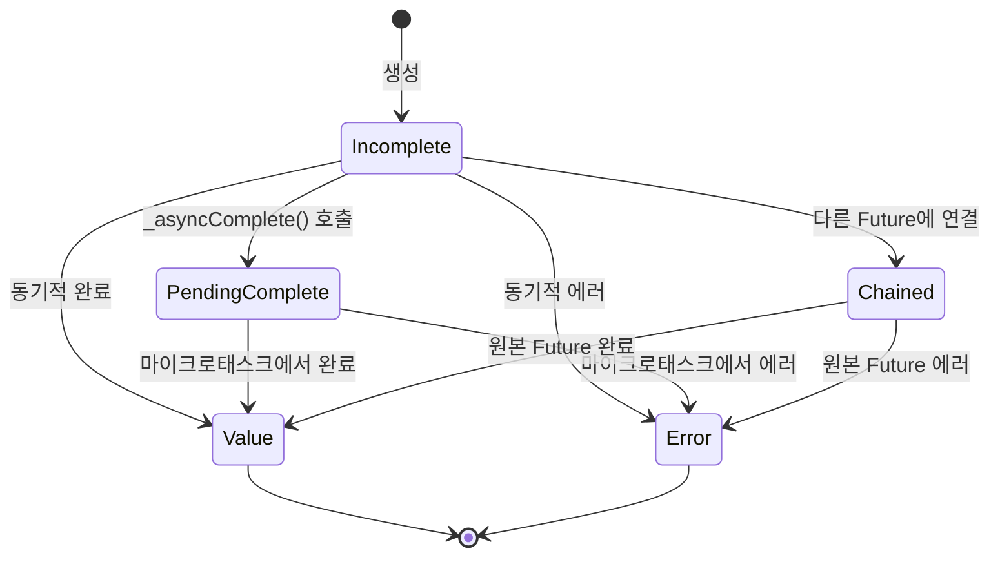

# Ch 04. 비동기 프로그래밍 — Future, Stream, 그리고 이벤트 루프

## 이 챕터에서 배울 것

- Dart의 이벤트 루프는 어떻게 동작하는가?
- `Future`는 내부적으로 어떤 상태 머신인가?
- `async`/`await`는 실제로 무엇으로 변환되는가?
- Microtask와 Event의 차이, 그리고 실행 순서
- `Stream`은 언제 꼭 필요한가?
- `Zone`은 무엇이며 Flutter에서 왜 중요한가?

---

## 🟢 기본 — 비동기를 이해하는 출발점

### 왜 비동기가 필요한가?

Dart는 **싱글 스레드** 언어입니다. UI 프레임워크인 Flutter에서 네트워크 요청이나 파일 읽기를 동기적으로 하면 16ms 안에 프레임을 그릴 수 없게 되어 **화면이 멈춥니다(jank)**.

```dart
// ❌ 만약 Dart가 동기적이었다면 (가상 코드)
String data = http.getSync('https://api.example.com/data'); // 2초 대기
// 이 2초 동안 UI가 완전히 멈춤!

// ✅ Dart의 비동기 방식
String data = await http.get('https://api.example.com/data');
// await 동안 이벤트 루프가 다른 작업(UI 렌더링 등)을 처리
```

### 🔗 다른 언어와 비교

| 특성 | JavaScript | Kotlin | Swift | Dart |
|------|------------|--------|-------|------|
| 동시성 모델 | 싱글 스레드 + 이벤트 루프 | 멀티 스레드 + 코루틴 | 멀티 스레드 + async/await | **싱글 스레드 + 이벤트 루프** |
| 비동기 단위 | `Promise` | `Deferred`/`suspend` | `Task` | **`Future`** |
| 데이터 스트림 | `AsyncIterable` | `Flow` | `AsyncSequence` | **`Stream`** |
| 병렬 처리 | Web Workers | 코루틴 + Dispatchers | Actor | **`Isolate`** |

> **핵심**: Dart의 비동기 모델은 JavaScript와 매우 유사합니다. 싱글 스레드에서 이벤트 루프로 동작하며, `Future`는 JS의 `Promise`에 해당합니다. 하지만 `Isolate`를 통해 진정한 병렬 처리도 가능합니다.

### `Future` — 미래에 완료될 값

```dart
// Future: "나중에 완료될 계산의 결과"를 나타내는 객체
Future<String> fetchUserName() async {
  final response = await http.get('/api/user');
  return response.body;
}

// 사용
final name = await fetchUserName();
print(name); // "Dart"
```

### `async`/`await`는 문법적 설탕이다

`async`/`await`는 `.then()` 체이닝의 **문법적 설탕(syntactic sugar)**입니다:

```dart
// async/await 버전
Future<int> computeTotal() async {
  int a = await fetchA();
  int b = await fetchB();
  return a + b;
}

// 위 코드는 컴파일러에 의해 대략 이렇게 변환됨:
Future<int> computeTotal() {
  return fetchA().then((a) {
    return fetchB().then((b) {
      return a + b;
    });
  });
}
```

> **주의**: 이것은 단순화된 설명이며, 실제 컴파일러는 상태 머신 기반의 더 효율적인 코드를 생성합니다 (심화 섹션에서 다룸).

---

## 🟡 중급 — 이벤트 루프의 두 개의 큐

### Microtask Queue vs Event Queue

Dart의 이벤트 루프에는 **두 개의 큐**가 있습니다:

```
┌─────────────────────────────────────────────┐
│                Event Loop                    │
│  ┌────────────────────┐  ┌───────────────┐  │
│  │  Microtask Queue   │  │  Event Queue  │  │
│  │  (높은 우선순위)    │  │ (낮은 우선순위)│  │
│  │                    │  │               │  │
│  │  • Future.then()   │  │ • Timer       │  │
│  │  • scheduleMicro   │  │ • I/O         │  │
│  │    task()          │  │ • UI events   │  │
│  │  • async/await     │  │ • Future()    │  │
│  │    재개             │  │   생성자       │  │
│  └────────────────────┘  └───────────────┘  │
└─────────────────────────────────────────────┘
  ↑
  Microtask Queue가 **완전히 비어야** Event Queue 처리
```

### 📁 소스코드로 확인: Microtask 스케줄러

> 📁 `_sources/dart-sdk/sdk/lib/async/schedule_microtask.dart`

```dart
// 마이크로태스크 큐: 단일 연결 리스트로 구현
_AsyncCallbackEntry? _nextCallback;  // 리스트의 head
_AsyncCallbackEntry? _lastCallback;  // 리스트의 tail

void _microtaskLoop() {
  // 큐에 있는 모든 콜백을 순서대로 실행
  for (var entry = _nextCallback; entry != null; entry = _nextCallback) {
    _lastPriorityCallback = null;
    var next = entry.next;
    _nextCallback = next;
    if (next == null) _lastCallback = null;
    _microtaskEntryCallback(entry)();  // 콜백 실행
  }
}

void _startMicrotaskLoop() {
  _isInCallbackLoop = true;
  try {
    _microtaskLoop();
  } finally {
    _isInCallbackLoop = false;
    // 루프 실행 중 새 마이크로태스크가 추가되었으면 다시 스케줄
    if (_nextCallback != null) {
      _AsyncRun._scheduleImmediate(_startMicrotaskLoop);
    }
  }
}
```

> **핵심 발견**: 마이크로태스크 큐는 **단일 연결 리스트**로 구현되어 있으며, 모든 마이크로태스크가 소진될 때까지 이벤트 큐의 다음 이벤트를 처리하지 않습니다. 이것이 마이크로태스크 무한 루프가 UI를 멈추는 이유입니다.

### 실행 순서 퀴즈

```dart
void main() {
  print('1: main start');

  Future(() => print('2: Event Queue (Future() 생성자)'));

  Future.microtask(() => print('3: Microtask Queue'));

  scheduleMicrotask(() => print('4: Microtask Queue'));

  Future.value('done').then((_) => print('5: Microtask (then)'));

  print('6: main end');
}
```

**실행 결과:**
```
1: main start
6: main end
3: Microtask Queue
4: Microtask Queue
5: Microtask (then)
2: Event Queue (Future() 생성자)
```

**왜?**
1. 동기 코드가 먼저 실행 (1, 6)
2. Microtask Queue가 **전부** 실행 (3, 4, 5)
3. 마지막으로 Event Queue 실행 (2)

### `Future()` vs `Future.microtask()` vs `Future.value()`

```dart
// Future(): Timer.run()으로 콜백 스케줄 → Event Queue에 들어감
factory Future(FutureOr<T> computation()) {
  _Future<T> result = _Future<T>();
  Timer.run(() { /* computation 실행 */ });  // Event Queue!
  return result;
}

// Future.microtask(): scheduleMicrotask()로 스케줄 → Microtask Queue에 들어감
factory Future.microtask(FutureOr<T> computation()) {
  _Future<T> result = _Future<T>();
  scheduleMicrotask(() { /* computation 실행 */ });  // Microtask Queue!
  return result;
}

// Future.value(): 이미 완료된 Future (then은 항상 Microtask으로 실행)
```

---

## 🟡 중급 — Stream 심화

### Future vs Stream

```dart
// Future: 단일 비동기 값
Future<int> fetchCount() async => 42;

// Stream: 연속적인 비동기 값
Stream<int> countStream() async* {
  for (int i = 1; i <= 5; i++) {
    await Future.delayed(Duration(seconds: 1));
    yield i;  // 값을 하나씩 방출
  }
}
```

### Single-subscription vs Broadcast

```dart
// Single-subscription: 리스너 1개만 가능 (기본값)
final controller = StreamController<int>();
controller.stream.listen((data) => print(data)); // ✅
// controller.stream.listen((data) => print(data)); // ❌ Error!

// Broadcast: 여러 리스너 가능
final broadcast = StreamController<int>.broadcast();
broadcast.stream.listen((data) => print('A: $data')); // ✅
broadcast.stream.listen((data) => print('B: $data')); // ✅
```

### `async*`와 `yield`

```dart
// async*: Stream을 반환하는 제너레이터 함수
Stream<int> fibonacci() async* {
  int a = 0, b = 1;
  while (true) {
    yield a;  // 값 하나 방출
    final next = a + b;
    a = b;
    b = next;
  }
}

// yield*: 다른 Stream의 모든 값을 위임
Stream<int> combinedStream() async* {
  yield* Stream.fromIterable([1, 2, 3]);  // 먼저 이 Stream 소진
  yield* fibonacci().take(5);              // 그 다음 이 Stream
}
```

### Stream의 변환 (Transform)

```dart
// map, where, expand 등으로 Stream 변환
final transformed = someStream
    .where((event) => event.isImportant)      // 필터링
    .map((event) => event.toViewModel())       // 변환
    .distinct()                                 // 중복 제거
    .debounce(Duration(milliseconds: 300));     // 디바운스 (rxdart)
```

---

## 🔴 심화 — Future의 내부 구현

### 📁 `_Future` 상태 머신

> 📁 `_sources/dart-sdk/sdk/lib/async/future_impl.dart`

`Future`의 실제 구현체인 `_Future<T>`는 **상태 머신**입니다:

```dart
class _Future<T> implements Future<T> {
  // 상태 상수들
  static const int _stateIncomplete      = 0;   // 대기 중
  static const int _stateIgnoreError     = 1;   // 에러 무시 플래그
  static const int _statePendingComplete = 2;   // 완료 대기 중
  static const int _stateChained         = 4;   // 다른 Future에 연결됨
  static const int _stateValue           = 8;   // ✅ 값으로 완료
  static const int _stateError           = 16;  // ❌ 에러로 완료

  int _state = _stateIncomplete;
  final _Zone _zone;            // 이 Future가 속한 Zone
  var _resultOrListeners;       // 결과값 또는 리스너 리스트
}
```



### `_resultOrListeners`의 이중 역할

`_resultOrListeners` 필드는 **상태에 따라 의미가 달라집니다**:

| 상태 | `_resultOrListeners`의 내용 |
|------|---------------------------|
| `_stateIncomplete` | `_FutureListener` 연결 리스트 (대기 중인 콜백들) |
| `_statePendingComplete` | `_FutureListener` 연결 리스트 |
| `_stateChained` | 원본 `_Future` 참조 |
| `_stateValue` | `T` 타입의 결과 값 |
| `_stateError` | `AsyncError` 객체 (에러 + 스택 트레이스) |

> **설계 의도**: 하나의 필드로 여러 역할을 대체하여 **메모리를 절약**합니다. Future 객체는 매우 많이 생성되므로 바이트 단위의 절약도 중요합니다.

### `.then()`이 호출되면 실제로 무슨 일이 일어나는가?

```dart
// 소스코드 분석: _Future.then()
Future<R> then<R>(FutureOr<R> f(T value), {Function? onError}) {
  Zone currentZone = Zone.current;

  // 1. 콜백을 현재 Zone에 등록 (Zone 컨텍스트 캡처)
  if (!identical(currentZone, _rootZone)) {
    f = currentZone.registerUnaryCallback<FutureOr<R>, T>(f);
    if (onError != null) {
      onError = _registerErrorHandler(onError, currentZone);
    }
  }

  // 2. 새로운 _Future를 결과로 생성
  _Future<R> result = _Future<R>();

  // 3. 리스너를 연결 리스트에 추가
  _addListener(_FutureListener<T, R>.then(result, f, onError));

  return result;  // 4. 아직 미완료 상태의 Future 반환
}
```

**이것이 의미하는 것**: `.then()`은 **즉시 반환**합니다. 콜백은 원본 Future가 완료될 때 **마이크로태스크로** 실행됩니다.

### `_FutureListener` — 콜백 체인

```dart
class _FutureListener<S, T> {
  static const int maskValue = 1 << 0;    // 0x01
  static const int maskError = 1 << 1;    // 0x02
  static const int maskAwait = 1 << 4;    // 0x10

  static const int stateThen       = maskValue;                 // 1
  static const int stateThenOnerror = maskValue | maskError;    // 3
  static const int stateThenAwait   = stateThenOnerror | maskAwait; // 19

  _FutureListener? _nextListener;   // 다음 리스너 (연결 리스트)
  final _Future<T> result;          // 결과를 받을 Future
  final int state;                  // 리스너 종류
  final Function? callback;         // 성공 콜백
  final Function? errorCallback;    // 에러 콜백
}
```

> **발견**: `await`는 내부적으로 `stateThenAwait` 타입의 `_FutureListener`를 생성합니다. 일반 `.then()`과 다른 플래그(`maskAwait = 16`)가 설정되어 VM이 `await`를 특별하게 최적화할 수 있습니다.

---

### 🔴 심화 — `async/await` vs `.then()` 내부 구현 차이

> 📁 `_sources/dart-sdk/sdk/lib/async/future_impl.dart` — `.then()` vs `_thenAwait()`
> 📁 `_sources/dart-sdk/sdk/lib/_internal/vm/lib/async_patch.dart` — `_SuspendState`

`async/await`와 `.then()`은 겉보기에 같은 동작을 하지만, **내부 구현 경로가 완전히 다릅니다**. 이 차이를 이해하면 성능 최적화 판단의 근거가 됩니다.

#### 1️⃣ Zone 등록 — 가장 핵심적인 차이

```dart
// 📄 future_impl.dart (Line 388~413)
// ─── .then()의 구현 ───
Future<R> then<R>(FutureOr<R> f(T value), {Function? onError}) {
  Zone currentZone = Zone.current;

  if (!identical(currentZone, _rootZone)) {  // ← Zone 체크
    f = currentZone.registerUnaryCallback<FutureOr<R>, T>(f);  // ← 매번 등록!
    if (onError != null) {
      onError = _registerErrorHandler(onError, currentZone);   // ← 에러도 등록!
    }
  }

  _Future<R> result = _Future<R>();
  _addListener(_FutureListener<T, R>.then(result, f, onError));
  return result;
}

// 📄 future_impl.dart (Line 416~424)
// ─── _thenAwait()의 구현 (await 전용) ───

/// Used by the implementation of `await` to listen to a future.
/// The system created listeners are not registered in the zone.  ← 핵심!
Future<E> _thenAwait<E>(FutureOr<E> f(T value), Function onError) {
  _Future<E> result = _Future<E>();
  _addListener(_FutureListener<T, E>.thenAwait(result, f, onError));
  return result;  // Zone 등록 전혀 없음!
}
```

**WHY Zone 등록을 건너뛸 수 있는가?**

`async` 함수의 콜백은 **컴파일러가 생성**합니다. 사용자 코드가 아닙니다. 컴파일러가 생성한 콜백은:
1. 항상 올바른 타입을 가지고 (타입 체크 불필요)
2. Zone 경계를 넘지 않으며 (Zone 래핑 불필요)
3. `_SuspendState._resume()`을 호출할 뿐입니다

반면 `.then()`의 콜백은 **사용자가 작성**한 임의의 함수입니다. Zone에 등록하여 추적하고, 타입을 검증해야 합니다.

#### 2️⃣ `_SuspendState` — async의 상태 머신

> 📁 `_sources/dart-sdk/sdk/lib/_internal/vm/lib/async_patch.dart` (Line 188~521)

`async` 함수는 컴파일 시 `_SuspendState` 기반의 **상태 머신**으로 변환됩니다:

```dart
// 원본 코드
Future<String> fetchUserName() async {
  final id = await fetchId();          // suspend point 1
  final name = await fetchName(id);    // suspend point 2
  return 'User: $name';
}

// 컴파일러가 내부적으로 변환하는 구조 (개념적 표현)
// _SuspendState는 VM 네이티브 객체로, 아래는 핵심 필드만 표현
class _SuspendState {
  Object _functionData;   // 결과를 받을 _Future<String>
  Function? _thenCallback;     // 성공 시 _resume() 호출
  Function? _errorCallback;    // 에러 시 _resume() 호출

  // VM이 함수의 실행 상태(레지스터, 로컬 변수)를 통째로 저장
  // → JS처럼 switch-case 상태 머신이 아님!
  // → VM 수준의 suspend/resume (코루틴)
}
```

**`_initAsync<T>()` — 시작점** (Line 191~193):
```dart
static Object? _initAsync<T>() {
  return _Future<T>();  // async 함수 호출 즉시 _Future 생성
}
```

**`_SuspendState._await()` — await가 실행되면** (Line 310~331):
```dart
Object? _await(Object? object) {
  if (_thenCallback == null) {
    _createAsyncCallbacks();  // ← 콜백을 한 번만 생성!
  }

  // 3가지 경로로 분기
  if (object is _Future) {
    if (object._isComplete) {
      // 🚀 Fast Path 1: 이미 완료된 Future
      // → 리스너 생성 없이 바로 마이크로태스크 스케줄
      _awaitCompletedFuture(object);
    } else {
      // 🚀 Fast Path 2: 내부 _Future (미완료)
      // → Zone 등록 없는 _thenAwait() 사용
      object._thenAwait<dynamic>(
        unsafeCast<dynamic Function(dynamic)>(_thenCallback),
        unsafeCast<dynamic Function(Object, StackTrace)>(_errorCallback),
      );
    }
  } else if (object is! Future) {
    // 🚀 Fast Path 3: Future가 아닌 값
    // → 리스너 필요 없이 바로 마이크로태스크
    _awaitNotFuture(object);
  } else {
    // ⚠️ Slow Path: 사용자 정의 Future
    // → .then()을 사용해야 함 (Zone 등록 포함)
    _awaitUserDefinedFuture(object);
  }
  return _functionData;
}
```

#### 3️⃣ 콜백 생성 — 1회 vs 매번

```dart
// .then() 체이닝 — 매번 새로운 클로저 생성
fetchId()
  .then((id) => fetchName(id))       // 클로저 1 생성 + Zone 등록 1
  .then((name) => 'User: $name');    // 클로저 2 생성 + Zone 등록 2
// → 2개의 클로저 + 2번의 Zone 등록

// async/await — _createAsyncCallbacks()에서 1회만 생성
// 📄 async_patch.dart (Line 196~232)
void _createAsyncCallbacks() {
  final suspendState = this;

  thenCallback(value) {
    suspendState._resume(value, null, null);  // 항상 같은 _resume
  }
  errorCallback(Object exception, StackTrace stackTrace) {
    suspendState._resume(null, exception, stackTrace);
  }

  // rootZone이면 Zone 등록도 건너뜀! (Flutter 기본 환경)
  final currentZone = Zone._current;
  if (identical(currentZone, _rootZone) ||
      identical(currentZone._registerUnaryCallback,
                _rootZone._registerUnaryCallback)) {
    _thenCallback = thenCallback;    // Zone 래핑 없이 직접 사용
  } else {
    _thenCallback = currentZone.registerUnaryCallback(thenCallback);
  }
  // errorCallback도 동일한 패턴...
}

// → 1개의 thenCallback + 1개의 errorCallback
// → 여러 await 포인트에서 재사용!
```

#### 4️⃣ 성능 비교 요약

| 비교 항목 | `.then()` 체이닝 | `async/await` |
|-----------|-----------------|---------------|
| 콜백 생성 | **매 .then() 호출마다** 새 클로저 | **1회**만 생성, 여러 `await`에서 재사용 |
| Zone 등록 | 매 호출마다 Zone에 등록 | **rootZone이면 등록 안 함** |
| `_FutureListener` 플래그 | `stateThen` (1) | `stateThenAwait` (19) — VM 최적화 힌트 |
| 이미 완료된 Future | 리스너 등록 후 즉시 실행 | **리스너 생성 자체를 건너뜀** |
| 상태 관리 | 연결 리스트 (`_nextListener`) | VM 수준 suspend/resume |
| 에러 처리 | Zone 경계에 따라 분리 | `try-catch`로 자연스럽게 |
| 디버깅 | 스택 트레이스 끊김 | `maskAwait` 플래그로 **스택 트레이스 복원** |
| 메모리 | `await` 포인트당 `_Future` + `_FutureListener` | `_SuspendState` 1개가 모든 `await` 관리 |

#### 5️⃣ 그렇다면 `.then()`은 언제 쓰는가?

```dart
// ✅ .then()이 더 적절한 경우: fire-and-forget
void logAnalytics() {
  // 결과를 기다릴 필요 없음 — await 불필요
  analyticsService.track('page_view')
    .then((_) => print('logged'))
    .catchError((e) => print('failed: $e'));
}

// ✅ .then()이 더 적절한 경우: 동적 체이닝
Future<int> buildPipeline(List<Future<int> Function(int)> steps, int input) {
  return steps.fold<Future<int>>(
    Future.value(input),
    (prev, step) => prev.then(step),  // 동적으로 체인 구성
  );
}

// ✅ async/await가 더 적절한 경우: 거의 항상
// — 가독성, 에러 처리, 디버깅, 성능 모두 유리
Future<String> fetchUserProfile(int userId) async {
  try {
    final user = await userApi.get(userId);
    final avatar = await storageApi.getAvatar(user.avatarId);
    return '${user.name}: $avatar';
  } catch (e) {
    return 'Unknown user';  // 깔끔한 에러 처리
  }
}
```

> **면접 포인트**: "async/await은 단순히 .then()의 문법적 설탕이 아닙니다. 내부적으로 `_SuspendState` 상태 머신, `_thenAwait()`의 Zone 등록 건너뛰기, 콜백 재사용, 이미 완료된 Future에 대한 fast path 등 **다른 최적화 경로**를 탑니다. 성능과 디버깅 모두에서 `async/await`가 유리하며, `.then()`은 fire-and-forget이나 동적 체이닝 같은 특수 상황에서만 쓰는 것이 좋습니다."

---

## 🔴 심화 — Zone의 역할

### Zone이란?

`Zone`은 **비동기 콜백이 실행되는 컨텍스트**입니다. 비동기 코드가 어디서 스케줄되었는지를 추적합니다.

> 📁 `_sources/dart-sdk/sdk/lib/async/zone.dart`

```dart
/// A zone represents an environment that remains stable across
/// asynchronous calls.
///
/// All code is executed in the context of a zone, available to the
/// code as [Zone.current].
abstract final class Zone {
  static const Zone root = _rootZone;
  static _Zone _current = _rootZone;
  static Zone get current => _current;

  void handleUncaughtError(Object error, StackTrace stackTrace);
  Zone? get parent;
  Zone get errorZone;
  // ...
}
```

### Flutter에서 Zone의 활용

```dart
// Flutter의 main()에서 Zone을 사용하는 패턴
void main() {
  runZonedGuarded(
    () => runApp(MyApp()),
    (error, stackTrace) {
      // 앱 전체의 처리되지 않은 비동기 에러를 잡음
      FirebaseCrashlytics.instance.recordError(error, stackTrace);
    },
  );
}
```

### Zone의 에러 경계

```dart
// Zone은 에러가 전파되는 경계를 만듦
// 다른 Zone의 에러는 넘어오지 않음
runZonedGuarded(() {
  var future = Future.error('error in zone A');

  runZonedGuarded(() {
    // ❌ Zone B에서는 Zone A의 에러를 catch할 수 없음!
    future.catchError((e) => print('never reached'));
  }, (error, stack) {
    print('Zone B error handler: never called');
  });
}, (error, stack) {
  print('Zone A error handler: $error'); // 이것이 호출됨
});
```

---

## 🟡 중급 — Isolate (진정한 병렬)

### 언제 Isolate가 필요한가?

```dart
// ❌ 이런 작업은 async/await로 해결 불가
// (CPU 바운드 작업은 싱글 스레드를 점유)
Future<int> heavyComputation() async {
  // 이 계산이 2초 걸리면 → 2초간 UI 멈춤
  return expensiveAlgorithm(data);
}

// ✅ Isolate로 다른 스레드에서 실행
final result = await Isolate.run(() {
  return expensiveAlgorithm(data);
});
```

### 🔑 Isolate 간 데이터 전달 — 무엇이, 왜 되고 안 되는가?

Isolate의 핵심 설계 원칙은 **"메모리를 공유하지 않는다"**입니다. 각 Isolate는 자신만의 **독립된 힙(heap)**을 가집니다. 따라서 데이터를 전달하려면 반드시 **직렬화 → 복사 → 역직렬화** 과정을 거쳐야 합니다.

> 📁 `_sources/dart-sdk/sdk/lib/isolate/isolate.dart` — `SendPort.send()` (Line 846~905)

#### 전송 가능한 타입 (WHY: 직렬화 가능하기 때문)

```dart
// SendPort.send()로 전송 가능한 타입들
// (같은 코드를 공유하는 Isolate, 즉 Isolate.spawn 사용 시)

// ✅ 원시 타입 — 값 자체를 복사하면 됨
null, true, false
int, double, String  // String은 immutable이므로 실제로는 "공유"

// ✅ 컬렉션 — 재귀적으로 내부 요소도 전송 가능해야 함
List<int>, Map<String, dynamic>, Set<String>

// ✅ 사용자 정의 클래스 — 필드가 모두 전송 가능하면 OK
class UserData {
  final String name;
  final int age;
  final List<String> tags;
  // → 모든 필드가 sendable → 전체 객체도 sendable
}

// ✅ 특수 Isolate 타입
SendPort    // Isolate 간 통신 채널
Capability  // 권한 토큰
TransferableTypedData  // 대용량 바이너리의 zero-copy 전송
```

#### 전송 불가능한 타입 (WHY: 네이티브 리소스가 있기 때문)

```dart
// ❌ 전송 불가 타입들과 그 이유

// 1. 네이티브 리소스를 가진 객체
Socket socket;       // ❌ OS 파일 디스크립터가 프로세스/스레드에 바인딩
File file;           // ❌ 열린 파일 핸들은 OS 커널 수준 자원
// WHY: 네이티브 리소스(파일 디스크립터, 소켓 핸들)는 OS가 특정 스레드/프로세스에
//      할당한 것. Isolate는 별도 스레드이므로 이 핸들을 그대로 가져갈 수 없음.
//      → "포인터를 복사해봤자 다른 힙에서는 무의미" 원칙

// 2. ReceivePort
ReceivePort port;    // ❌ 메시지를 "받는" 포트는 생성 Isolate에 귀속
// WHY: ReceivePort은 이벤트 루프에 직접 연결됨.
//      다른 Isolate의 이벤트 루프에서는 메시지를 수신할 수 없음.
//      대신 SendPort를 보내서 "여기로 보내줘"라고 알려주는 패턴 사용.

// 3. Finalizer 관련
Finalizer, NativeFinalizer, Finalizable
// WHY: GC finalization은 객체가 생성된 힙의 GC에 등록됨.
//      다른 Isolate 힙으로 복사하면 finalization 콜백이 무효화됨.

// 4. FFI 관련
DynamicLibrary          // ❌ 네이티브 라이브러리 핸들
// WHY: dlopen() 핸들은 프로세스 수준 자원이지만,
//      Dart 객체로서의 래퍼는 Isolate 힙에 종속됨.

// 5. 명시적 전송 불가 마킹
@pragma('vm:isolate-unsendable')
class MyNativeWrapper { /* ... */ }
// WHY: VM 수준에서 직렬화를 차단하는 어노테이션.
//      네이티브 자원을 래핑하는 클래스에 사용.
```

#### 복사(Copy) vs 공유(Share) — 왜 구분하는가?

```dart
// 💡 핵심 원칙: 불변(immutable) 객체는 공유, 가변(mutable) 객체는 복사

// 🔄 복사되는 타입: 가변 상태가 있으므로 독립 사본 필요
List<int> numbers = [1, 2, 3];
// 다른 Isolate가 이 리스트를 수정해도 원본에 영향 없어야 함
// → 새로운 List를 만들어 요소를 복사

// 🔗 공유되는 타입: 불변이므로 같은 메모리를 참조해도 안전
String text = "hello";  // String은 immutable
// → 포인터만 전달해도 양쪽에서 안전하게 읽기 가능
// (수정이 불가능하므로 race condition 없음)

// ⚡ TransferableTypedData: "이동" — 소유권 전달
// WHY: 대용량 바이너리 데이터(이미지, 오디오)를 복사하면 비용이 큼
// → 소유권(ownership)을 이전하여 복사 비용을 0으로 만듦
final bytes = TransferableTypedData.fromList([
  Uint8List(1024 * 1024),  // 1MB 데이터
]);
// send 후에는 원본 Isolate에서 접근 불가! (소유권 이전됨)
port.send(bytes);  // → zero-copy 전송
```

#### 🔴 심화 — `TransferableTypedData` Deep Dive

> 📁 `_sources/dart-sdk/sdk/lib/isolate/isolate.dart` (Line 1052~1076)
> 📁 `_sources/dart-sdk/sdk/lib/_internal/vm/lib/isolate_patch.dart` (Line 739~763)

##### 탄생 배경 — 왜 필요했는가?

Isolate 간 데이터 전달의 기본 메커니즘은 **직렬화-복사**입니다. 텍스트 JSON이나 작은 객체에는 문제없지만, **바이너리 데이터**에서는 치명적인 성능 병목이 됩니다:

```dart
// ❌ 기존 방식의 문제
// 10MB 이미지를 Isolate에서 처리 후 반환
final Uint8List processedImage = await Isolate.run(() {
  return applyFilter(rawImageBytes);  // 10MB 결과
});
// → SendPort.send()로 전송 시: 10MB 전체를 바이트 단위로 복사
// → 복사 시간 + 메모리 2배 사용 (원본 + 사본이 일시 공존)
```

이 문제를 해결하기 위해 **Dart 2.3.2** (2019년)에 `TransferableTypedData`가 도입되었습니다. 핵심 아이디어는 시스템 프로그래밍 언어인 **Rust의 소유권(ownership) 모델**에서 차용했습니다.

##### 설계 철학 — Move Semantics (이동 의미론)

```
┌─────────────────────────────────────────────────────────────────────┐
│                   데이터 전달 전략 비교                                │
│                                                                     │
│  Copy (복사)           Share (공유)           Move (이동)            │
│  ┌──────┐              ┌──────┐              ┌──────┐              │
│  │ data │─── copy ───▶│ data │   │ data │◀── both ──▶│ data │   │ data │──── move ───▶│ data │  │
│  └──────┘              └──────┘   └──────┘              └──────┘   └──────┘              └──────┘  │
│  원본 유지             양쪽 접근              원본 무효화            │
│  O(n) 비용             O(1) 비용             O(1) 비용             │
│  안전 (독립 사본)       불변만 가능            소유권 전달             │
│                                                                     │
│  List, Map 등          String, num 등        TransferableTypedData  │
└─────────────────────────────────────────────────────────────────────┘
```

**핵심 원칙**: `TransferableTypedData`는 **한 번에 하나의 Isolate만 소유**할 수 있습니다:

```dart
/// The [TransferableTypedData] is a cross-isolate single-use resource.
/// This method must not be called more than once on the same underlying
/// transferable bytes, even if the calls occur in different isolates.
ByteBuffer materialize();
```

이것이 Rust의 `ownership`과 같습니다 — 값을 "이동(move)"하면 원래 소유자는 더 이상 접근할 수 없습니다.

##### API 라이프사이클 — 4단계

```dart
import 'dart:isolate';
import 'dart:typed_data';

// ═══════ 1단계: 생성 (Wrap) ═══════
// 기존 TypedData를 TransferableTypedData로 감쌈
// 이 시점에서 바이트가 VM 내부 버퍼로 복사됨 → O(n)
final rawImage = Uint8List(10 * 1024 * 1024);  // 10MB
final transferable = TransferableTypedData.fromList([rawImage]);
// fromList은 List<TypedData>를 받음 → 여러 청크 결합 가능!

// ═══════ 2단계: 전송 (Send) ═══════
// SendPort를 통해 다른 Isolate로 전송
// 이 시점에서 소유권 이전 → O(1) 상수 시간!
sendPort.send(transferable);
// ⚠️ 이후 이 Isolate에서 transferable 사용 불가

// ═══════ 3단계: 수신 (Receive) ═══════
// 다른 Isolate에서 메시지 수신
receivePort.listen((message) {
  final received = message as TransferableTypedData;

  // ═══════ 4단계: 실체화 (Materialize) ═══════
  // TransferableTypedData를 다시 ByteBuffer로 변환
  // 이것도 소유권 이전 → O(1)
  final ByteBuffer buffer = received.materialize();
  final Uint8List bytes = buffer.asUint8List();
  // ⚠️ materialize()는 한 번만 호출 가능!
  // 두 번째 호출 시 → 에러 또는 빈 데이터
});
```

##### VM 내부 구현 — 왜 O(1)인가?

```dart
// 📄 isolate_patch.dart (Line 752~763)
// VM 네이티브 코드로 구현됨
@pragma("vm:entry-point")
final class _TransferableTypedDataImpl implements TransferableTypedData {

  // 1. 생성: 네이티브 C++ 코드에서 힙 외부(external) 메모리에 바이트 저장
  @pragma("vm:external-name", "TransferableTypedData_factory")
  external factory _TransferableTypedDataImpl(List<TypedData> list);

  ByteBuffer materialize() {
    return _materializeIntoUint8List().buffer;
  }

  // 2. 실체화: 외부 메모리 포인터를 Uint8List로 래핑 (복사 없음)
  @pragma("vm:external-name", "TransferableTypedData_materialize")
  external Uint8List _materializeIntoUint8List();
}
// → 비밀: 데이터가 Dart 힙이 아닌 "외부 메모리"에 저장됨
// → 전송 시 포인터만 이동 → 복사 없음 → O(1)
// → GC의 영향도 받지 않는 별도 관리 메모리
```

##### ⚠️ 플랫폼 제한

```dart
// 📄 js_runtime/lib/isolate_patch.dart (Line 176~179)
abstract class TransferableTypedData {
  factory TransferableTypedData.fromList(List<TypedData> list) {
    throw UnsupportedError('TransferableTypedData.fromList');
    // ❌ Web에서는 사용 불가!
  }
}

// 📄 wasm/lib/isolate_patch.dart (Line 152~155)
// ❌ Wasm에서도 사용 불가!
```

| 플랫폼 | 지원 여부 | 이유 |
|--------|-----------|------|
| **Dart VM** (Flutter mobile/desktop) | ✅ | VM이 외부 메모리 포인터 직접 관리 |
| **dart2js** (Web) | ❌ | JS에는 Isolate/스레드 공유 메모리 없음 |
| **dart2wasm** (Wasm) | ❌ | SharedArrayBuffer 제한 |

##### `TransferableTypedData` vs `Isolate.exit()` — 현대적 대안

```dart
// ═══════ 방법 1: TransferableTypedData (Dart 2.3.2+) ═══════
// 장기 실행 Isolate에서 반복적으로 데이터 전송할 때 유용
void longRunningIsolate(SendPort port) {
  while (true) {
    final processed = processNextFrame();
    final transferable = TransferableTypedData.fromList([processed]);
    port.send(transferable);  // 반복 전송, Isolate는 유지됨
  }
}

// ═══════ 방법 2: Isolate.exit() (Dart 2.15+) ═══════
// 일회성 작업에 더 간편 — Isolate.run()이 내부적으로 사용
final result = await Isolate.run(() {
  final processed = processImage(data);
  return processed;  // exit()로 자동 zero-copy 전송
  // Isolate 종료 + 힙 메모리 이전이 동시에 일어남
});
```

| 비교 항목 | `TransferableTypedData` | `Isolate.exit()` |
|-----------|------------------------|-------------------|
| 도입 시점 | Dart 2.3.2 (2019) | Dart 2.15 (2021) |
| 사용 패턴 | 장기 실행 Isolate의 반복 전송 | 일회성 작업 후 결과 반환 |
| 데이터 준비 | `fromList()` → 수동 래핑 필요 | 자동 (결과를 그대로 반환) |
| Isolate 생존 | **유지됨** — 계속 사용 가능 | **종료됨** — 결과와 함께 파괴 |
| 대상 데이터 | `TypedData`만 (바이너리) | **모든 sendable 객체** |
| API 복잡도 | 높음 (생성-전송-수신-실체화) | 낮음 (return만 하면 됨) |

> **실무 가이드**: 대부분의 경우 `Isolate.run()` (내부적으로 `exit()` 사용)으로 충분합니다. `TransferableTypedData`가 필요한 경우는 **장기 실행 전용 Isolate**에서 **바이너리 데이터를 반복적으로 전송**할 때뿐입니다 — 예: 실시간 비디오 프레임 처리, 오디오 스트림 인코딩.

##### Flutter 실무 패턴 — 이미지 처리 파이프라인

```dart
// 장기 실행 Isolate + TransferableTypedData 조합
class ImageProcessingService {
  late final SendPort _workerPort;
  final _receivePort = ReceivePort();

  Future<void> init() async {
    await Isolate.spawn(_worker, _receivePort.sendPort);
    _workerPort = await _receivePort.first as SendPort;
  }

  // 메인 Isolate → 워커 Isolate: 이미지 전송
  Future<Uint8List> processImage(Uint8List rawImage) async {
    final completer = Completer<Uint8List>();
    final responsePort = ReceivePort();

    // 1. 원본 이미지를 TransferableTypedData로 래핑
    final transferable = TransferableTypedData.fromList([rawImage]);

    // 2. O(1) 전송 — 10MB 이미지도 즉시 전달
    _workerPort.send([transferable, responsePort.sendPort]);

    // 3. 처리된 결과 수신 (역시 TransferableTypedData)
    responsePort.listen((message) {
      final result = (message as TransferableTypedData).materialize();
      completer.complete(result.asUint8List());
      responsePort.close();
    });

    return completer.future;
  }

  static void _worker(SendPort mainPort) {
    final port = ReceivePort();
    mainPort.send(port.sendPort);

    port.listen((message) {
      final [transferable as TransferableTypedData, replyPort as SendPort] =
          message as List;

      // 4. materialize()로 바이트 접근
      final bytes = transferable.materialize().asUint8List();

      // 5. 이미지 처리
      final processed = applyAdvancedFilters(bytes);

      // 6. 결과를 다시 TransferableTypedData로 래핑하여 반환
      replyPort.send(TransferableTypedData.fromList([processed]));
    });
  }
}
```

#### Isolate.run()의 결과 전송 — exit()를 통한 최적화

> 📁 `_sources/dart-sdk/sdk/lib/isolate/isolate.dart` — `Isolate.run()` (Line 197~198)
>
> "The result is sent using `exit`, which means it's sent to this isolate **without copying**."

```dart
// Isolate.run()의 내부 구현 핵심
// (실제 소스코드 기반)
static Future<R> run<R>(FutureOr<R> computation(), {String? debugName}) {
  // ... (생략)
  Isolate.spawn(
    _RemoteRunner._remoteExecute,
    _RemoteRunner<R>(computation, resultPort.sendPort),
    onError: resultPort.sendPort,
    onExit: resultPort.sendPort,   // 종료 시 자동 전송
    errorsAreFatal: true,
  );
  // ...
}

// _RemoteRunner에서 결과를 보내는 부분:
// Isolate.exit(resultPort, [result]);
// → exit()는 Isolate 종료와 동시에 결과를 전송
// → 종료되는 Isolate의 힙 메모리를 직접 이전하므로 복사 불필요!
```

> **왜 이게 중요한가?**: `Isolate.run()`으로 이미지를 처리하면, 결과 이미지 데이터가 **복사 없이** 메인 Isolate로 전달됩니다. 반면, `SendPort.send()`로 직접 보내면 **전체 데이터를 복사**합니다. 대용량 데이터를 다룬다면 이 차이가 성능에 큰 영향을 줍니다.

#### 클로저(Closure) 캡처 함정 — 왜 top-level 함수를 써야 하나?

```dart
class ImageProcessor {
  final File _configFile;  // ❌ File은 전송 불가!
  final int quality;

  Future<Uint8List> process(Uint8List imageData) async {
    // ❌ Bad: 클로저가 `this`를 캡처함
    return Isolate.run(() {
      // 이 클로저는 ImageProcessor 인스턴스 전체를 캡처
      // → _configFile (File 타입)도 함께 전송 시도
      // → "Illegal argument in isolate message" 런타임 에러!
      return _doProcess(imageData, quality);
    });
  }
}

// ✅ Good: 필요한 데이터만 명시적으로 전달
Future<Uint8List> processImage(Uint8List imageData, int quality) async {
  // top-level 함수는 아무것도 캡처하지 않음
  return Isolate.run(() => _processInIsolate(imageData, quality));
}

// top-level 함수
Uint8List _processInIsolate(Uint8List data, int quality) {
  // data와 quality만 전달됨 (둘 다 sendable)
  return applyCompression(data, quality);
}

// WHY top-level 또는 static이어야 하는가?
// 1. 인스턴스 메서드 → `this` 캡처 → 인스턴스의 모든 필드가 전송됨
// 2. 로컬 클로저 → 스코프의 변수를 캡처 → 예상보다 많은 데이터 전송
// 3. top-level/static → 캡처 대상 없음 → 인자만 직렬화하면 됨
```

### Flutter의 `compute()` vs `Isolate.run()` — 무엇을 쓸까?

```dart
// compute(): Flutter 프레임워크 제공 (foundation 패키지)
// Isolate.run(): Dart SDK 제공 (dart:isolate)

// compute()는 내부적으로 Isolate.run()과 거의 동일
// 하지만 강제로 top-level 함수를 요구하여 캡처 실수를 방지

// compute() — 함수와 인자를 분리 강제
Future<List<Photo>> _parsePhotos(String responseBody) async {
  return compute(
    _parsePhotosInBackground,  // ← 반드시 top-level/static
    responseBody,              // ← 반드시 sendable 타입
  );
}

List<Photo> _parsePhotosInBackground(String body) {
  final json = jsonDecode(body) as List;
  return json.map((j) => Photo.fromJson(j)).toList();
}

// Isolate.run() — 더 유연하지만 캡처 주의
final result = await Isolate.run(() {
  // 클로저 내부에서 외부 변수 사용 시 캡처됨!
  return doSomething();
});
```

### Isolate vs async/await 선택 기준

| 작업 유형 | 해결 방법 | 예시 | WHY |
|-----------|----------|------|-----|
| I/O 바운드 | `async`/`await` | HTTP 요청, 파일 읽기 | OS가 대기 → Dart 스레드 미점유 |
| CPU 바운드 (< 16ms) | `async`/`await` | 간단한 데이터 변환 | 프레임 예산(16ms) 내 → UI 영향 없음 |
| CPU 바운드 (> 16ms) | `Isolate.run()` | 이미지 처리, 대량 JSON 파싱 | 프레임 예산 초과 → jank 유발 |
| 지속적 백그라운드 처리 | 전용 `Isolate` | 실시간 데이터 처리, 센서 스트림 | 반복적 spawn 비용 > 유지 비용 |
| 대용량 데이터 전송 | `TransferableTypedData` | 이미지/오디오/영상 바이너리 | 복사 비용 O(n) → 이동 비용 O(1) |

---

## ❌→✅ 안티패턴

### 1. 불필요한 `async` 마킹

```dart
// ❌ Bad: 불필요한 async (Future 래핑만 추가)
Future<String> getName() async {
  return repository.fetchName();
  // 이미 Future<String>을 반환하는데 async가 또 감싸면
  // 불필요한 마이크로태스크가 추가됨
}

// ✅ Good: 직접 반환
Future<String> getName() {
  return repository.fetchName();
}

// ✅ async가 필요한 경우: try-catch를 사용할 때
Future<String> getName() async {
  try {
    return await repository.fetchName();
  } catch (e) {
    return 'Unknown';
  }
}
```

### 2. Future의 순차 실행 (병렬 가능할 때)

```dart
// ❌ Bad: 순차 실행 — 총 3초 소요
Future<void> loadData() async {
  final users = await fetchUsers();      // 1초
  final products = await fetchProducts(); // 1초
  final orders = await fetchOrders();     // 1초
}

// ✅ Good: 병렬 실행 — 총 1초 소요
Future<void> loadData() async {
  final results = await Future.wait([
    fetchUsers(),
    fetchProducts(),
    fetchOrders(),
  ]);
  // 또는 Dart 3.x의 Record 활용
  final (users, products, orders) = await (
    fetchUsers(),
    fetchProducts(),
    fetchOrders(),
  ).wait;
}
```

### 3. Stream 리스너 미해제

```dart
// ❌ Bad: StreamSubscription을 해제하지 않으면 메모리 누수
class MyWidget extends StatefulWidget { /* ... */ }
class _MyWidgetState extends State<MyWidget> {
  @override
  void initState() {
    super.initState();
    someStream.listen((data) {
      setState(() { /* ... */ });
    });
    // Widget이 dispose되어도 리스너가 계속 동작!
  }
}

// ✅ Good: dispose에서 해제
class _MyWidgetState extends State<MyWidget> {
  late final StreamSubscription _subscription;

  @override
  void initState() {
    super.initState();
    _subscription = someStream.listen((data) {
      setState(() { /* ... */ });
    });
  }

  @override
  void dispose() {
    _subscription.cancel();
    super.dispose();
  }
}
```

### 4. 에러 핸들링 누락

```dart
// ❌ Bad: 에러가 조용히 삼켜짐
fetchData().then((data) {
  processData(data);
});
// 에러 발생 시 → uncaught error → 앱 크래시 가능

// ✅ Good: 항상 에러 처리
try {
  final data = await fetchData();
  processData(data);
} catch (e, stack) {
  logger.error('Failed to fetch data', error: e, stackTrace: stack);
  showErrorSnackbar(context, 'Failed to load data');
}
```

---

## 💼 실무에서는

### API 호출 패턴

```dart
class UserRepository {
  final Dio _dio;

  Future<Result<User>> getUser(String id) async {
    try {
      final response = await _dio.get('/users/$id');
      return Result.success(User.fromJson(response.data));
    } on DioException catch (e) {
      if (e.response?.statusCode == 404) {
        return Result.failure(UserNotFoundError(id));
      }
      return Result.failure(NetworkError(e.message));
    } catch (e, stack) {
      // 예상치 못한 에러
      logger.error('Unexpected error', error: e, stackTrace: stack);
      return Result.failure(UnknownError(e));
    }
  }
}
```

### Debounce 패턴 (검색 자동완성)

```dart
class SearchViewModel {
  Timer? _debounceTimer;

  void onSearchChanged(String query) {
    _debounceTimer?.cancel();
    _debounceTimer = Timer(
      const Duration(milliseconds: 300),
      () => _performSearch(query),
    );
  }

  Future<void> _performSearch(String query) async {
    if (query.isEmpty) return;
    final results = await searchRepository.search(query);
    // 결과 업데이트
  }

  void dispose() {
    _debounceTimer?.cancel();
  }
}
```

---

## 🎯 면접 대비 Q&A

### Q1. Dart의 이벤트 루프에서 Microtask와 Event의 차이를 설명하세요.

**모범 답변**: Dart의 이벤트 루프에는 두 개의 큐가 있습니다. Microtask Queue는 `Future.then()`, `scheduleMicrotask()`, `async/await` 재개 등이 들어가며 우선순위가 높습니다. Event Queue는 `Timer`, I/O 이벤트, `Future()` 생성자의 콜백이 들어가며 우선순위가 낮습니다. 중요한 점은 이벤트 루프가 항상 Microtask Queue를 **완전히 비운 후에** Event Queue의 다음 이벤트를 처리한다는 것입니다. 따라서 Microtask에서 또 다른 Microtask를 무한히 스케줄하면 UI 이벤트가 처리되지 않아 화면이 멈춥니다.

### Q2. `async/await`와 `.then()`의 내부적 차이는?

**모범 답변**: 문법적으로는 `async/await`가 `.then()` 체이닝의 설탕이지만, 내부 구현은 다릅니다. `await`는 `_FutureListener`를 `stateThenAwait` 상태로 생성하여 VM이 특별하게 최적화합니다. 또한 `async` 함수는 **상태 머신**으로 변환되어, 각 `await` 지점이 상태 전환점이 됩니다. `.then()`은 각 콜백마다 새로운 클로저를 생성하므로, 연쇄 `.then()`은 중첩된 클로저 체인이 되는 반면, `async/await`는 단일 상태 머신으로 효율적입니다.

### Q3. `Isolate`와 `async/await`는 각각 언제 사용하나요?

**모범 답변**: `async/await`는 I/O 바운드 작업(네트워크 요청, 파일 읽기)에 사용합니다. 이런 작업은 실제로 Dart 스레드를 점유하지 않고 OS 수준에서 대기하므로 싱글 스레드로 충분합니다. `Isolate`는 CPU 바운드 작업(이미지 처리, 복잡한 JSON 파싱, 암호화)에 사용합니다. 이런 작업은 Dart 스레드를 직접 점유하여 16ms 프레임 예산을 초과할 수 있으므로 별도 스레드가 필요합니다. 기준은 "해당 작업이 프레임 드롭을 유발하는가"입니다.

### Q4. Isolate 간 데이터 전달 시 어떤 타입이 전송 가능하고, 왜 일부 타입은 전송이 불가능한가요?

**모범 답변**: Isolate는 독립된 힙 메모리를 가지므로, 데이터 전달은 본질적으로 **직렬화-복사-역직렬화** 과정입니다. `SendPort.send()`로 전송 가능한 타입은 원시 타입(`null`, `bool`, `int`, `double`, `String`), 컬렉션(`List`, `Map`, `Set` — 내부 요소도 sendable이어야 함), 사용자 정의 클래스(필드가 모두 sendable), 그리고 `SendPort`, `Capability`, `TransferableTypedData` 등 특수 타입입니다. 반면, `Socket`, 열린 `File`, `ReceivePort`, `DynamicLibrary`, `Finalizable` 등은 전송 불가합니다. 이유는 이들이 **OS 커널 수준의 리소스**(파일 디스크립터, 소켓 핸들) 또는 **특정 Isolate의 이벤트 루프/GC에 귀속된 자원**을 참조하기 때문입니다. 다른 힙으로 포인터를 복사해봤자 무의미합니다. 또한 불변 객체(`String`)는 메모리를 공유하고, 가변 객체(`List`)는 복사하며, `TransferableTypedData`는 소유권 이전(zero-copy)으로 대용량 바이너리를 효율적으로 전달합니다. `Isolate.run()`은 내부적으로 `Isolate.exit()`를 사용하여 결과를 **복사 없이** 전달하므로, 대용량 데이터를 주고받을 때는 `SendPort.send()`보다 유리합니다.

### Q5. `async/await`와 `.then()`의 내부 구현 차이를 설명해주세요. "문법적 설탕(syntactic sugar)"이라고 말할 수 있나요?

**모범 답변**: 흔히 "async/await은 .then()의 문법적 설탕"이라고 하지만, **내부 구현 경로가 완전히 다릅니다**. `.then()`은 매 호출마다 콜백을 Zone에 등록(`registerUnaryCallback`)하고, 새 `_FutureListener`와 `_Future`를 생성합니다. 반면 `await`는 `_thenAwait()`를 사용하여 **Zone 등록을 건너뜁니다** — 소스코드 주석에 "The system created listeners are not registered in the zone"이라고 명시되어 있습니다. 또한 `async` 함수는 VM 수준의 `_SuspendState`로 컴파일되어, 콜백을 한 번만 생성(`_createAsyncCallbacks`)하고 여러 `await` 지점에서 재사용합니다. 추가로 `_SuspendState._await()`는 3가지 fast path를 가집니다: (1) 이미 완료된 Future → 리스너 생성 자체를 건너뜀, (2) 내부 `_Future` → `_thenAwait()` 사용, (3) Future가 아닌 값 → 바로 마이크로태스크 스케줄. `maskAwait` 플래그(bit 16)는 VM이 스택 트레이스를 복원하는 데에도 사용됩니다. 결론적으로, 성능(콜백 재사용, Zone 생략), 디버깅(스택 트레이스), 메모리(단일 `_SuspendState`) 모든 측면에서 `async/await`가 유리하며, `.then()`은 fire-and-forget이나 동적 체이닝 같은 특수 상황에서만 적합합니다.

### Q6. Zone이 Flutter에서 중요한 이유는?

**모범 답변**: Zone은 비동기 작업의 실행 컨텍스트를 캡슐화합니다. Flutter에서는 크게 두 가지로 활용됩니다. 첫째, `runZonedGuarded`로 전역 에러 핸들러를 설정하여 처리되지 않은 비동기 에러를 Crashlytics 등에 보고할 수 있습니다. 둘째, Flutter 엔진 내부에서 `runZoned`를 사용하여 위젯 빌드 에러를 격리하고, 에러가 발생하더라도 앱 전체가 크래시되지 않도록 합니다. Zone의 계층 구조는 에러가 Zone 경계를 넘지 않도록 보장하여 에러 격리에 핵심적인 역할을 합니다.

---

## 📝 핵심 정리

| 개념 | 핵심 포인트 |
|------|-------------|
| `Future` | 미래에 완료될 값. 내부적으로 상태 머신 (Incomplete → Value/Error) |
| `async/await` | `.then()`의 문법적 설탕이지만 VM 수준에서 최적화됨 |
| Microtask Queue | 높은 우선순위. `then()`, `await` 재개 등 |
| Event Queue | 낮은 우선순위. `Timer`, I/O, `Future()` 생성자 |
| `Stream` | 연속적인 비동기 값. Single/Broadcast 두 가지 |
| `Zone` | 비동기 컨텍스트. 에러 경계 및 콜백 추적 |
| `Isolate` | 진정한 병렬. CPU 바운드 작업에 사용 |
| `_resultOrListeners` | 상태에 따라 의미 변환 (메모리 최적화) |
