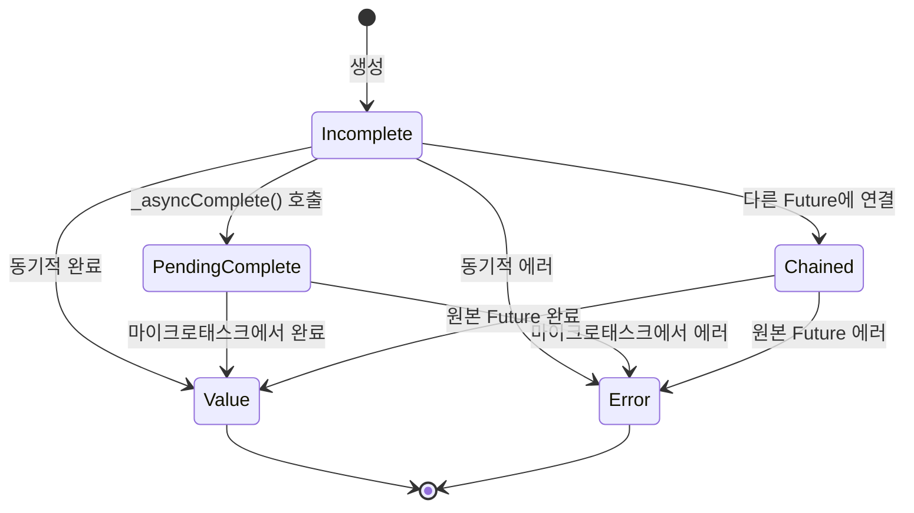

# Ch 04. 비동기 프로그래밍 — Future, Stream, 그리고 이벤트 루프

## 4.1 왜 비동기가 필요한가?

Dart는 싱글 스레드 언어다. UI 프레임워크인 Flutter에서 네트워크 요청이나 파일 읽기를 동기적으로 하면 16ms 안에 프레임을 그릴 수 없어 화면이 멈춘다(jank).

```dart
// ❌ 만약 Dart가 동기적이었다면 (가상 코드)
String data = http.getSync('https://api.example.com/data'); // 2초 대기
// 이 2초 동안 UI가 완전히 멈춤!

// ✅ Dart의 비동기 방식
String data = await http.get('https://api.example.com/data');
// await 동안 이벤트 루프가 다른 작업(UI 렌더링 등)을 처리
```

## 4.2 다른 언어와 비교

| 특성          | JavaScript                | Kotlin               | Swift                     | Dart                          |
| ------------- | ------------------------- | -------------------- | ------------------------- | ----------------------------- |
| 동시성 모델   | 싱글 스레드 + 이벤트 루프 | 멀티 스레드 + 코루틴 | 멀티 스레드 + async/await | 싱글 스레드 + 이벤트 루프 |
| 비동기 단위   | `Promise`                 | `Deferred`/`suspend` | `Task`                    | `Future`                  |
| 데이터 스트림 | `AsyncIterable`           | `Flow`               | `AsyncSequence`           | **`Stream`                  |
| 병렬 처리     | Web Workers               | 코루틴 + Dispatchers | Actor                     | `Isolate`                 |

> Dart의 비동기 모델은 JavaScript와 매우 유사하다. 싱글 스레드에서 이벤트 루프로 동작하며, `Future`는 JS의 `Promise`에 해당한다. 다만 `Isolate`를 통해 진정한 병렬 처리도 가능하다.

## 4.3 `Future` — 미래에 완료될 값

```dart
// Future: "나중에 완료될 계산의 결과"를 나타내는 객체
Future<String> fetchUserName() async {
  final response = await http.get('/api/user');
  return response.body;
}

// 사용
final name = await fetchUserName();
print(name); // "Dart"
```

## 4.4 `async`/`await`는 문법적 설탕이다

`async`/`await`는 `.then()` 체이닝의 문법적 설탕(syntactic sugar)이다:

```dart
// async/await 버전
Future<int> computeTotal() async {
  int a = await fetchA();
  int b = await fetchB();
  return a + b;
}

// 위 코드는 컴파일러에 의해 대략 이렇게 변환됨:
Future<int> computeTotal() {
  return fetchA().then((a) {
    return fetchB().then((b) {
      return a + b;
    });
  });
}
```

> 주의: 이것은 단순화된 설명이며, 실제 컴파일러는 상태 머신 기반의 더 효율적인 코드를 생성한다 (심화 섹션에서 다룸).

---

## 4.5 Microtask Queue vs Event Queue

Dart의 이벤트 루프에는 두 개의 큐가 있다:

```
┌─────────────────────────────────────────────┐
│                Event Loop                   │
│  ┌────────────────────┐  ┌───────────────┐  │
│  │  Microtask Queue   │  │  Event Queue  │  │
│  │  Higher priority   │  │ Lower priority│  │
│  │                    │  │               │  │
│  │  • Future.then()   │  │ • Timer       │  │
│  │  • scheduleMicro   │  │ • I/O         │  │
│  │    task()          │  │ • UI events   │  │
│  │  • async/await     │  │ • Future()    │  │
│  │    restart         │  │   constructor │  │
│  └────────────────────┘  └───────────────┘  │
└─────────────────────────────────────────────┘
  ↑
  Microtask Queue가 **완전히 비어야** Event Queue 처리
```

### 소스코드로 확인: Microtask 스케줄러

> `dart-sdk/sdk/lib/async/schedule_microtask.dart`

```dart
// 마이크로태스크 큐: 단일 연결 리스트로 구현
_AsyncCallbackEntry? _nextCallback;  // 리스트의 head
_AsyncCallbackEntry? _lastCallback;  // 리스트의 tail

void _microtaskLoop() {
  // 큐에 있는 모든 콜백을 순서대로 실행
  for (var entry = _nextCallback; entry != null; entry = _nextCallback) {
    _lastPriorityCallback = null;
    var next = entry.next;
    _nextCallback = next;
    if (next == null) _lastCallback = null;
    _microtaskEntryCallback(entry)();  // 콜백 실행
  }
}

void _startMicrotaskLoop() {
  _isInCallbackLoop = true;
  try {
    _microtaskLoop();
  } finally {
    _isInCallbackLoop = false;
    // 루프 실행 중 새 마이크로태스크가 추가되었으면 다시 스케줄
    if (_nextCallback != null) {
      _AsyncRun._scheduleImmediate(_startMicrotaskLoop);
    }
  }
}
```

> 마이크로태스크 큐는 단일 연결 리스트로 구현되어 있으며, 모든 마이크로태스크가 소진될 때까지 이벤트 큐의 다음 이벤트를 처리하지 않는다. 마이크로태스크 무한 루프가 UI를 멈추는 이유가 여기에 있다.

### JavaScript 이벤트 루프와의 비교

Dart와 JavaScript는 둘 다 싱글 스레드 + 이벤트 루프 모델이지만, 내부 구조에 차이가 있다.

#### 큐 구조 비교

**JavaScript**

```
┌────────────────────────────────┐
│          Event Loop            │
│                                │
│  1. Macrotask Queue            │
│     • setTimeout               │
│     • setInterval              │
│     • I/O callbacks            │
│     • MessageChannel           │
│                                │
│  2. Microtask Queue            │
│     • Promise.then()           │
│     • queueMicrotask()         │
│     • MutationObserver         │
│                                │
│  3. requestAnimationFrame      │
│     • pre-render callbacks     │
│                                │
│  4. Rendering (browser)        │
└────────────────────────────────┘
```

**Dart**

```
┌────────────────────────────────┐
│          Event Loop            │
│                                │
│  1. Microtask Queue            │
│     • Future.then()            │
│     • scheduleMicrotask        │
│     • async/await resume       │
│                                │
│  2. Event Queue                │
│     • Timer                    │
│     • I/O                      │
│     • UI events                │
│     • Future() constructor     │
│                                │
│  * Rendering managed by        │
│    Flutter engine separately   │
└────────────────────────────────┘
```

#### 루프 1회전(tick)의 실행 순서

```
[JavaScript]                          [Dart]
1. Macrotask 1개 실행                 1. Microtask Queue 전부 처리
2. Microtask Queue 전부 처리          2. Event Queue에서 1개 실행
3. requestAnimationFrame 처리         3. → 1로 돌아감
4. 렌더링 (Layout → Paint)
5. → 1로 돌아감
```

#### 태스크 스케줄링 모델은 동일하다

위 표를 보면 JS는 "macrotask 먼저", Dart는 "microtask 먼저"로 순서가 다른 것처럼 보인다. 하지만 이것은 같은 원형 사이클을 어디서 끊어 표현하느냐의 차이일 뿐이다:

```
JS:   ... → micro 전부 → macro 1개 → micro 전부 → macro 1개 → ...
Dart: ... → micro 전부 → event 1개 → micro 전부 → event 1개 → ...
                ↑ 여기서 끊으면 Dart식       ↑ 여기서 끊으면 JS식
```

따라서 태스크 큐 우선순위 메커니즘 자체는 사실상 동일하며, 동일한 코드의 실행 순서도 같다:

```javascript
// JavaScript
setTimeout(() => console.log("A"), 0); // macrotask
setTimeout(() => console.log("B"), 0); // macrotask
Promise.resolve().then(() => console.log("C")); // microtask
// 실행: C → A → B
```

```dart
// Dart (동일한 구조)
Timer.run(() => print('A'));  // event queue
Timer.run(() => print('B'));  // event queue
Future.microtask(() => print('C'));  // microtask
// 실행: C → A → B  ← 동일!
```

event/macrotask 내부에서 microtask를 추가하는 경우에도 동일하다:

```javascript
// JavaScript: A 실행 중 microtask 추가
setTimeout(() => {
  console.log("A");
  Promise.resolve().then(() => console.log("D"));
}, 0);
setTimeout(() => console.log("B"), 0);
Promise.resolve().then(() => console.log("C"));
// 실행: C → A → D → B
```

```dart
// Dart: 동일한 구조
Timer.run(() {
  print('A');
  Future.microtask(() => print('D'));
});
Timer.run(() => print('B'));
Future.microtask(() => print('C'));
// 실행: C → A → D → B  ← 역시 동일!
```

두 언어 모두 "macrotask/event를 1개 실행할 때마다 microtask queue를 전부 소진"하는 구조이므로, 태스크 스케줄링 관점에서 관찰 가능한 차이는 없다.

#### 그렇다면 실제 차이는 무엇인가?

차이는 이벤트 루프의 태스크 스케줄링이 아니라, 그 주변 구조에 있다.

첫째, 렌더링 통합 방식이 다르다. JS 브라우저는 이벤트 루프 안에 렌더링 단계(`rAF → Layout → Paint`)가 내장되어 있고, 브라우저가 "이제 렌더링할 시간이다"를 루프 안에서 결정한다. 반면 Dart(Flutter)에서 렌더링은 이벤트 루프에 내장되어 있지 않다. C++ 엔진이 vsync 시그널을 받아 event queue에 콜백을 넣는 구조이므로, 렌더링도 event queue의 또 다른 이벤트일 뿐이다.

둘째, task queue 개수가 다르다. JS 브라우저는 macrotask queue가 여러 개 존재하며, 브라우저가 어떤 queue에서 꺼낼지 우선순위를 조절할 수 있다 (예: 사용자 입력 이벤트 > `setTimeout`). Dart는 event queue가 하나뿐이다. 모든 이벤트가 동일한 FIFO 큐에 들어간다.

#### 렌더링 파이프라인 차이

| 항목          | JavaScript (브라우저)                     | Dart (Flutter)                                              |
| ------------- | ----------------------------------------- | ----------------------------------------------------------- |
| 렌더링 트리거 | 브라우저가 이벤트 루프 내에서 자동 스케줄 | `SchedulerBinding`이 vsync에 맞춰 스케줄                    |
| 렌더링 콜백   | `requestAnimationFrame` (이벤트 루프 안)  | `handleBeginFrame` / `handleDrawFrame` (vsync 콜백)         |
| 렌더링 트리거 | 이벤트 루프가 직접 렌더링 단계를 실행     | C++ 엔진이 vsync 시그널을 받아 Dart event queue에 콜백 전달 |
| 렌더링 실행   | 이벤트 루프 안에서 실행                   | 같은 UI 스레드(Dart Isolate)에서 이벤트로 실행          |
| UI 블로킹     | 마이크로태스크 과다 → 렌더링 지연         | 마이크로태스크 과다 → 프레임 드롭 (동일한 위험)             |

#### "렌더링이 별개"라는 오해

흔히 "Flutter 렌더링은 엔진 레벨에서 별개"라는 표현을 쓰지만, 이는 부정확하다. 별개인 것은 트리거(vsync 시그널 수신)뿐이고, 실제 렌더링 함수는 같은 Dart UI 스레드에서 실행된다.

```
[1] C++ Engine Thread
    : receives vsync signal from OS
    : posts callback to Dart event queue
              |
              v
[2] Dart UI Thread (Event Loop)
    : picks up vsync callback as a normal event
    |
    +-- handleBeginFrame()
    |     +-- Ticker / Animation update
    |
    +-- handleDrawFrame()
          +-- build()        (Widget -> Element -> RenderObject)
          +-- layout()       (size / position calculation)
          +-- paint()        (draw commands to Layer)
          +-- compositing    (build Layer Tree)
                  |
                  v
[3] Raster Thread
    : receives Layer Tree
    : GPU rendering via Skia / Impeller
```

따라서 microtask가 Dart UI 스레드를 점유하면, JavaScript든 Dart든 렌더링은 동일하게 블로킹된다.

#### microtask 폭주 시 차이

```javascript
// JavaScript: microtask 무한 → 렌더링 완전 차단
function bomb() {
  Promise.resolve().then(bomb); // 영원히 렌더링 안됨
}
```

```dart
// Dart: microtask 무한 → 동일하게 UI 완전 멈춤
// vsync 콜백이 event queue에 들어오지만, microtask가 끝나야 event를 처리하므로
void bomb() {
  scheduleMicrotask(bomb);  // UI 완전 멈춤
}
```

두 경우 모두 UI가 멈추며 블로킹 원인도 동일하다. 같은 스레드에서 microtask → event 순서로 처리하는데, microtask가 끝나지 않으면 event queue의 vsync 콜백(혹은 rAF)이 실행되지 못한다.

> 면접 포인트: "Dart와 JS의 이벤트 루프가 같은가?"라는 질문에 대해. 큐 구조와 싱글 스레드 실행 모델은 동일하지만, 렌더링을 트리거하는 주체가 다르다. JS는 이벤트 루프 자체가 렌더링 스케줄을 관장하고, Flutter는 C++ 엔진이 vsync를 받아 Dart 이벤트 루프에 작업을 넣는 구조다. 실제 렌더링 코드(build/layout/paint)는 둘 다 같은 메인 스레드에서 실행되므로, 블로킹 결과는 동일하다. 스레드 구조의 상세는 §4.12에서 다룬다.

## 4.6 실행 순서 퀴즈

```dart
void main() {
  print('1: main start');

  Future(() => print('2: Event Queue (Future() 생성자)'));

  Future.microtask(() => print('3: Microtask Queue'));

  scheduleMicrotask(() => print('4: Microtask Queue'));

  Future.value('done').then((_) => print('5: Microtask (then)'));

  print('6: main end');
}
```

**실행 결과:**

```
1: main start
6: main end
3: Microtask Queue
4: Microtask Queue
5: Microtask (then)
2: Event Queue (Future() 생성자)
```

**왜?**

1. 동기 코드가 먼저 실행 (1, 6)
2. Microtask Queue가 **전부** 실행 (3, 4, 5)
3. 마지막으로 Event Queue 실행 (2)

## 4.7 `Future()` vs `Future.microtask()` vs `Future.value()`

```dart
// Future(): Timer.run()으로 콜백 스케줄 → Event Queue에 들어감
factory Future(FutureOr<T> computation()) {
  _Future<T> result = _Future<T>();
  Timer.run(() { /* computation 실행 */ });  // Event Queue!
  return result;
}

// Future.microtask(): scheduleMicrotask()로 스케줄 → Microtask Queue에 들어감
factory Future.microtask(FutureOr<T> computation()) {
  _Future<T> result = _Future<T>();
  scheduleMicrotask(() { /* computation 실행 */ });  // Microtask Queue!
  return result;
}

// Future.value(): 이미 완료된 Future (then은 항상 Microtask으로 실행)
```

---

## 4.8 Stream 심화

### Future vs Stream

```dart
// Future: 단일 비동기 값
Future<int> fetchCount() async => 42;

// Stream: 연속적인 비동기 값
Stream<int> countStream() async* {
  for (int i = 1; i <= 5; i++) {
    await Future.delayed(Duration(seconds: 1));
    yield i;  // 값을 하나씩 방출
  }
}
```

### Single-subscription vs Broadcast

```dart
// Single-subscription: 리스너 1개만 가능 (기본값)
final controller = StreamController<int>();
controller.stream.listen((data) => print(data));
// controller.stream.listen((data) => print(data)); // ❌ Error!

// Broadcast: 여러 리스너 가능
final broadcast = StreamController<int>.broadcast();
broadcast.stream.listen((data) => print('A: $data'));
broadcast.stream.listen((data) => print('B: $data'));
```

#### 왜 Single-subscription이 존재하는가?

"리스너를 여러 개 붙일 수 있는 Broadcast가 무조건 좋은 것 아닌가?" 아니다. 둘은 설계 목적이 다르다.

|               | Single-subscription                   | Broadcast                           |
| ------------- | ------------------------------------- | ----------------------------------- |
| 리스너 수     | 1개만                                 | 여러 개                             |
| 데이터 버퍼링 | 리스너 없어도 데이터 보관             | 리스너 없으면 데이터 유실           |
| pause/resume  | 리스너가 처리 속도 제어 가능          | 지원하지 않음                       |
| 용도          | 파일 읽기, HTTP 응답 등 소비형 데이터 | 버튼 클릭, 상태 변경 등 이벤트 알림 |

핵심 차이는 버퍼링이다:

```dart
// Single-subscription: 리스너 붙이기 전에 add한 데이터도 받을 수 있음
final controller = StreamController<int>();
controller.add(1);  // 아직 리스너 없음
controller.add(2);  // 아직 리스너 없음
controller.stream.listen((data) => print(data));  // 1, 2 모두 수신!

// Broadcast: 리스너 붙이기 전 데이터는 유실됨
final broadcast = StreamController<int>.broadcast();
broadcast.add(1);  // 리스너 없음 → 유실!
broadcast.add(2);  // 리스너 없음 → 유실!
broadcast.stream.listen((data) => print(data));  // 아무것도 안 찍힘
broadcast.add(3);  // 이제야 수신: 3
```

비유하자면:

- Single-subscription = 택배 (받는 사람 1명, 부재 시 보관함에 보관)
- Broadcast = 라디오 방송 (청취자 무제한, 안 듣고 있으면 놓침)

따라서 파일 읽기, HTTP 응답처럼 데이터를 빠짐없이 순서대로 처리해야 하는 경우 Single-subscription이 적합하고, 사용자 입력이나 상태 변경 알림처럼 현재 시점의 이벤트만 중요한 경우 Broadcast가 적합하다. Flutter에서 흔히 쓰는 예시:

```dart
// Single-subscription이 적합한 경우
final file = File('data.csv');
file.openRead().listen((bytes) {
  // 파일 데이터를 순서대로, 빠짐없이 처리해야 함
  // pause/resume으로 처리 속도 조절 가능
});

// Broadcast가 적합한 경우
final buttonClicks = StreamController<void>.broadcast();
buttonClicks.stream.listen((_) => updateCounter());   // UI 카운터
buttonClicks.stream.listen((_) => logAnalytics());     // 분석 로깅
// 두 리스너가 독립적으로 같은 이벤트를 처리
```

### `async*`와 `yield`

```dart
// async*: Stream을 반환하는 제너레이터 함수
Stream<int> fibonacci() async* {
  int a = 0, b = 1;
  while (true) {
    yield a;  // 값 하나 방출
    final next = a + b;
    a = b;
    b = next;
  }
}

// yield*: 다른 Stream의 모든 값을 위임
Stream<int> combinedStream() async* {
  yield* Stream.fromIterable([1, 2, 3]);  // 먼저 이 Stream 소진
  yield* fibonacci().take(5);              // 그 다음 이 Stream
}
```

### Stream의 변환 (Transform)

```dart
// map, where, expand 등으로 Stream 변환
final transformed = someStream
    .where((event) => event.isImportant)      // 필터링
    .map((event) => event.toViewModel())       // 변환
    .distinct()                                 // 중복 제거
    .debounce(Duration(milliseconds: 300));     // 디바운스 (rxdart)
```

---

## 4.9 Future의 내부 구현

### `_Future` 상태 머신

> `dart-sdk/sdk/lib/async/future_impl.dart`

`Future`의 실제 구현체인 `_Future<T>`는 상태 머신이다:

```dart
class _Future<T> implements Future<T> {
  // 상태 상수들
  static const int _stateIncomplete      = 0;   // 대기 중
  static const int _stateIgnoreError     = 1;   // 에러 무시 플래그
  static const int _statePendingComplete = 2;   // 완료 대기 중
  static const int _stateChained         = 4;   // 다른 Future에 연결됨
  static const int _stateValue           = 8;   // ✅ 값으로 완료
  static const int _stateError           = 16;  // ❌ 에러로 완료

  int _state = _stateIncomplete;
  final _Zone _zone;            // 이 Future가 속한 Zone
  var _resultOrListeners;       // 결과값 또는 리스너 리스트
}
```


```mermaid
stateDiagram-v2
    [*] --> Incomplete: 생성
    Incomplete --> PendingComplete: _asyncComplete() 호출
    Incomplete --> Chained: 다른 Future에 연결
    Incomplete --> Value: 동기적 완료
    Incomplete --> Error: 동기적 에러
    PendingComplete --> Value: 마이크로태스크에서 완료
    PendingComplete --> Error: 마이크로태스크에서 에러
    Chained --> Value: 원본 Future 완료
    Chained --> Error: 원본 Future 에러
    Value --> [*]
    Error --> [*]
```

### `_resultOrListeners`의 이중 역할

`_resultOrListeners` 필드는 상태에 따라 의미가 달라진다:

| 상태                    | `_resultOrListeners`의 내용                      |
| ----------------------- | ------------------------------------------------ |
| `_stateIncomplete`      | `_FutureListener` 연결 리스트 (대기 중인 콜백들) |
| `_statePendingComplete` | `_FutureListener` 연결 리스트                    |
| `_stateChained`         | 원본 `_Future` 참조                              |
| `_stateValue`           | `T` 타입의 결과 값                               |
| `_stateError`           | `AsyncError` 객체 (에러 + 스택 트레이스)         |

> 설계 의도: 하나의 필드로 여러 역할을 대체하여 메모리를 절약한다. Future 객체는 매우 많이 생성되므로 바이트 단위의 절약도 중요하다.

### `.then()`이 호출되면 실제로 무슨 일이 일어나는가?

```dart
// 소스코드 분석: _Future.then()
Future<R> then<R>(FutureOr<R> f(T value), {Function? onError}) {
  Zone currentZone = Zone.current;

  // 1. 콜백을 현재 Zone에 등록 (Zone 컨텍스트 캡처)
  if (!identical(currentZone, _rootZone)) {
    f = currentZone.registerUnaryCallback<FutureOr<R>, T>(f);
    if (onError != null) {
      onError = _registerErrorHandler(onError, currentZone);
    }
  }

  // 2. 새로운 _Future를 결과로 생성
  _Future<R> result = _Future<R>();

  // 3. 리스너를 연결 리스트에 추가
  _addListener(_FutureListener<T, R>.then(result, f, onError));

  return result;  // 4. 아직 미완료 상태의 Future 반환
}
```

`.then()`은 즉시 반환한다. 콜백은 원본 Future가 완료될 때 마이크로태스크로 실행된다.

### `_FutureListener` — 콜백 체인

```dart
class _FutureListener<S, T> {
  static const int maskValue = 1 << 0;    // 0x01
  static const int maskError = 1 << 1;    // 0x02
  static const int maskAwait = 1 << 4;    // 0x10

  static const int stateThen       = maskValue;                 // 1
  static const int stateThenOnerror = maskValue | maskError;    // 3
  static const int stateThenAwait   = stateThenOnerror | maskAwait; // 19

  _FutureListener? _nextListener;   // 다음 리스너 (연결 리스트)
  final _Future<T> result;          // 결과를 받을 Future
  final int state;                  // 리스너 종류
  final Function? callback;         // 성공 콜백
  final Function? errorCallback;    // 에러 콜백
}
```

> 참고: `await`는 내부적으로 `stateThenAwait` 타입의 `_FutureListener`를 생성한다. 일반 `.then()`과 다른 플래그(`maskAwait = 16`)가 설정되어 VM이 `await`를 특별하게 최적화할 수 있다.

---

## 4.10 `async/await` vs `.then()` 내부 구현 차이

> `dart-sdk/sdk/lib/async/future_impl.dart`, `.then()` vs `_thenAwait()`
> `dart-sdk/sdk/lib/_internal/vm/lib/async_patch.dart`, `_SuspendState`

`async/await`와 `.then()`은 겉보기에 같은 동작을 하지만, 내부 구현 경로가 완전히 다르다. 이 차이를 이해하면 성능 최적화 판단의 근거가 된다.

#### 1. Zone 등록 — 가장 큰 차이

```dart
// 📄 future_impl.dart (Line 388~413)
// ─── .then()의 구현 ───
Future<R> then<R>(FutureOr<R> f(T value), {Function? onError}) {
  Zone currentZone = Zone.current;

  if (!identical(currentZone, _rootZone)) {  // ← Zone 체크
    f = currentZone.registerUnaryCallback<FutureOr<R>, T>(f);  // ← 매번 등록!
    if (onError != null) {
      onError = _registerErrorHandler(onError, currentZone);   // ← 에러도 등록!
    }
  }

  _Future<R> result = _Future<R>();
  _addListener(_FutureListener<T, R>.then(result, f, onError));
  return result;
}

// 📄 future_impl.dart (Line 416~424)
// ─── _thenAwait()의 구현 (await 전용) ───

/// Used by the implementation of `await` to listen to a future.
/// The system created listeners are not registered in the zone.  ← 핵심!
Future<E> _thenAwait<E>(FutureOr<E> f(T value), Function onError) {
  _Future<E> result = _Future<E>();
  _addListener(_FutureListener<T, E>.thenAwait(result, f, onError));
  return result;  // Zone 등록 전혀 없음!
}
```

WHY: Zone 등록을 건너뛸 수 있는가?

`async` 함수의 콜백은 컴파일러가 생성한다. 사용자 코드가 아니다. 컴파일러가 생성한 콜백은:

1. 항상 올바른 타입을 가지고 (타입 체크 불필요)
2. Zone 경계를 넘지 않으며 (Zone 래핑 불필요)
3. `_SuspendState._resume()`을 호출할 뿐이다

반면 `.then()`의 콜백은 사용자가 작성한 임의의 함수다. Zone에 등록하여 추적하고, 타입을 검증해야 한다.

#### 2. `_SuspendState` — async의 상태 머신

> `dart-sdk/sdk/lib/_internal/vm/lib/async_patch.dart` (Line 188~521)

`async` 함수는 컴파일 시 `_SuspendState` 기반의 상태 머신으로 변환된다:

```dart
// 원본 코드
Future<String> fetchUserName() async {
  final id = await fetchId();          // suspend point 1
  final name = await fetchName(id);    // suspend point 2
  return 'User: $name';
}

// 컴파일러가 내부적으로 변환하는 구조 (개념적 표현)
// _SuspendState는 VM 네이티브 객체로, 아래는 핵심 필드만 표현
class _SuspendState {
  Object _functionData;   // 결과를 받을 _Future<String>
  Function? _thenCallback;     // 성공 시 _resume() 호출
  Function? _errorCallback;    // 에러 시 _resume() 호출

  // VM이 함수의 실행 상태(레지스터, 로컬 변수)를 통째로 저장
  // → JS처럼 switch-case 상태 머신이 아님!
  // → VM 수준의 suspend/resume (코루틴)
}
```

`_initAsync<T>()`, 시작점 (Line 191~193):

```dart
static Object? _initAsync<T>() {
  return _Future<T>();  // async 함수 호출 즉시 _Future 생성
}
```

`_SuspendState._await()`, await가 실행되면 (Line 310~331):

```dart
Object? _await(Object? object) {
  if (_thenCallback == null) {
    _createAsyncCallbacks();  // ← 콜백을 한 번만 생성!
  }

  // 3가지 경로로 분기
  if (object is _Future) {
    if (object._isComplete) {
      // Fast Path 1: 이미 완료된 Future
      // → 리스너 생성 없이 바로 마이크로태스크 스케줄
      _awaitCompletedFuture(object);
    } else {
      // Fast Path 2: 내부 _Future (미완료)
      // → Zone 등록 없는 _thenAwait() 사용
      object._thenAwait<dynamic>(
        unsafeCast<dynamic Function(dynamic)>(_thenCallback),
        unsafeCast<dynamic Function(Object, StackTrace)>(_errorCallback),
      );
    }
  } else if (object is! Future) {
    // Fast Path 3: Future가 아닌 값
    // → 리스너 필요 없이 바로 마이크로태스크
    _awaitNotFuture(object);
  } else {
    // Slow Path: 사용자 정의 Future
    // → .then()을 사용해야 함 (Zone 등록 포함)
    _awaitUserDefinedFuture(object);
  }
  return _functionData;
}
```

#### 3. 콜백 생성 — 1회 vs 매번

```dart
// .then() 체이닝 — 매번 새로운 클로저 생성
fetchId()
  .then((id) => fetchName(id))       // 클로저 1 생성 + Zone 등록 1
  .then((name) => 'User: $name');    // 클로저 2 생성 + Zone 등록 2
// → 2개의 클로저 + 2번의 Zone 등록

// async/await — _createAsyncCallbacks()에서 1회만 생성
// 📄 async_patch.dart (Line 196~232)
void _createAsyncCallbacks() {
  final suspendState = this;

  thenCallback(value) {
    suspendState._resume(value, null, null);  // 항상 같은 _resume
  }
  errorCallback(Object exception, StackTrace stackTrace) {
    suspendState._resume(null, exception, stackTrace);
  }

  // rootZone이면 Zone 등록도 건너뜀! (Flutter 기본 환경)
  final currentZone = Zone._current;
  if (identical(currentZone, _rootZone) ||
      identical(currentZone._registerUnaryCallback,
                _rootZone._registerUnaryCallback)) {
    _thenCallback = thenCallback;    // Zone 래핑 없이 직접 사용
  } else {
    _thenCallback = currentZone.registerUnaryCallback(thenCallback);
  }
  // errorCallback도 동일한 패턴...
}

// → 1개의 thenCallback + 1개의 errorCallback
// → 여러 await 포인트에서 재사용!
```

#### 4. 성능 비교 요약

| 비교 항목                | `.then()` 체이닝                               | `async/await`                               |
| ------------------------ | ---------------------------------------------- | ------------------------------------------- |
| 콜백 생성                | 매 `.then()` 호출마다 새 클로저                | 1회만 생성, 여러 `await`에서 재사용         |
| Zone 등록                | 매 호출마다 Zone에 등록                        | rootZone이면 등록 안 함                     |
| `_FutureListener` 플래그 | `stateThen` (1)                                | `stateThenAwait` (19), VM 최적화 힌트      |
| 이미 완료된 Future       | 리스너 등록 후 즉시 실행                       | 리스너 생성 자체를 건너뜀                   |
| 상태 관리                | 연결 리스트 (`_nextListener`)                  | VM 수준 suspend/resume                      |
| 에러 처리                | Zone 경계에 따라 분리                          | `try-catch`로 자연스럽게                    |
| 디버깅                   | 스택 트레이스 끊김                             | `maskAwait` 플래그로 스택 트레이스 복원     |
| 메모리                   | `await` 포인트당 `_Future` + `_FutureListener` | `_SuspendState` 1개가 모든 `await` 관리     |

#### 5. 그렇다면 `.then()`은 언제 쓰는가?

```dart
// ✅ .then()이 더 적절한 경우: fire-and-forget
void logAnalytics() {
  // 결과를 기다릴 필요 없음 — await 불필요
  analyticsService.track('page_view')
    .then((_) => print('logged'))
    .catchError((e) => print('failed: $e'));
}

// ✅ .then()이 더 적절한 경우: 동적 체이닝
Future<int> buildPipeline(List<Future<int> Function(int)> steps, int input) {
  return steps.fold<Future<int>>(
    Future.value(input),
    (prev, step) => prev.then(step),  // 동적으로 체인 구성
  );
}

// ✅ async/await가 더 적절한 경우: 거의 항상
// — 가독성, 에러 처리, 디버깅, 성능 모두 유리
Future<String> fetchUserProfile(int userId) async {
  try {
    final user = await userApi.get(userId);
    final avatar = await storageApi.getAvatar(user.avatarId);
    return '${user.name}: $avatar';
  } catch (e) {
    return 'Unknown user';  // 깔끔한 에러 처리
  }
}
```

> 면접 포인트: "async/await은 단순히 .then()의 문법적 설탕이 아니다. 내부적으로 `_SuspendState` 상태 머신, `_thenAwait()`의 Zone 등록 건너뛰기, 콜백 재사용, 이미 완료된 Future에 대한 fast path 등 다른 최적화 경로를 탄다. 성능과 디버깅 모두에서 `async/await`가 유리하며, `.then()`은 fire-and-forget이나 동적 체이닝 같은 특수 상황에서만 쓰는 것이 좋다."

---

## 4.11 Zone의 역할

### Zone이란?

`Zone`은 비동기 콜백이 실행되는 컨텍스트다. 비동기 코드가 어디서 스케줄되었는지를 추적한다.

> `dart-sdk/sdk/lib/async/zone.dart`

```dart
/// A zone represents an environment that remains stable across
/// asynchronous calls.
///
/// All code is executed in the context of a zone, available to the
/// code as [Zone.current].
abstract final class Zone {
  static const Zone root = _rootZone;
  static _Zone _current = _rootZone;
  static Zone get current => _current;

  void handleUncaughtError(Object error, StackTrace stackTrace);
  Zone? get parent;
  Zone get errorZone;
  // ...
}
```

### Flutter에서 Zone의 활용

```dart
// Flutter의 main()에서 Zone을 사용하는 패턴
void main() {
  runZonedGuarded(
    () => runApp(MyApp()),
    (error, stackTrace) {
      // 앱 전체의 처리되지 않은 비동기 에러를 잡음
      FirebaseCrashlytics.instance.recordError(error, stackTrace);
    },
  );
}
```

### Zone의 에러 경계

```dart
// Zone은 에러가 전파되는 경계를 만듦
// 다른 Zone의 에러는 넘어오지 않음
runZonedGuarded(() {
  var future = Future.error('error in zone A');

  runZonedGuarded(() {
    // ❌ Zone B에서는 Zone A의 에러를 catch할 수 없음!
    future.catchError((e) => print('never reached'));
  }, (error, stack) {
    print('Zone B error handler: never called');
  });
}, (error, stack) {
  print('Zone A error handler: $error'); // 이것이 호출됨
});
```

---

## 4.12 Flutter 엔진의 스레드 구조

§4.5에서 "렌더링 함수는 같은 Dart UI 스레드에서 실행된다"고 했다. 그렇다면 Flutter 엔진 전체는 어떤 스레드 구조로 동작하는가?

### 4개의 Task Runner

Flutter 엔진은 4개의 독립된 스레드(Task Runner)를 운용한다.

> `flutter/engine/src/flutter/common/task_runners.h`

```cpp
// 엔진이 생성하는 4개의 Task Runner
class TaskRunners {
 public:
  TaskRunners(std::string label,
              fml::RefPtr<fml::TaskRunner> platform,
              fml::RefPtr<fml::TaskRunner> raster,
              fml::RefPtr<fml::TaskRunner> ui,
              fml::RefPtr<fml::TaskRunner> io);

  fml::RefPtr<fml::TaskRunner> GetPlatformTaskRunner() const;
  fml::RefPtr<fml::TaskRunner> GetUITaskRunner() const;
  fml::RefPtr<fml::TaskRunner> GetRasterTaskRunner() const;
  fml::RefPtr<fml::TaskRunner> GetIOTaskRunner() const;

 private:
  fml::RefPtr<fml::TaskRunner> platform_;  // 플랫폼 채널
  fml::RefPtr<fml::TaskRunner> raster_;    // GPU 래스터화
  fml::RefPtr<fml::TaskRunner> ui_;        // Dart Isolate
  fml::RefPtr<fml::TaskRunner> io_;        // 이미지 디코딩/파일 I/O
};
```

각 스레드의 역할:

```
Platform Thread (= OS main thread)
  • MethodChannel calls (send/receive)
  • OS events (lifecycle, input)
  • Native plugin code execution
  ! Heavy work here -> OS kills app (ANR/watchdog)

---

UI Thread (= Dart Isolate thread)
  • Dart event loop (microtask -> event queue)
  • Widget build / layout / paint
  • vsync callbacks (handleBeginFrame/handleDrawFrame)
  • Animation ticker
  > Output: Layer Tree

---

Raster Thread (= GPU thread)
  • Rasterizes Layer Tree from UI Thread
  • Converts to Skia/Impeller commands -> GPU
  • Connected to UI Thread via Pipeline (Producer-Consumer)
  > Bottleneck here = frame drop, regardless of UI Thread speed

---

I/O Thread
  • Image decoding (network/file image -> GPU texture)
  • Offloads work from Raster Thread
  • Shares GPU context to upload textures directly
```

### vsync 시그널 → Dart 실행의 전체 흐름

이 4개 스레드가 어떻게 협력하여 한 프레임을 만드는지 추적한다.

> `flutter/engine/src/flutter/shell/common/animator.cc`

Step 1. Dart 코드에서 `setState()` 등으로 리빌드가 필요하면 `scheduleFrame()`을 호출한다. 이는 엔진의 `Animator::RequestFrame()`을 트리거한다.

```cpp
// animator.cc — Line 239~271
void Animator::RequestFrame(bool regenerate_layer_trees) {
  // ...
  // VsyncWaiter에 "다음 vsync 때 깨워줘" 요청을 등록
  // 이 요청 자체도 UI Task Runner에서 실행됨
  task_runners_.GetUITaskRunner()->PostTask(
      [self = weak_factory_.GetWeakPtr()]() {
        if (!self) return;
        self->AwaitVSync();  // Step 2로
      });
  frame_scheduled_ = true;
}
```

Step 2. `AwaitVSync()`이 호출되면, 플랫폼별 `VsyncWaiter`가 OS의 vsync 시그널을 기다린다. 시그널이 오면 콜백을 UI Task Runner에 post한다.

```cpp
// animator.cc — Line 273~289
void Animator::AwaitVSync() {
  waiter_->AsyncWaitForVsync(
      [self = weak_factory_.GetWeakPtr()](
          std::unique_ptr<FrameTimingsRecorder> frame_timings_recorder) {
        if (self) {
          if (self->CanReuseLastLayerTrees()) {
            self->DrawLastLayerTrees(std::move(frame_timings_recorder));
          } else {
            self->BeginFrame(std::move(frame_timings_recorder)); // Step 3으로
            self->EndFrame();
          }
        }
      });
}
```

Step 3. `BeginFrame()`이 UI 스레드에서 실행된다. 여기서 Dart 쪽의 `handleBeginFrame`/`handleDrawFrame`을 호출한다.

```cpp
// animator.cc — Line 61~119
void Animator::BeginFrame(
    std::unique_ptr<FrameTimingsRecorder> frame_timings_recorder) {
  // ...
  frame_timings_recorder_->RecordBuildStart(fml::TimePoint::Now());

  // Dart의 handleBeginFrame → handleDrawFrame 실행
  // 이 안에서 build() → layout() → paint() 전체가 실행됨
  delegate_.OnAnimatorBeginFrame(frame_target_time, frame_number);
}
```

Step 4. `EndFrame()`에서 생성된 Layer Tree를 `FramePipeline`에 넣으면, Raster 스레드가 꺼내서 래스터화한다.

```cpp
// animator.cc — Line 121~186
void Animator::EndFrame() {
  // Layer Tree를 파이프라인에 커밋
  PipelineProduceResult result = producer_continuation_.Complete(
      std::make_unique<FrameItem>(
          std::move(layer_tree_task_list),
          std::move(frame_timings_recorder_)));

  if (result.is_first_item) {
    // Raster 스레드에 "새 Layer Tree 있으니 래스터화해" 통보
    delegate_.OnAnimatorDraw(layer_tree_pipeline_);
  }
}
```

### 전체 타임라인

```
시간 → ─────────────────────────────────────────────────────────→

[vsync 1]                           [vsync 2]
    ↓                                   ↓
UI Thread:
    ├─ BeginFrame ──────────────────┤   ├─ BeginFrame ─────┤
    │   handleBeginFrame (animation)│   │                  │
    │   handleDrawFrame:            │   │                  │
    │     build()                   │   │                  │
    │     layout()                  │   │                  │
    │     paint() → Layer Tree      │   │                  │
    ├─ EndFrame ────────────────────┤   ├─ EndFrame ───────┤
    │         ↓ Pipeline에 전달       │   │                  │
    │   ★ 빈 시간: 다른 이벤트 처리       │   │                  │
    │   (Timer, I/O 콜백, 터치 등)     │   │                  │
    ├───────────────────────────────┤   ├──────────────────┤

Raster Thread:
              ├─ 래스터화 ────────────┤
              │  Layer Tree → GPU   │
              │  Skia/Impeller 변환  │
              ├─────────────────────┤
```

### 왜 이 구조를 알아야 하는가?

이 스레드 구조를 모르면 다음 혼동이 발생한다:

| 오해                                          | 실제                                                                                                                                               |
| --------------------------------------------- | -------------------------------------------------------------------------------------------------------------------------------------------------- |
| "렌더링은 엔진에서 별도로 돌아간다"           | build/layout/paint는 UI 스레드에서 실행된다. Raster 스레드는 그 결과물(Layer Tree)만 받는다                                                        |
| "Isolate를 쓰면 렌더링이 안 멈춘다"           | Isolate는 별도 스레드를 쓰지만, UI 스레드의 부하만 줄여주는 것이다. Raster 스레드 병목은 해결 못 함                                                |
| "microtask가 많아도 엔진이 알아서 렌더링한다" | vsync 콜백도 event queue 이벤트이므로, microtask가 끝나야 처리됨                                                                                   |
| "jank은 항상 build가 느려서 생긴다"           | Raster 스레드 병목(복잡한 shader, 과도한 saveLayer 등)으로도 발생한다. DevTools의 Frame Rendering Chart에서 UI vs Raster 시간을 분리 확인해야 한다 |

### 면접 Q: "Flutter는 싱글 스레드인가?"

> "Dart 코드는 싱글 스레드(UI Thread)에서 실행된다. 하지만 Flutter 엔진 전체는 4개 스레드(Platform, UI, Raster, I/O)로 구성된다. UI 스레드에서 build/layout/paint를 실행한 결과(Layer Tree)를 Raster 스레드가 래스터화하는 Producer-Consumer 구조이며, I/O 스레드는 이미지 디코딩 등 무거운 I/O를 분담한다. 추가 병렬 처리가 필요하면 Dart Isolate를 생성하여 별도 워커 스레드에서 연산할 수 있다."

---

## 4.13 Isolate — 진정한 병렬

### 언제 Isolate가 필요한가?

```dart
// ❌ 이런 작업은 async/await로 해결 불가
// (CPU 바운드 작업은 싱글 스레드를 점유)
Future<int> heavyComputation() async {
  // 이 계산이 2초 걸리면 → 2초간 UI 멈춤
  return expensiveAlgorithm(data);
}

// ✅ Isolate로 다른 스레드에서 실행
final result = await Isolate.run(() {
  return expensiveAlgorithm(data);
});
```

### Isolate 간 데이터 전달 — 무엇이, 왜 되고 안 되는가?

Isolate의 설계 원칙은 "메모리를 공유하지 않는다"이다. 각 Isolate는 자신만의 독립된 힙(heap)을 가진다. 따라서 데이터를 전달하려면 직렬화 → 복사 → 역직렬화 과정을 거쳐야 한다.

> `dart-sdk/sdk/lib/isolate/isolate.dart`, `SendPort.send()` (Line 846~905)

#### 전송 가능한 타입 (WHY: 직렬화 가능하기 때문)

```dart
// SendPort.send()로 전송 가능한 타입들
// (같은 코드를 공유하는 Isolate, 즉 Isolate.spawn 사용 시)

// ✅ 원시 타입 — 값 자체를 복사하면 됨
null, true, false
int, double, String  // String은 immutable이므로 실제로는 "공유"

// ✅ 컬렉션 — 재귀적으로 내부 요소도 전송 가능해야 함
List<int>, Map<String, dynamic>, Set<String>

// ✅ 사용자 정의 클래스 — 필드가 모두 전송 가능하면 OK
class UserData {
  final String name;
  final int age;
  final List<String> tags;
  // → 모든 필드가 sendable → 전체 객체도 sendable
}

// ✅ 특수 Isolate 타입
SendPort    // Isolate 간 통신 채널
Capability  // 권한 토큰
TransferableTypedData  // 대용량 바이너리의 zero-copy 전송
```

#### 전송 불가능한 타입 (WHY: 네이티브 리소스가 있기 때문)

```dart
// ❌ 전송 불가 타입들과 그 이유

// 1. 네이티브 리소스를 가진 객체
Socket socket;       // ❌ OS 파일 디스크립터가 프로세스/스레드에 바인딩
File file;           // ❌ 열린 파일 핸들은 OS 커널 수준 자원
// WHY: 네이티브 리소스(파일 디스크립터, 소켓 핸들)는 OS가 특정 스레드/프로세스에
//      할당한 것. Isolate는 별도 스레드이므로 이 핸들을 그대로 가져갈 수 없음.
//      → "포인터를 복사해봤자 다른 힙에서는 무의미" 원칙

// 2. ReceivePort
ReceivePort port;    // ❌ 메시지를 "받는" 포트는 생성 Isolate에 귀속
// WHY: ReceivePort은 이벤트 루프에 직접 연결됨.
//      다른 Isolate의 이벤트 루프에서는 메시지를 수신할 수 없음.
//      대신 SendPort를 보내서 "여기로 보내줘"라고 알려주는 패턴 사용.

// 3. Finalizer 관련
Finalizer, NativeFinalizer, Finalizable
// WHY: GC finalization은 객체가 생성된 힙의 GC에 등록됨.
//      다른 Isolate 힙으로 복사하면 finalization 콜백이 무효화됨.

// 4. FFI 관련
DynamicLibrary          // ❌ 네이티브 라이브러리 핸들
// WHY: dlopen() 핸들은 프로세스 수준 자원이지만,
//      Dart 객체로서의 래퍼는 Isolate 힙에 종속됨.

// 5. 명시적 전송 불가 마킹
@pragma('vm:isolate-unsendable')
class MyNativeWrapper { /* ... */ }
// WHY: VM 수준에서 직렬화를 차단하는 어노테이션.
//      네이티브 자원을 래핑하는 클래스에 사용.
```

#### 복사(Copy) vs 공유(Share) — 왜 구분하는가?

```dart
// 원칙: 불변(immutable) 객체는 공유, 가변(mutable) 객체는 복사

// [복사] 가변 상태가 있으므로 독립 사본 필요
List<int> numbers = [1, 2, 3];
// 다른 Isolate가 이 리스트를 수정해도 원본에 영향 없어야 함
// → 새로운 List를 만들어 요소를 복사

// [공유] 불변이므로 같은 메모리를 참조해도 안전
String text = "hello";  // String은 immutable
// → 포인터만 전달해도 양쪽에서 안전하게 읽기 가능
// (수정이 불가능하므로 race condition 없음)

// [이동] TransferableTypedData — 소유권 전달
// WHY: 대용량 바이너리 데이터(이미지, 오디오)를 복사하면 비용이 큼
// → 소유권(ownership)을 이전하여 복사 비용을 0으로 만듦
final bytes = TransferableTypedData.fromList([
  Uint8List(1024 * 1024),  // 1MB 데이터
]);
// send 후에는 원본 Isolate에서 접근 불가! (소유권 이전됨)
port.send(bytes);  // → zero-copy 전송
```

#### 심화 — `TransferableTypedData` Deep Dive

> `dart-sdk/sdk/lib/isolate/isolate.dart` (Line 1052~1076)
> `dart-sdk/sdk/lib/_internal/vm/lib/isolate_patch.dart` (Line 739~763)

##### 탄생 배경 — 왜 필요했는가?

Isolate 간 데이터 전달의 기본 메커니즘은 직렬화-복사다. 텍스트 JSON이나 작은 객체에는 문제없지만, 바이너리 데이터에서는 치명적인 성능 병목이 된다:

```dart
// 기존 방식의 문제점
// 10MB 이미지를 Isolate에서 처리 후 반환
final Uint8List processedImage = await Isolate.run(() {
  return applyFilter(rawImageBytes);  // 10MB 결과
});
// → SendPort.send()로 전송 시: 10MB 전체를 바이트 단위로 복사
// → 복사 시간 + 메모리 2배 사용 (원본 + 사본이 일시 공존)
```

이 문제를 해결하기 위해 Dart 2.3.2 (2019년)에 `TransferableTypedData`가 도입되었다. 아이디어는 Rust의 소유권(ownership) 모델에서 가져왔다.

##### 설계 철학 — Move Semantics (이동 의미론)

```
Data Transfer Strategies
========================

1. Copy
   [data] --- copy ---> [data']
   - Original preserved, independent copy created
   - O(n) cost
   - Safe (isolated copies)
   - e.g. List, Map

2. Share (immutable only)
   [data] <--- both read ---> [data]
   - Both sides access same data
   - O(1) cost
   - Only immutable types allowed
   - e.g. String, num, bool

3. Move (ownership transfer)
   [data] ==== move ====> [data]
   (original invalidated)
   - Original becomes unusable after transfer
   - O(1) cost
   - Ownership passes to receiver
   - e.g. TransferableTypedData
```

`TransferableTypedData`는 한 번에 하나의 Isolate만 소유할 수 있다:

```dart
/// The [TransferableTypedData] is a cross-isolate single-use resource.
/// This method must not be called more than once on the same underlying
/// transferable bytes, even if the calls occur in different isolates.
ByteBuffer materialize();
```

이것이 Rust의 `ownership`과 같다. 값을 "이동(move)"하면 원래 소유자는 더 이상 접근할 수 없다.

##### API 라이프사이클 — 4단계

```dart
import 'dart:isolate';
import 'dart:typed_data';

// ═══════ 1단계: 생성 (Wrap) ═══════
// 기존 TypedData를 TransferableTypedData로 감쌈
// 이 시점에서 바이트가 VM 내부 버퍼로 복사됨 → O(n)
final rawImage = Uint8List(10 * 1024 * 1024);  // 10MB
final transferable = TransferableTypedData.fromList([rawImage]);
// fromList은 List<TypedData>를 받음 → 여러 청크 결합 가능!

// ═══════ 2단계: 전송 (Send) ═══════
// SendPort를 통해 다른 Isolate로 전송
// 이 시점에서 소유권 이전 → O(1) 상수 시간!
sendPort.send(transferable);
// ⚠️ 이후 이 Isolate에서 transferable 사용 불가

// ═══════ 3단계: 수신 (Receive) ═══════
// 다른 Isolate에서 메시지 수신
receivePort.listen((message) {
  final received = message as TransferableTypedData;

  // ═══════ 4단계: 실체화 (Materialize) ═══════
  // TransferableTypedData를 다시 ByteBuffer로 변환
  // 이것도 소유권 이전 → O(1)
  final ByteBuffer buffer = received.materialize();
  final Uint8List bytes = buffer.asUint8List();
  // ⚠️ materialize()는 한 번만 호출 가능!
  // 두 번째 호출 시 → 에러 또는 빈 데이터
});
```

##### VM 내부 구현 — 왜 O(1)인가?

```dart
// 📄 isolate_patch.dart (Line 752~763)
// VM 네이티브 코드로 구현됨
@pragma("vm:entry-point")
final class _TransferableTypedDataImpl implements TransferableTypedData {

  // 1. 생성: 네이티브 C++ 코드에서 힙 외부(external) 메모리에 바이트 저장
  @pragma("vm:external-name", "TransferableTypedData_factory")
  external factory _TransferableTypedDataImpl(List<TypedData> list);

  ByteBuffer materialize() {
    return _materializeIntoUint8List().buffer;
  }

  // 2. 실체화: 외부 메모리 포인터를 Uint8List로 래핑 (복사 없음)
  @pragma("vm:external-name", "TransferableTypedData_materialize")
  external Uint8List _materializeIntoUint8List();
}
// → 비밀: 데이터가 Dart 힙이 아닌 "외부 메모리"에 저장됨
// → 전송 시 포인터만 이동 → 복사 없음 → O(1)
// → GC의 영향도 받지 않는 별도 관리 메모리
```

##### 플랫폼 제한

```dart
// 📄 js_runtime/lib/isolate_patch.dart (Line 176~179)
abstract class TransferableTypedData {
  factory TransferableTypedData.fromList(List<TypedData> list) {
    throw UnsupportedError('TransferableTypedData.fromList');
    // ❌ Web에서는 사용 불가!
  }
}

// 📄 wasm/lib/isolate_patch.dart (Line 152~155)
// ❌ Wasm에서도 사용 불가!
```

| 플랫폼                               | 지원 여부 | 이유                                   |
| ------------------------------------ | --------- | -------------------------------------- |
| Dart VM (Flutter mobile/desktop)     | O         | VM이 외부 메모리 포인터 직접 관리      |
| dart2js (Web)                        | X         | JS에는 Isolate/스레드 공유 메모리 없음 |
| dart2wasm (Wasm)                     | X         | SharedArrayBuffer 제한                 |

##### `TransferableTypedData` vs `Isolate.exit()` — 현대적 대안

```dart
// ═══════ 방법 1: TransferableTypedData (Dart 2.3.2+) ═══════
// 장기 실행 Isolate에서 반복적으로 데이터 전송할 때 유용
void longRunningIsolate(SendPort port) {
  while (true) {
    final processed = processNextFrame();
    final transferable = TransferableTypedData.fromList([processed]);
    port.send(transferable);  // 반복 전송, Isolate는 유지됨
  }
}

// ═══════ 방법 2: Isolate.exit() (Dart 2.15+) ═══════
// 일회성 작업에 더 간편 — Isolate.run()이 내부적으로 사용
final result = await Isolate.run(() {
  final processed = processImage(data);
  return processed;  // exit()로 자동 zero-copy 전송
  // Isolate 종료 + 힙 메모리 이전이 동시에 일어남
});
```

| 비교 항목    | `TransferableTypedData`       | `Isolate.exit()`              |
| ------------ | ----------------------------- | ----------------------------- |
| 도입 시점    | Dart 2.3.2 (2019)             | Dart 2.15 (2021)              |
| 사용 패턴    | 장기 실행 Isolate의 반복 전송 | 일회성 작업 후 결과 반환      |
| 데이터 준비  | `fromList()` → 수동 래핑 필요 | 자동 (결과를 그대로 반환)     |
| Isolate 생존 | 유지됨, 계속 사용 가능        | 종료됨, 결과와 함께 파괴      |
| 대상 데이터  | `TypedData`만 (바이너리)      | 모든 sendable 객체            |
| API 복잡도   | 높음 (생성-전송-수신-실체화)  | 낮음 (return만 하면 됨)       |

> 실무 가이드: 대부분의 경우 `Isolate.run()` (내부적으로 `exit()` 사용)으로 충분하다. `TransferableTypedData`가 필요한 경우는 장기 실행 전용 Isolate에서 바이너리 데이터를 반복적으로 전송할 때뿐이다. 예: 실시간 비디오 프레임 처리, 오디오 스트림 인코딩.

##### Flutter 실무 패턴 — 이미지 처리 파이프라인

```dart
// 장기 실행 Isolate + TransferableTypedData 조합
class ImageProcessingService {
  late final SendPort _workerPort;
  final _receivePort = ReceivePort();

  Future<void> init() async {
    await Isolate.spawn(_worker, _receivePort.sendPort);
    _workerPort = await _receivePort.first as SendPort;
  }

  // 메인 Isolate → 워커 Isolate: 이미지 전송
  Future<Uint8List> processImage(Uint8List rawImage) async {
    final completer = Completer<Uint8List>();
    final responsePort = ReceivePort();

    // 1. 원본 이미지를 TransferableTypedData로 래핑
    final transferable = TransferableTypedData.fromList([rawImage]);

    // 2. O(1) 전송 — 10MB 이미지도 즉시 전달
    _workerPort.send([transferable, responsePort.sendPort]);

    // 3. 처리된 결과 수신 (역시 TransferableTypedData)
    responsePort.listen((message) {
      final result = (message as TransferableTypedData).materialize();
      completer.complete(result.asUint8List());
      responsePort.close();
    });

    return completer.future;
  }

  static void _worker(SendPort mainPort) {
    final port = ReceivePort();
    mainPort.send(port.sendPort);

    port.listen((message) {
      final [transferable as TransferableTypedData, replyPort as SendPort] =
          message as List;

      // 4. materialize()로 바이트 접근
      final bytes = transferable.materialize().asUint8List();

      // 5. 이미지 처리
      final processed = applyAdvancedFilters(bytes);

      // 6. 결과를 다시 TransferableTypedData로 래핑하여 반환
      replyPort.send(TransferableTypedData.fromList([processed]));
    });
  }
}
```

#### Isolate.run()의 결과 전송 — exit()를 통한 최적화

> `dart-sdk/sdk/lib/isolate/isolate.dart`, `Isolate.run()` (Line 197~198)
>
> "The result is sent using `exit`, which means it's sent to this isolate **without copying**."

```dart
// Isolate.run()의 내부 구현 핵심
// (실제 소스코드 기반)
static Future<R> run<R>(FutureOr<R> computation(), {String? debugName}) {
  // ... (생략)
  Isolate.spawn(
    _RemoteRunner._remoteExecute,
    _RemoteRunner<R>(computation, resultPort.sendPort),
    onError: resultPort.sendPort,
    onExit: resultPort.sendPort,   // 종료 시 자동 전송
    errorsAreFatal: true,
  );
  // ...
}

// _RemoteRunner에서 결과를 보내는 부분:
// Isolate.exit(resultPort, [result]);
// → exit()는 Isolate 종료와 동시에 결과를 전송
// → 종료되는 Isolate의 힙 메모리를 직접 이전하므로 복사 불필요!
```

> 왜 이게 중요한가?: `Isolate.run()`으로 이미지를 처리하면, 결과 이미지 데이터가 복사 없이 메인 Isolate로 전달된다. 반면 `SendPort.send()`로 직접 보내면 전체 데이터를 복사한다. 대용량 데이터를 다룬다면 이 차이가 성능에 크게 영향을 준다.

#### 클로저(Closure) 캡처 함정 — 왜 top-level 함수를 써야 하나?

```dart
class ImageProcessor {
  final File _configFile;  // ❌ File은 전송 불가!
  final int quality;

  Future<Uint8List> process(Uint8List imageData) async {
    // ❌ Bad: 클로저가 `this`를 캡처함
    return Isolate.run(() {
      // 이 클로저는 ImageProcessor 인스턴스 전체를 캡처
      // → _configFile (File 타입)도 함께 전송 시도
      // → "Illegal argument in isolate message" 런타임 에러!
      return _doProcess(imageData, quality);
    });
  }
}

// ✅ Good: 필요한 데이터만 명시적으로 전달
Future<Uint8List> processImage(Uint8List imageData, int quality) async {
  // top-level 함수는 아무것도 캡처하지 않음
  return Isolate.run(() => _processInIsolate(imageData, quality));
}

// top-level 함수
Uint8List _processInIsolate(Uint8List data, int quality) {
  // data와 quality만 전달됨 (둘 다 sendable)
  return applyCompression(data, quality);
}

// WHY top-level 또는 static이어야 하는가?
// 1. 인스턴스 메서드 → `this` 캡처 → 인스턴스의 모든 필드가 전송됨
// 2. 로컬 클로저 → 스코프의 변수를 캡처 → 예상보다 많은 데이터 전송
// 3. top-level/static → 캡처 대상 없음 → 인자만 직렬화하면 됨
```

## 4.14 Flutter의 `compute()` vs `Isolate.run()`

```dart
// compute(): Flutter 프레임워크 제공 (foundation 패키지)
// Isolate.run(): Dart SDK 제공 (dart:isolate)

// compute()는 내부적으로 Isolate.run()과 거의 동일
// 하지만 강제로 top-level 함수를 요구하여 캡처 실수를 방지

// compute() — 함수와 인자를 분리 강제
Future<List<Photo>> _parsePhotos(String responseBody) async {
  return compute(
    _parsePhotosInBackground,  // ← 반드시 top-level/static
    responseBody,              // ← 반드시 sendable 타입
  );
}

List<Photo> _parsePhotosInBackground(String body) {
  final json = jsonDecode(body) as List;
  return json.map((j) => Photo.fromJson(j)).toList();
}

// Isolate.run() — 더 유연하지만 캡처 주의
final result = await Isolate.run(() {
  // 클로저 내부에서 외부 변수 사용 시 캡처됨!
  return doSomething();
});
```

## 4.15 Isolate vs async/await 선택 기준

| 작업 유형              | 해결 방법               | 예시                            | WHY                                 |
| ---------------------- | ----------------------- | ------------------------------- | ----------------------------------- |
| I/O 바운드             | `async`/`await`         | HTTP 요청, 파일 읽기            | OS가 대기 → Dart 스레드 미점유      |
| CPU 바운드 (< 16ms)    | `async`/`await`         | 간단한 데이터 변환              | 프레임 예산(16ms) 내 → UI 영향 없음 |
| CPU 바운드 (> 16ms)    | `Isolate.run()`         | 이미지 처리, 대량 JSON 파싱     | 프레임 예산 초과 → jank 유발        |
| 지속적 백그라운드 처리 | 전용 `Isolate`          | 실시간 데이터 처리, 센서 스트림 | 반복적 spawn 비용 > 유지 비용       |
| 대용량 데이터 전송     | `TransferableTypedData` | 이미지/오디오/영상 바이너리     | 복사 비용 O(n) → 이동 비용 O(1)     |

---

## 4.16 안티패턴

### 불필요한 `async` 마킹

```dart
// ❌ Bad: 불필요한 async (Future 래핑만 추가)
Future<String> getName() async {
  return repository.fetchName();
  // 이미 Future<String>을 반환하는데 async가 또 감싸면
  // 불필요한 마이크로태스크가 추가됨
}

// ✅ Good: 직접 반환
Future<String> getName() {
  return repository.fetchName();
}

// ✅ async가 필요한 경우: try-catch를 사용할 때
Future<String> getName() async {
  try {
    return await repository.fetchName();
  } catch (e) {
    return 'Unknown';
  }
}
```

### Future의 순차 실행 (병렬 가능할 때)

```dart
// ❌ Bad: 순차 실행 — 총 3초 소요
Future<void> loadData() async {
  final users = await fetchUsers();      // 1초
  final products = await fetchProducts(); // 1초
  final orders = await fetchOrders();     // 1초
}

// ✅ Good: 병렬 실행 — 총 1초 소요
Future<void> loadData() async {
  final results = await Future.wait([
    fetchUsers(),
    fetchProducts(),
    fetchOrders(),
  ]);
  // 또는 Dart 3.x의 Record 활용
  final (users, products, orders) = await (
    fetchUsers(),
    fetchProducts(),
    fetchOrders(),
  ).wait;
}
```

### Stream 리스너 미해제

```dart
// ❌ Bad: StreamSubscription을 해제하지 않으면 메모리 누수
class MyWidget extends StatefulWidget { /* ... */ }
class _MyWidgetState extends State<MyWidget> {
  @override
  void initState() {
    super.initState();
    someStream.listen((data) {
      setState(() { /* ... */ });
    });
    // Widget이 dispose되어도 리스너가 계속 동작!
  }
}

// ✅ Good: dispose에서 해제
class _MyWidgetState extends State<MyWidget> {
  late final StreamSubscription _subscription;

  @override
  void initState() {
    super.initState();
    _subscription = someStream.listen((data) {
      setState(() { /* ... */ });
    });
  }

  @override
  void dispose() {
    _subscription.cancel();
    super.dispose();
  }
}
```

### 에러 핸들링 누락

```dart
// ❌ Bad: 에러가 조용히 삼켜짐
fetchData().then((data) {
  processData(data);
});
// 에러 발생 시 → uncaught error → 앱 크래시 가능

// ✅ Good: 항상 에러 처리
try {
  final data = await fetchData();
  processData(data);
} catch (e, stack) {
  logger.error('Failed to fetch data', error: e, stackTrace: stack);
  showErrorSnackbar(context, 'Failed to load data');
}
```

---

## 4.17 실무 패턴

### API 호출 패턴

```dart
class UserRepository {
  final Dio _dio;

  Future<Result<User>> getUser(String id) async {
    try {
      final response = await _dio.get('/users/$id');
      return Result.success(User.fromJson(response.data));
    } on DioException catch (e) {
      if (e.response?.statusCode == 404) {
        return Result.failure(UserNotFoundError(id));
      }
      return Result.failure(NetworkError(e.message));
    } catch (e, stack) {
      // 예상치 못한 에러
      logger.error('Unexpected error', error: e, stackTrace: stack);
      return Result.failure(UnknownError(e));
    }
  }
}
```

### Debounce 패턴 (검색 자동완성)

```dart
class SearchViewModel {
  Timer? _debounceTimer;

  void onSearchChanged(String query) {
    _debounceTimer?.cancel();
    _debounceTimer = Timer(
      const Duration(milliseconds: 300),
      () => _performSearch(query),
    );
  }

  Future<void> _performSearch(String query) async {
    if (query.isEmpty) return;
    final results = await searchRepository.search(query);
    // 결과 업데이트
  }

  void dispose() {
    _debounceTimer?.cancel();
  }
}
```

---

## 4.18 면접 Q&A

### Q1. Dart의 이벤트 루프에서 Microtask와 Event의 차이를 설명하세요.

모범 답변: Dart의 이벤트 루프에는 두 개의 큐가 있다. Microtask Queue는 `Future.then()`, `scheduleMicrotask()`, `async/await` 재개 등이 들어가며 우선순위가 높다. Event Queue는 `Timer`, I/O 이벤트, `Future()` 생성자의 콜백이 들어가며 우선순위가 낮다. 중요한 점은 이벤트 루프가 항상 Microtask Queue를 완전히 비운 후에 Event Queue의 다음 이벤트를 처리한다는 것이다. 그래서 Microtask에서 또 다른 Microtask를 무한히 스케줄하면 UI 이벤트가 처리되지 않아 화면이 멈춘다.

### Q2. `async/await`와 `.then()`의 내부적 차이는?

모범 답변: 문법적으로는 `async/await`가 `.then()` 체이닝의 설탕이지만, 내부 구현은 다르다. `await`는 `_FutureListener`를 `stateThenAwait` 상태로 생성하여 VM이 특별하게 최적화한다. `async` 함수는 상태 머신으로 변환되어, 각 `await` 지점이 상태 전환점이 된다. `.then()`은 각 콜백마다 새 클로저를 생성하므로, 연쇄 `.then()`은 중첩된 클로저 체인이 되는 반면, `async/await`는 단일 상태 머신으로 동작한다.

### Q3. `Isolate`와 `async/await`는 각각 언제 사용하나요?

모범 답변: `async/await`는 I/O 바운드 작업(네트워크 요청, 파일 읽기)에 쓴다. 이런 작업은 실제로 Dart 스레드를 점유하지 않고 OS 수준에서 대기하므로 싱글 스레드로 충분하다. `Isolate`는 CPU 바운드 작업(이미지 처리, 복잡한 JSON 파싱, 암호화)에 쓴다. 이런 작업은 Dart 스레드를 직접 점유하여 16ms 프레임 예산을 초과할 수 있으므로 별도 스레드가 필요하다. 기준은 "해당 작업이 프레임 드롭을 유발하는가"다.

### Q4. Isolate 간 데이터 전달 시 어떤 타입이 전송 가능하고, 왜 일부 타입은 전송이 불가능한가요?

모범 답변: Isolate는 독립된 힙 메모리를 가지므로, 데이터 전달은 직렬화-복사-역직렬화 과정이다. `SendPort.send()`로 전송 가능한 타입은 원시 타입(`null`, `bool`, `int`, `double`, `String`), 컬렉션(`List`, `Map`, `Set` — 내부 요소도 sendable이어야 함), 사용자 정의 클래스(필드가 모두 sendable), 그리고 `SendPort`, `Capability`, `TransferableTypedData` 등 특수 타입이다. 반면, `Socket`, 열린 `File`, `ReceivePort`, `DynamicLibrary`, `Finalizable` 등은 전송 불가다. 이들이 OS 커널 수준의 리소스(파일 디스크립터, 소켓 핸들) 또는 특정 Isolate의 이벤트 루프/GC에 귀속된 자원을 참조하기 때문이다. 다른 힙으로 포인터를 복사해봐야 무의미하다. 불변 객체(`String`)는 메모리를 공유하고, 가변 객체(`List`)는 복사하며, `TransferableTypedData`는 소유권 이전(zero-copy)으로 대용량 바이너리를 전달한다. `Isolate.run()`은 내부적으로 `Isolate.exit()`를 사용하여 결과를 복사 없이 전달하므로, 대용량 데이터를 주고받을 때는 `SendPort.send()`보다 유리하다.

### Q5. `async/await`와 `.then()`의 내부 구현 차이를 설명해주세요. "문법적 설탕(syntactic sugar)"이라고 말할 수 있나요?

모범 답변: 흔히 "async/await은 .then()의 문법적 설탕"이라고 하지만, 내부 구현 경로가 완전히 다르다. `.then()`은 매 호출마다 콜백을 Zone에 등록(`registerUnaryCallback`)하고, 새 `_FutureListener`와 `_Future`를 생성한다. 반면 `await`는 `_thenAwait()`를 사용하여 Zone 등록을 건너뛴다 — 소스코드 주석에 "The system created listeners are not registered in the zone"이라고 명시되어 있다. `async` 함수는 VM 수준의 `_SuspendState`로 컴파일되어, 콜백을 한 번만 생성(`_createAsyncCallbacks`)하고 여러 `await` 지점에서 재사용한다. `_SuspendState._await()`는 3가지 fast path를 가진다: (1) 이미 완료된 Future → 리스너 생성 자체를 건너뛴다, (2) 내부 `_Future` → `_thenAwait()` 사용, (3) Future가 아닌 값 → 바로 마이크로태스크 스케줄. `maskAwait` 플래그(bit 16)는 VM이 스택 트레이스를 복원하는 데에도 쓰인다. 결론적으로, 성능(콜백 재사용, Zone 생략), 디버깅(스택 트레이스), 메모리(단일 `_SuspendState`) 모든 측면에서 `async/await`가 유리하며, `.then()`은 fire-and-forget이나 동적 체이닝 같은 특수 상황에서만 적합하다.

### Q6. Zone이 Flutter에서 중요한 이유는?

모범 답변: Zone은 비동기 작업의 실행 컨텍스트를 캡슐화한다. Flutter에서는 크게 두 가지로 쓴다. 첫째, `runZonedGuarded`로 전역 에러 핸들러를 설정하여 처리되지 않은 비동기 에러를 Crashlytics 등에 보고할 수 있다. 둘째, Flutter 엔진 내부에서 `runZoned`를 사용하여 위젯 빌드 에러를 격리하고, 에러가 나더라도 앱 전체가 크래시되지 않도록 한다. Zone의 계층 구조는 에러가 Zone 경계를 넘지 않도록 보장하여 에러 격리에 중요한 역할을 한다.

---

## 4.19 핵심 정리

| 개념                 | 핵심 포인트                                                                             |
| -------------------- | --------------------------------------------------------------------------------------- |
| `Future`             | 미래에 완료될 값. 내부적으로 상태 머신 (Incomplete → Value/Error)                       |
| `async/await`        | 겉보기에 `.then()`과 같지만 내부 경로가 다름 (`_SuspendState`, Zone 생략 등 §4.10 참고) |
| Microtask Queue      | 높은 우선순위. `then()`, `await` 재개 등                                                |
| Event Queue          | 낮은 우선순위. `Timer`, I/O, `Future()` 생성자                                          |
| `Stream`             | 연속적인 비동기 값. Single/Broadcast 두 가지                                            |
| `Zone`               | 비동기 컨텍스트. 에러 경계 및 콜백 추적                                                 |
| `Isolate`            | 진정한 병렬. CPU 바운드 작업에 사용                                                     |
| `_resultOrListeners` | 상태에 따라 의미 변환 (메모리 최적화)                                                   |
