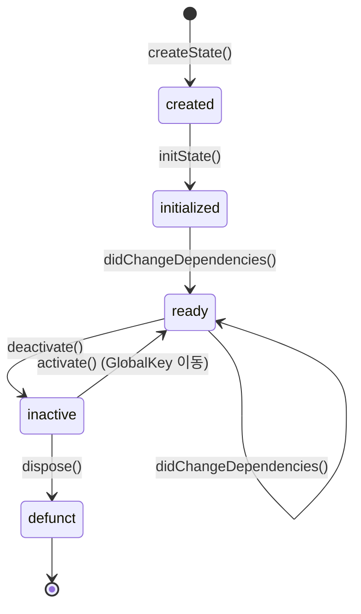

# Ch 05. 위젯의 본질 — 세 개의 트리

## 5.1 세 개의 트리 이해하기

Flutter는 화면을 그리기 위해 **세 개의 트리**를 유지한다:

```
Widget Tree          Element Tree         RenderObject Tree
(설계도)              (인스턴스 관리자)       (실제 렌더링)

Container ──────▶ ComponentElement        ╌╌╌ (없음)
  │                     │
  ├─ ColoredBox ───▶ RenderElement ──────▶ RenderDecoratedBox
  │                     │
  └─ Padding ──────▶ RenderElement ──────▶ RenderPadding
       │                │
       └─ Text ────▶ ComponentElement      ╌╌╌ (없음)
            │            │
            └─ ───▶ RenderElement ──────▶ RenderParagraph
```

### 다른 UI 프레임워크와 비교

| | React | SwiftUI | Android View | Flutter |
|--|-------|---------|-------------|---------|
| 선언적 UI | ✅ | ✅ | ❌ (명령형) | ✅ |
| 가상 DOM / 디핑 | Virtual DOM | AttributeGraph | — | **Element Tree** |
| 렌더링 단위 | DOM Node | UIView | View | **RenderObject** |
| 재사용 전략 | key + type | identity | id | **runtimeType + key** |
| 불변 설정 | JSX (불변) | ViewBody (불변) | — | **Widget (불변)** |

> **핵심**: Flutter의 Element Tree는 React의 Virtual DOM과 같은 역할을 한다. Widget은 React의 JSX처럼 불변 설정이고, Element가 실제 인스턴스를 관리한다.

---

## 5.2 Widget은 불변 설정이다

### 소스코드 분석: Widget 클래스

> 📁 `_sources/flutter/packages/flutter/lib/src/widgets/framework.dart`

```dart
/// Widgets are the central class hierarchy in the Flutter framework.
/// A widget is an immutable description of part of a user interface.
/// Widgets can be inflated into elements, which manage the underlying
/// render tree.
@immutable
abstract class Widget extends DiagnosticableTree {
  const Widget({this.key});

  final Key? key;

  /// Inflates this configuration to a concrete instance.
  @protected
  @factory
  Element createElement();

  /// ⭐ Widget 교체 여부를 결정하는 핵심 메서드
  static bool canUpdate(Widget oldWidget, Widget newWidget) {
    return oldWidget.runtimeType == newWidget.runtimeType
        && oldWidget.key == newWidget.key;
  }

  // ⭐ == 와 hashCode를 override 금지!
  @override
  @nonVirtual
  bool operator ==(Object other) => super == other;

  @override
  @nonVirtual
  int get hashCode => super.hashCode;
}
```

### 왜 Widget은 `@immutable`인가?

```dart
// Widget은 매 프레임마다 재생성될 수 있다
class MyWidget extends StatelessWidget {
  const MyWidget({super.key, required this.title});

  final String title;  // 반드시 final!

  @override
  Widget build(BuildContext context) {
    // build()는 매 프레임마다 호출될 수 있다
    // → Widget 객체가 매번 새로 생성된다
    // → 그러나 Element는 재사용된다!
    return Text(title);
  }
}
```

> **설계 의도**: Widget을 불변으로 만들면:
> 1. **비교가 단순해진다** — `runtimeType`과 `key`만 비교하면 충분
> 2. **부수효과가 없다** — Widget 생성이 안전 (UI 스레드에서 자유롭게 생성)
> 3. **const 최적화** — `const` Widget은 메모리에 하나만 존재

### `canUpdate` — Widget 재사용 판단

```dart
// canUpdate가 true: Element를 재사용하고 Widget만 교체
// canUpdate가 false: 기존 Element를 폐기하고 새 Element 생성

// 예시 1: canUpdate = true (같은 타입, key 없음)
Text('Hello')  →  Text('World')
// runtimeType: Text == Text ✅
// key: null == null ✅
// → Element 재사용, Text만 교체

// 예시 2: canUpdate = false (다른 타입)
Text('Hello')  →  Icon(Icons.star)
// runtimeType: Text != Icon ❌
// → 기존 Element 폐기, 새 Element 생성

// 예시 3: canUpdate = false (같은 타입이지만 다른 key)
Text('Hello', key: ValueKey('a'))  →  Text('World', key: ValueKey('b'))
// runtimeType: Text == Text ✅
// key: ValueKey('a') != ValueKey('b') ❌
// → 기존 Element 폐기, 새 Element 생성
```

---

## 5.3 StatefulWidget과 State 생명주기

### StatefulWidget은 State를 생성한다

```dart
abstract class StatefulWidget extends Widget {
  const StatefulWidget({super.key});

  @override
  StatefulElement createElement() => StatefulElement(this);

  // ⭐ 핵심: State 객체를 생성하는 팩토리 메서드
  @protected
  @factory
  State createState();
}
```

### State 생명주기



### `setState()`의 실체

```dart
// 소스코드에서 발견한 setState의 진짜 구현:
@protected
void setState(VoidCallback fn) {
  // 1. 콜백을 동기적으로 즉시 실행
  final Object? result = fn() as dynamic;

  // 2. async 금지! (Future 반환하면 에러)
  assert(() {
    if (result is Future) {
      throw FlutterError.fromParts([
        ErrorSummary('setState() callback argument returned a Future.'),
        // ...
      ]);
    }
    return true;
  }());

  // 3. 핵심: Element를 "dirty"로 마킹
  _element!.markNeedsBuild();
}
```

> **발견**: `setState()`는 매우 단순하다.
> 1. 전달받은 콜백을 **동기적으로 즉시 실행**
> 2. `_element!.markNeedsBuild()`를 호출하여 다음 프레임에 `build()` 재실행을 예약
> 3. `setState(() {})`처럼 빈 콜백을 넘겨도 동작한다 — 상태 변경이 아닌 **리빌드 예약이 핵심**

```dart
// ❌ 흔한 오해: setState 안에서 상태를 변경해야 한다?
setState(() {
  _counter++;  // 이것은 단순히 콜백의 편의
});

// ✅ 실제로는 이렇게 해도 동일하게 동작
_counter++;
setState(() {});  // 빈 콜백도 가능!

// 하지만 가독성과 의도 전달을 위해 콜백 안에서 변경하는 것을 권장
```

---

## 5.4 Element의 `updateChild` 결정 트리

### 소스코드 분석: updateChild

> 📁 `_sources/flutter/packages/flutter/lib/src/widgets/framework.dart` (line 3982)

```dart
Element? updateChild(Element? child, Widget? newWidget, Object? newSlot) {
  // Case 1: newWidget == null → 자식 제거
  if (newWidget == null) {
    if (child != null) {
      deactivateChild(child);
    }
    return null;
  }

  final Element newChild;
  if (child != null) {
    if (child.widget == newWidget) {
      // Case 2: 완전히 동일한 Widget 인스턴스 → 아무것도 안 함
      if (child.slot != newSlot) {
        updateSlotForChild(child, newSlot);
      }
      newChild = child;
    } else if (Widget.canUpdate(child.widget, newWidget)) {
      // Case 3: 같은 타입+key → Element 재사용, Widget만 교체
      child.update(newWidget);
      newChild = child;
    } else {
      // Case 4: 타입이나 key가 다름 → Element 폐기 후 새로 생성
      deactivateChild(child);
      newChild = inflateWidget(newWidget, newSlot);
    }
  } else {
    // Case 5: 기존 child 없음 → 새 Element 생성
    newChild = inflateWidget(newWidget, newSlot);
  }

  return newChild;
}
```

### `updateChild` 결정 트리 요약

```
updateChild(child, newWidget, newSlot)
│
├── newWidget == null?
│   ├── child != null → deactivateChild(child) → return null
│   └── child == null → return null
│
└── newWidget != null?
    ├── child == null → inflateWidget(newWidget) → return newChild
    │
    └── child != null?
        ├── child.widget == newWidget (동일 인스턴스)
        │   → return child (아무것도 안 함, const 최적화!)
        │
        ├── Widget.canUpdate(old, new) == true (같은 type+key)
        │   → child.update(newWidget) → return child
        │
        └── Widget.canUpdate(old, new) == false
            → deactivateChild(child)
            → inflateWidget(newWidget) → return newChild
```

> **핵심 발견**: `child.widget == newWidget`이 `true`인 경우 (동일 인스턴스) 아무 작업도 하지 않는다. 이것이 **`const` Widget의 성능 이점**이다. `const` Widget은 동일한 인스턴스가 재사용되므로 `updateChild`에서 즉시 반환된다.

---

## 5.5 RenderObject의 레이아웃과 페인트

> 📌 **더 깊이 알고 싶다면**: RenderObject를 직접 만들어야 하는 경우, `BoxConstraints` 프로토콜 심화, 커스텀 `RenderObjectWidget` 작성법 (Leaf/SingleChild/Multi 3가지 예제) 등은 [Ch08 — 레이아웃 시스템과 RenderObject](./ch08_layout_system.md)에서 상세히 다룬다.

### Layout Pipeline

```
markNeedsLayout()
      │
      ▼
Pipeline Owner가 등록
      │
      ▼
다음 프레임에 layout() 호출
      │
      ├── constraints가 변경되지 않았으면 → 건너뜀 (최적화!)
      │
      ├── sizedByParent == true
      │   → performResize() 먼저 실행
      │
      ▼
performLayout()
      │
      ├── 자식들에게 layout() 전달
      ├── 자신의 크기 결정
      │
      ▼
markNeedsPaint() ← layout 완료 후 자동 호출
      │
      ▼
paint(PaintingContext, Offset)
```

### 소스코드 분석: layout() 메서드

```dart
// RenderObject.layout() 핵심 로직 (단순화)
void layout(Constraints constraints, {bool parentUsesSize = false}) {
  // 1. Relayout boundary 결정
  _isRelayoutBoundary = !parentUsesSize
      || sizedByParent
      || constraints.isTight
      || parent == null;

  // 2. 이미 레이아웃되었고 constraints가 같으면 → 건너뜀!
  if (!_needsLayout && constraints == _constraints) {
    return;  // ⭐ 핵심 최적화!
  }

  _constraints = constraints;

  // 3. sizedByParent가 true면 크기를 먼저 결정
  if (sizedByParent) {
    performResize();
  }

  // 4. 실제 레이아웃 실행
  performLayout();

  _needsLayout = false;
  markNeedsPaint();  // 레이아웃 후 페인팅 필요 표시
}
```

### Relayout Boundary — 레이아웃 최적화의 핵심

```dart
// _isRelayoutBoundary가 true가 되는 조건:
_isRelayoutBoundary = !parentUsesSize    // 부모가 자식 크기를 사용하지 않음
    || sizedByParent                     // 크기가 constraints에 의해서만 결정됨
    || constraints.isTight               // constraints가 고정 크기
    || parent == null;                   // 루트 노드
```

> **발견**: `SizedBox(width: 100, height: 100, child: ...)` 같은 위젯은 tight constraints를 제공하므로 자식이 relayout boundary가 된다. 자식의 레이아웃이 변경되어도 `SizedBox` 위로 전파되지 않는다. 이것이 **레이아웃 최적화의 핵심 메커니즘**이다.

### RepaintBoundary — 페인팅 최적화

```dart
// RepaintBoundary: 자식의 repaint가 부모까지 전파되지 않게 한다
class RepaintBoundary extends SingleChildRenderObjectWidget {
  const RepaintBoundary({super.key, super.child});

  @override
  RenderRepaintBoundary createRenderObject(BuildContext context) {
    return RenderRepaintBoundary();
  }
}

// 사용 예: 스크롤 가능한 리스트
ListView.builder(
  // ListView 내부에서 RepaintBoundary를 자동으로 추가한다
  // → 개별 아이템이 repaint되어도 다른 아이템에 영향 없음
  itemBuilder: (context, index) => ListTile(...),
)
```

---

## 5.6 Key의 역할과 종류

### Key가 필요한 이유

```dart
// Key가 없으면 → runtimeType만으로 비교
// 리스트에서 항목 순서가 바뀌면 → 잘못된 Element에 Widget이 매핑된다!

// ❌ Key 없이: 색상 타일을 재정렬하면 색상은 바뀌지만 State는 안 바뀜
Column(children: [
  ColorTile(color: Colors.red),     // Element[0]에 맵핑
  ColorTile(color: Colors.blue),    // Element[1]에 맵핑
]);
// 순서를 바꾸면:
Column(children: [
  ColorTile(color: Colors.blue),    // Element[0]에 맵핑 (기존 red의 State!)
  ColorTile(color: Colors.red),     // Element[1]에 맵핑 (기존 blue의 State!)
]);

// ✅ Key 사용: 올바르게 매핑
Column(children: [
  ColorTile(key: ValueKey('red'), color: Colors.red),
  ColorTile(key: ValueKey('blue'), color: Colors.blue),
]);
```

### Key의 종류

| Key 타입 | 용도 | 비교 방식 |
|---------|------|----------|
| `ValueKey<T>` | 값 기반 식별 | `value == other.value` |
| `ObjectKey` | 인스턴스 기반 식별 | `identical(value, other.value)` |
| `UniqueKey` | 항상 고유 | 인스턴스 자체 (== override 없음) |
| `GlobalKey` | 트리 전체에서 고유 + State 접근 | 인스턴스 자체 |

### `updateChildren` — 리스트 디핑 알고리즘

> 📁 `_sources/flutter/packages/flutter/lib/src/widgets/framework.dart` (line 4125)

```
Flutter의 리스트 비교 알고리즘:

1. ↓ 위에서부터 스캔: canUpdate가 true인 동안 업데이트
   [A, B, C, D, E]  →  [A, B, F, D, E]
    ✅ ✅  ↓              ✅ ✅  ↓

2. ↑ 아래에서부터 스캔: canUpdate가 true인 동안
   [A, B, C, D, E]  →  [A, B, F, D, E]
              ✅ ✅              ✅ ✅

3. 마 중간 부분: Key 기반 매칭
   old: [C]  →  new: [F]
   C는 deactivate, F는 inflate

→ O(N) 시간복잡도 (React의 O(N)과 동일 수준)
```

---

## 5.7 InheritedWidget의 동작 원리

### `of(context)` 패턴의 비밀

```dart
// Theme.of(context)가 실제로 하는 일:
static ThemeData of(BuildContext context) {
  final _InheritedTheme? inheritedTheme =
      context.dependOnInheritedWidgetOfExactType<_InheritedTheme>();
  return inheritedTheme?.theme.data ?? ThemeData.fallback();
}
```

### InheritedWidget은 O(1)로 찾는다

```dart
// Element 내부에서 InheritedWidget을 찾는 방법:
// HashMap으로 타입별 InheritedElement를 저장!
Map<Type, InheritedElement>? _inheritedElements;

// → O(1) 조회! 트리를 위로 올라가며 찾는 것이 아니다
T? dependOnInheritedWidgetOfExactType<T extends InheritedWidget>() {
  final InheritedElement? ancestor = _inheritedElements?[T];
  if (ancestor != null) {
    return dependOnInheritedElement(ancestor) as T;
  }
  return null;
}
```

> **발견**: `Theme.of(context)`, `MediaQuery.of(context)` 등은 트리를 순회하지 않는다. 각 Element가 **HashMap**으로 상위의 InheritedElement 참조를 캐시하고 있어 **O(1)**으로 접근한다. 이것이 Flutter에서 InheritedWidget 조회가 빠른 이유다.

### 의존성 등록과 리빌드

```dart
// dependOnInheritedWidgetOfExactType은 "의존성"을 등록한다
// → InheritedWidget이 변경되면 의존하는 모든 Element가 리빌드된다

// 이것이 context.watch()의 원리이고,
// 불필요한 리빌드를 줄이려면 위젯을 분리해야 하는 이유다

// ❌ Bad: 전체 위젯이 Theme 변경 시 리빌드
class BigWidget extends StatelessWidget {
  @override
  Widget build(BuildContext context) {
    final theme = Theme.of(context);  // 의존성 등록!
    return Column(
      children: [
        // theme을 사용하지 않는 무거운 위젯들도 함께 리빌드된다!
        HeavyWidget1(),
        HeavyWidget2(),
        Text('themed', style: theme.textTheme.titleLarge),
      ],
    );
  }
}

// ✅ Good: theme을 사용하는 부분만 분리
class BigWidget extends StatelessWidget {
  @override
  Widget build(BuildContext context) {
    return Column(
      children: [
        const HeavyWidget1(),  // const → 리빌드 스킵
        const HeavyWidget2(),  // const → 리빌드 스킵
        ThemedText(),           // 이것만 Theme에 의존
      ],
    );
  }
}
```

---

## 5.8 안티패턴

### 1. build()에서 무거운 객체 생성

```dart
// ❌ Bad: build()마다 컨트롤러 생성
class _MyState extends State<MyWidget> {
  @override
  Widget build(BuildContext context) {
    final controller = TextEditingController();  // 매 빌드마다 생성!
    return TextField(controller: controller);
  }
}

// ✅ Good: initState()에서 한 번 생성
class _MyState extends State<MyWidget> {
  late final TextEditingController _controller;

  @override
  void initState() {
    super.initState();
    _controller = TextEditingController();
  }

  @override
  void dispose() {
    _controller.dispose();
    super.dispose();
  }

  @override
  Widget build(BuildContext context) {
    return TextField(controller: _controller);
  }
}
```

### 2. 불필요한 setState 범위

```dart
// ❌ Bad: 상위 위젯에서 setState → 전체 서브트리 리빌드
class _ParentState extends State<Parent> {
  int _counter = 0;

  @override
  Widget build(BuildContext context) {
    return Column(
      children: [
        const ExpensiveHeader(),  // 이것도 리빌드된다!
        const ExpensiveList(),    // 이것도 리빌드된다!
        Text('$_counter'),       // 이것만 바꾸면 되는데...
        ElevatedButton(
          onPressed: () => setState(() => _counter++),
          child: const Text('Increment'),
        ),
      ],
    );
  }
}

// ✅ Good: 카운터만 분리된 위젯으로
class CounterDisplay extends StatefulWidget { /* ... */ }
// 또는 ValueListenableBuilder 사용
```

### 3. GlobalKey 남용

```dart
// ❌ Bad: GlobalKey를 build()에서 생성
Widget build(BuildContext context) {
  return Form(
    key: GlobalKey<FormState>(),  // 매 빌드마다 새 Key!
    child: /* ... */,
  );
}

// ✅ Good: State의 필드로 선언
class _MyState extends State<MyWidget> {
  final _formKey = GlobalKey<FormState>();

  @override
  Widget build(BuildContext context) {
    return Form(key: _formKey, child: /* ... */);
  }
}
```

### 4. 리스트에서 Key 미사용

```dart
// ❌ Bad: StatefulWidget 리스트에서 Key 없음
ListView(
  children: items.map((item) => TodoTile(item: item)).toList(),
);
// 항목 순서가 바뀌면 State가 잘못 매핑된다!

// ✅ Good: 고유한 Key 사용
ListView(
  children: items.map((item) => TodoTile(
    key: ValueKey(item.id),
    item: item,
  )).toList(),
);
```

---

## 5.9 실무 패턴

### 성능 최적화 체크리스트

```dart
// 1. const Widget 최대한 활용
const SizedBox(height: 16),  // ✅ 인스턴스 재사용

// 2. RepaintBoundary로 페인트 범위 제한
RepaintBoundary(
  child: ComplexAnimation(),  // 이 안의 repaint가 바깥으로 전파되지 않는다
),

// 3. Builder 패턴으로 context 범위 최소화
Builder(builder: (context) {
  // 이 context에서만 InheritedWidget에 의존
  final theme = Theme.of(context);
  return Text('styled', style: theme.textTheme.bodyLarge);
}),

// 4. ListView.builder → lazy 생성
ListView.builder(
  itemCount: 10000,  // 10000개지만 화면에 보이는 것만 생성
  itemBuilder: (context, index) => ListTile(title: Text('Item $index')),
),
```

### Flutter DevTools로 리빌드 확인

```
Flutter DevTools > Performance > Widget rebuild counts
→ 어떤 위젯이 얼마나 자주 리빌드되는지 확인
→ 불필요한 리빌드가 있다면 const, Builder 분리, Selector 등으로 최적화
```

---

## 5.10 면접 Q&A

### Q1. Flutter의 세 개의 트리를 설명하세요.

**모범 답변**: Flutter는 Widget Tree, Element Tree, RenderObject Tree 세 개를 유지한다. **Widget**은 불변(immutable)의 설정 객체로, UI의 "설계도"다. 매 프레임마다 새로 생성될 수 있다. **Element**는 Widget과 RenderObject를 중개하는 "인스턴스 관리자"로, Widget이 재생성되어도 Element는 재사용된다. `canUpdate`(runtimeType + key 비교)를 통해 기존 Element를 업데이트할지, 새로 만들지 결정한다. **RenderObject**는 실제 레이아웃(크기/위치 계산)과 페인팅(화면 그리기)을 담당한다. 모든 Widget이 RenderObject를 갖는 것은 아니며, `Container`처럼 다른 Widget을 조합하는 Widget은 RenderObject 없이 Element만 가진다.

### Q2. `setState()`는 내부적으로 무엇을 하나요?

**모범 답변**: `setState()`는 매우 단순하다. 소스코드를 보면, 전달받은 콜백을 **동기적으로 즉시 실행**하고, 그 다음 `_element!.markNeedsBuild()`를 호출한다. `markNeedsBuild()`는 해당 Element를 "dirty"로 표시하여 다음 프레임의 빌드 단계에서 `build()` 메서드가 다시 호출되도록 예약한다. 중요한 점은 `setState`의 핵심이 "상태 변경"이 아닌 **"리빌드 예약"**이라는 것이다. 실제로 `setState(() {})`처럼 빈 콜백을 넘겨도 리빌드가 발생한다. 콜백 안에서 상태를 변경하는 것은 가독성을 위한 관례다.

### Q3. `const` Widget이 성능에 좋은 이유를 내부 구현 측면에서 설명하세요.

**모범 답변**: `const` Widget은 **컴파일 타임에 단일 인스턴스로 정규화(canonicalization)**된다. 이로 인해 `updateChild`에서 `child.widget == newWidget` 비교가 `true`가 되어 **어떤 비교나 업데이트 작업도 수행하지 않고 즉시 반환**한다. `const`가 아닌 Widget은 설령 모든 프로퍼티가 같더라도 `==`가 identity 비교이므로 매번 새 인스턴스로 취급되어 `canUpdate` → `update()`의 전체 경로를 거친다. 따라서 `const`Widget을 사용하면 `updateChild`의 가장 빠른 경로를 타게 되어 리빌드 비용이 극적으로 줄어든다.

### Q4. InheritedWidget의 조회가 O(1)인 이유는?

**모범 답변**: 각 Element는 `_inheritedElements`라는 `HashMap<Type, InheritedElement>`을 유지한다. Element가 mount될 때 부모의 HashMap을 복사하고, InheritedElement는 자신을 이 HashMap에 추가한다. 따라서 `dependOnInheritedWidgetOfExactType<T>()`를 호출하면 트리를 순회하는 것이 아니라 HashMap에서 타입 `T`로 직접 조회한다. 이것이 `Theme.of(context)`, `MediaQuery.of(context)` 등이 빠른 이유다. 다만, 이 메서드는 호출한 Element를 InheritedElement의 의존자로 등록하므로, InheritedWidget이 변경되면 등록된 모든 Element가 리빌드된다.

---

## 5.11 핵심 정리

| 개념 | 핵심 포인트 |
|------|-------------|
| Widget | 불변 설정 객체. `@immutable`. 매 프레임 재생성 가능 |
| Element | Widget과 RenderObject의 중개자. 재사용됨 |
| RenderObject | 실제 layout + paint 담당 |
| `canUpdate` | `runtimeType == runtimeType && key == key` |
| `updateChild` | 5가지 분기: null/동일 인스턴스/update/inflate/deactivate |
| `setState` | 콜백 즉시 실행 + `markNeedsBuild()` |
| `const` Widget | `updateChild`에서 즉시 반환 (최적화 최고 경로) |
| Key | 리스트에서 StatefulWidget 식별에 필수 |
| InheritedWidget | HashMap으로 O(1) 조회. 의존자 자동 리빌드 |
| RelayoutBoundary | layout 전파 차단. tight constraints가 핵심 |
| RepaintBoundary | paint 전파 차단. 복잡한 애니메이션에 유용 |
