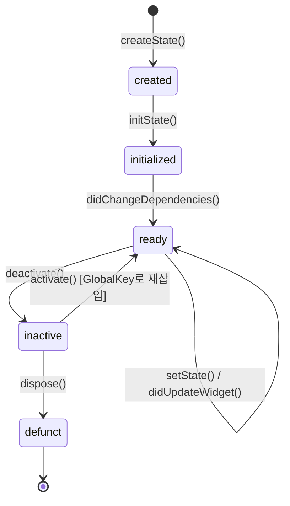
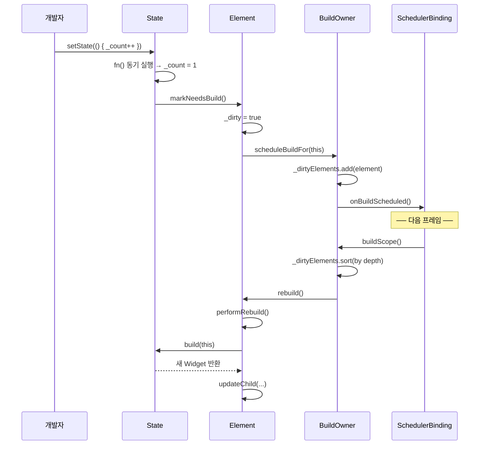

# Ch 06. State와 생명주기 — 소스코드로 읽는 StatefulWidget의 일생

> 📁 분석 대상: `_sources/flutter/packages/flutter/lib/src/widgets/framework.dart`
> 📌 버전: Flutter 3.41.1

---

## 6.1 State 생명주기 전체 그림

### `_StateLifecycle` 열거형

프레임워크는 State 객체의 현재 상태를 `_StateLifecycle`로 추적한다:

```dart
// framework.dart L804-820
enum _StateLifecycle {
  created,      // createState() 직후, initState() 호출 시점
  initialized,  // initState() 완료, didChangeDependencies() 호출 시점
  ready,        // 정상 상태 — build() 가능
  defunct,      // dispose() 완료 — 더 이상 build 불가
}
```

### 생명주기 흐름도



### 전체 콜백 호출 순서

```
┌─ 1. createState()           Widget이 처음 inflate될 때
│   └── _StateLifecycle.created
│
├─ 2. initState()             최초 1회. 여기서 구독 시작
│   └── _StateLifecycle.initialized
│
├─ 3. didChangeDependencies() initState 직후 + InheritedWidget 변경 시
│   └── _StateLifecycle.ready
│
├─ 4. build()                 UI 반환. 프레임마다 호출 가능
│
├─ 5. didUpdateWidget()       부모가 같은 타입의 새 위젯으로 리빌드 시
│   └── → build() 자동 호출 (setState 불필요)
│
├─ 6. setState()              내부 상태 변경 → markNeedsBuild()
│   └── → 다음 빌드 페이즈에서 build() 호출
│
├─ 7. deactivate()            트리에서 제거 시 (재삽입 가능)
│
├─ 8. activate()              GlobalKey로 다른 위치에 재삽입 시
│   └── → markNeedsBuild() → build()
│
├─ 9. dispose()               프레임 끝까지 재삽입 안 되면 호출
│   └── _StateLifecycle.defunct
│
└─ 10. (GC)                   State 객체 수거
```

---

## 6.2 StatefulElement의 내부 동작

### StatefulElement 생성자 — State와의 결합

```dart
// framework.dart L5903-5931
class StatefulElement extends ComponentElement {
  StatefulElement(StatefulWidget widget)
    : _state = widget.createState(),  // ← 여기서 State 탄생!
      super(widget) {
    // 타입 검증: State<T>의 T와 Widget 타입 일치 확인
    assert(state._debugTypesAreRight(widget));
    
    // 핵심: State ↔ Element 양방향 연결
    state._element = this;   // State.context가 가능해지는 이유
    state._widget = widget;  // State.widget이 가능해지는 이유
  }
```

> 💡 **설계 포인트**: `createState()`는 생성자에서 호출된다. 따라서 `StatefulWidget` 인스턴스당 1개의 State가 생기는 것이 아니라, **`StatefulElement` 인스턴스당 1개**의 State가 생깁니다. 같은 `StatefulWidget` 인스턴스가 트리의 두 곳에 있으면 State도 2개이다.

### `_firstBuild()` — 초기화의 심장

```dart
// framework.dart L5950-5977
@override
void _firstBuild() {
  // ① initState 호출 — 반환값이 Future면 에러!
  assert(state._debugLifecycleState == _StateLifecycle.created);
  final Object? debugCheckForReturnedFuture = state.initState() as dynamic;
  assert(() {
    if (debugCheckForReturnedFuture is Future) {
      throw FlutterError.fromParts([
        ErrorSummary('${state.runtimeType}.initState() returned a Future.'),
        ErrorDescription('State.initState() must be a void method without '
                         'an `async` keyword.'),
      ]);
    }
    return true;
  }());
  
  // ② 상태 전이: created → initialized
  assert(() {
    state._debugLifecycleState = _StateLifecycle.initialized;
    return true;
  }());
  
  // ③ didChangeDependencies 즉시 호출
  state.didChangeDependencies();
  
  // ④ 상태 전이: initialized → ready
  assert(() {
    state._debugLifecycleState = _StateLifecycle.ready;
    return true;
  }());
  
  // ⑤ 부모의 _firstBuild() → performRebuild() → build()
  super._firstBuild();
}
```

이 코드에서 두 가지 중요한 사실을 알 수 있다:

1. **`initState()`를 `async`로 선언하면 에러** — `as dynamic`으로 캐스팅 후 Future 여부를 확인한다
2. **`didChangeDependencies()`는 `initState()` 직후 무조건 호출** — `InheritedWidget` 변경이 아니라 초기화 과정의 일부이다

### `initState()`에서 `dependOnInheritedWidgetOfExactType()`을 못 쓰는 이유

```dart
// framework.dart L6052-6074 — StatefulElement.dependOnInheritedElement()
@override
InheritedWidget dependOnInheritedElement(Element ancestor, {Object? aspect}) {
  assert(() {
    if (state._debugLifecycleState == _StateLifecycle.created) {
      throw FlutterError.fromParts([
        ErrorSummary(
          'dependOnInheritedWidgetOfExactType<$targetType>() or '
          'dependOnInheritedElement() was called before '
          '${state.runtimeType}.initState() completed.',
        ),
        ErrorHint(
          'Typically references to inherited widgets should occur '
          'in widget build() methods. Alternatively, initialization '
          'based on inherited widgets can be placed in the '
          'didChangeDependencies method...',
        ),
      ]);
    }
    return true;
  }());
  return super.dependOnInheritedElement(...);
}
```

> 📌 **핵심**: `initState()` 시점은 `_StateLifecycle.created`이다. `dependOnInheritedElement()`는 이 상태를 감지하고 즉시 에러를 던집니다. `didChangeDependencies()`는 `initialized` 이후에 호출되므로 안전하다.

**결론**: `InheritedWidget`에 의존하는 초기화 로직은 반드시 `didChangeDependencies()`에 넣어야 한다.

```dart
// ✅ 올바른 패턴
@override
void didChangeDependencies() {
  super.didChangeDependencies();
  final theme = Theme.of(context);  // 여기서는 OK
  _setupBasedOnTheme(theme);
}

// ❌ 잘못된 패턴
@override
void initState() {
  super.initState();
  final theme = Theme.of(context);  // 💥 FlutterError!
}
```

---

## 6.3 `setState()`의 전체 경로 추적

### `setState()` 소스코드

```dart
// framework.dart L1160-1219 — State.setState()
@protected
void setState(VoidCallback fn) {
  // ❶ dispose 후 호출 방지
  assert(() {
    if (_debugLifecycleState == _StateLifecycle.defunct) {
      throw FlutterError.fromParts([
        ErrorSummary('setState() called after dispose(): $this'),
        ErrorHint(
          'The preferred solution is to cancel the timer or stop '
          'listening to the animation in the dispose() callback. '
          'Another solution is to check the "mounted" property...',
        ),
      ]);
    }
    return true;
  }());
  
  // ❷ 콜백 즉시 동기 실행
  final Object? result = fn() as dynamic;
  
  // ❸ async 콜백 검출
  assert(() {
    if (result is Future) {
      throw FlutterError.fromParts([
        ErrorSummary('setState() callback argument returned a Future.'),
        ErrorHint(
          'Instead of performing asynchronous work inside a call to '
          'setState(), first execute the work (without updating the '
          'widget state), and then synchronously update the state '
          'inside a call to setState().',
        ),
      ]);
    }
    return true;
  }());
  
  // ❹ Element를 dirty로 마킹
  _element!.markNeedsBuild();
}
```

### `setState()` 설계 비화 💡

setState의 원래 이름이 `markNeedsBuild`였다는 것을 소스코드 주석에서 확인할 수 있다:

```
// framework.dart L1115-1133 — State.setState() 주석
//
// Design discussion:
// The original version of this API was a method called `markNeedsBuild`,
// for consistency with RenderObject.markNeedsLayout, etc.
//
// However, early user testing of the Flutter framework revealed that
// people would call markNeedsBuild() much more often than necessary.
// Essentially, people used it like a good luck charm, any time they
// weren't sure if they needed to call it, they would call it, just in case.
//
// When the API was changed to take a callback instead, this practice
// was greatly reduced.
```

> 💡 개발자가 "혹시 몰라서" 남발하는 걸 막기 위해 콜백을 요구하도록 API를 바꿨다. 콜백 안에서 실제 상태 변경을 하게 만들면 개발자가 "뭘 바꾸는지" 생각하게 된다.

### `markNeedsBuild()` — Dirty 리스트에 등록

```dart
// framework.dart L5342-5394 — Element.markNeedsBuild()
void markNeedsBuild() {
  assert(_lifecycleState != _ElementLifecycle.defunct);
  
  // inactive 상태면 무시 (트리에서 제거된 상태)
  if (_lifecycleState != _ElementLifecycle.active) {
    return;
  }
  
  // 빌드 중 setState 호출 검증
  // → 자기 자손은 OK, 형제/조상은 에러
  assert(() {
    if (owner!._debugBuilding) {
      if (_debugIsDescendantOf(owner!._debugCurrentBuildTarget!)) {
        return true;  // 자손이면 허용
      }
      throw FlutterError.fromParts([
        ErrorSummary('setState() or markNeedsBuild() called during build.'),
      ]);
    }
    return true;
  }());
  
  // 이미 dirty면 중복 등록 방지 (멱등성)
  if (dirty) {
    return;
  }
  
  _dirty = true;
  owner!.scheduleBuildFor(this);  // BuildOwner의 _dirtyElements 리스트에 추가
}
```

### setState → build() 전체 경로



> 📌 **핵심**: `setState()`는 동기이다. 콜백도 즉시 동기로 실행된다. 하지만 `build()`는 **다음 프레임**에서 일어납니다. `markNeedsBuild()`는 Element를 "dirty 리스트"에 등록만 하고, 실제 빌드는 `SchedulerBinding`이 다음 VSync에서 `buildScope()`를 호출할 때 수행된다.

---

## 6.4 위젯 갱신 (`didUpdateWidget`)

### `StatefulElement.update()` — 부모가 리빌드할 때

```dart
// framework.dart L5988-6011
@override
void update(StatefulWidget newWidget) {
  super.update(newWidget);
  assert(widget == newWidget);
  
  // ① State의 widget 참조를 새 위젯으로 교체
  final StatefulWidget oldWidget = state._widget!;
  state._widget = widget as StatefulWidget;
  
  // ② didUpdateWidget 호출 (async 금지!)
  final Object? debugCheckForReturnedFuture =
      state.didUpdateWidget(oldWidget) as dynamic;
  assert(() {
    if (debugCheckForReturnedFuture is Future) {
      throw FlutterError.fromParts([
        ErrorSummary(
          '${state.runtimeType}.didUpdateWidget() returned a Future.'),
      ]);
    }
    return true;
  }());
  
  // ③ 강제 리빌드 예약
  rebuild(force: true);
}
```

> 💡 `didUpdateWidget` 후에 `rebuild(force: true)`가 자동으로 호출되므로, `didUpdateWidget` 안에서 `setState`를 부르는 것은 불필요하다. 소스코드 주석에도 "any calls to setState in didUpdateWidget are redundant"라고 명시되어 있다.

### 언제 `didUpdateWidget`이 호출되나?

```
부모 build() 실행
  ↓
updateChild(existingElement, newWidget, slot)
  ↓
Widget.canUpdate(oldWidget, newWidget)?
  ├── runtimeType 동일 AND key 동일 → ✅ update()
  │     ↓
  │   StatefulElement.update(newWidget)
  │     ↓
  │   state.didUpdateWidget(oldWidget)  ← 이 시점!
  │     ↓
  │   rebuild(force: true) → build()
  │
  └── 다르다 → ❌ deactivateChild + inflateWidget
        ↓
      새 StatefulElement 생성 → createState() → initState() ...
```

### didUpdateWidget 실무 패턴

```dart
class _PlayerState extends State<AudioPlayer> {
  late AudioController _controller;
  
  @override
  void initState() {
    super.initState();
    _controller = AudioController(widget.url);
  }
  
  @override
  void didUpdateWidget(AudioPlayer oldWidget) {
    super.didUpdateWidget(oldWidget);
    // URL이 바뀌었을 때만 컨트롤러 재생성
    if (widget.url != oldWidget.url) {
      _controller.dispose();
      _controller = AudioController(widget.url);
    }
  }
  
  @override
  void dispose() {
    _controller.dispose();
    super.dispose();
  }
}
```

---

## 6.5 Deactivate / Activate / Dispose

### `deactivate()` — 트리에서 제거

```dart
// framework.dart L6024-6028
@override
void deactivate() {
  state.deactivate();   // State.deactivate() 먼저
  super.deactivate();   // Element.deactivate() (조상→자손 순서)
}
```

### `activate()` — GlobalKey로 재삽입

```dart
// framework.dart L6013-6022
@override
void activate() {
  super.activate();      // Element.activate() 먼저
  state.activate();      // State.activate() 호출
  
  // 핵심: deactivate 중 해제한 리소스를 재할당하도록
  // 리빌드를 예약한다
  assert(_lifecycleState == _ElementLifecycle.active);
  markNeedsBuild();  // → build() 다시 호출됨
}
```

### `unmount()` — 최종 해제

```dart
// framework.dart L6030-6050
@override
void unmount() {
  super.unmount();
  state.dispose();  // ← 여기서 State.dispose() 호출
  
  // dispose에서 super.dispose()를 안 불렀으면 에러 (defunct 상태가 아니므로)
  assert(() {
    if (state._debugLifecycleState == _StateLifecycle.defunct) {
      return true;
    }
    throw FlutterError.fromParts([
      ErrorSummary(
        '${state.runtimeType}.dispose failed to call super.dispose.'),
    ]);
  }());
  
  // 참조 끊기 — 메모리 누수 방지
  state._element = null;
  _state = null;
}
```

### deactivate vs dispose

| | `deactivate()` | `dispose()` |
|------|----------------|-------------|
| **시점** | 트리에서 제거 직후 | 프레임 끝, 재삽입 안 됨 확정 |
| **재삽입 가능** | ✅ (GlobalKey) | ❌ |
| **`mounted`** | 아직 true | false (이후) |
| **용도** | 조상과의 링크 해제 | 리소스 최종 해제 |
| **호출 주체** | `Element.deactivate()` | `Element.unmount()` |

### GlobalKey 재삽입 시나리오

```dart
// 부모가 리빌드하면서 MyWidget의 위치를 바꿈
// GlobalKey 덕분에 State가 보존됨

Widget build(BuildContext context) {
  final child = MyWidget(key: _globalKey, data: _data);
  
  if (_showOnLeft) {
    return Row(children: [child, OtherWidget()]);
  } else {
    return Row(children: [OtherWidget(), child]);  // 위치 변경!
  }
}
```

이때 내부적으로:
```
1. 기존 위치에서 deactivate()    ← State.deactivate() 호출
2. 새 위치에서 activate()        ← State.activate() 호출
3. markNeedsBuild()              ← 리빌드 예약
4. build()                       ← State.build() 다시 호출
```

> 💡 `deactivate()`에서 리소스를 해제하고 `activate()`에서 재획득하는 패턴이 가능하기 때문에, **비용이 큰 리소스는 `deactivate`에서 해제하고 `activate`에서 재설정**하는 것이 좋다.

---

## 6.6 `didChangeDependencies` 최적화

### `performRebuild()`의 비밀

```dart
// framework.dart L5979-5986 — StatefulElement.performRebuild()
@override
void performRebuild() {
  if (_didChangeDependencies) {
    state.didChangeDependencies();
    _didChangeDependencies = false;
  }
  super.performRebuild();  // → build()
}
```

```dart
// framework.dart L6108-6123
// _didChangeDependencies 플래그 — 불필요한 호출 방지
bool _didChangeDependencies = false;

@override
void didChangeDependencies() {
  super.didChangeDependencies();
  _didChangeDependencies = true;  // 플래그만 켜고, 즉시 호출 X
}
```

> 💡 **최적화**: `InheritedWidget`이 변경되면 `_didChangeDependencies = true`만 설정한다. 실제 `State.didChangeDependencies()`는 **`performRebuild()` 시점**에 호출된다. 이는 위젯이 트리에서 빠져나간 경우 불필요한 `didChangeDependencies` 호출을 막기 위한 설계이다:

```
// framework.dart L6108-6116 주석:
// This controls whether we should call State.didChangeDependencies
// from the start of build, to avoid calls when the State will not
// get built. This can happen when the widget has dropped out of the
// tree, but depends on an InheritedWidget that is still in the tree.
```

---

## 6.7 `build()`가 State에 있는 이유

소스코드 주석에서 세 가지 이유를 밝히고 있다:

### 이유 1: 서브클래싱 유연성

```dart
// framework.dart L1379-1396 주석 발췌
//
// AnimatedWidget은 StatefulWidget의 서브클래스인데,
// build(BuildContext context)를 자체적으로 정의한다.
// 만약 build가 StatefulWidget에 있었다면,
// AnimatedWidget은 서브클래스에 State를 노출해야 했을 것이다.
//
// 개념적으로 StatelessWidget도 StatefulWidget의 서브클래스로
// 구현할 수 있어야 하는데, build가 StatefulWidget에 있으면
// 이것도 불가능해집니다.
```

### 이유 2: 클로저의 `this` 캡처 문제

```dart
// WRONG — build가 StatefulWidget에 있다고 가정
class MyButton extends StatefulWidgetX {
  final Color color;
  
  Widget build(BuildContext context, State state) {
    return SpecialWidget(
      handler: () { print('color: $color'); },
      // ↑ 클로저가 Widget(불변)을 캡처 → 부모 리빌드 후에도 옛 값 참조
    );
  }
}
```

```dart
// CORRECT — build가 State에 있음
class MyButtonState extends State<MyButton> {
  Widget build(BuildContext context) {
    return SpecialWidget(
      handler: () { print('color: ${widget.color}'); },
      // ↑ 클로저가 State(가변)를 캡처 → widget 프로퍼티는 항상 최신
    );
  }
}
```

### 이유 3: StatefulElement.build()의 단순함

```dart
// framework.dart L5933-5934
@override
Widget build() => state.build(this);
// StatefulElement는 build를 State에 위임할 뿐!
```

---

## 6.8 실전 생명주기 패턴

### Pattern 1: 구독/해제

```dart
class _MyWidgetState extends State<MyWidget> {
  late StreamSubscription _sub;
  
  @override
  void initState() {
    super.initState();
    _sub = widget.stream.listen(_onData);  // 구독 시작
  }
  
  @override
  void didUpdateWidget(MyWidget oldWidget) {
    super.didUpdateWidget(oldWidget);
    if (widget.stream != oldWidget.stream) {
      _sub.cancel();                         // 기존 구독 해제
      _sub = widget.stream.listen(_onData);  // 새 구독 시작
    }
  }
  
  @override
  void dispose() {
    _sub.cancel();  // 최종 해제
    super.dispose();
  }
  
  void _onData(dynamic data) {
    if (!mounted) return;  // Safety check
    setState(() { /* 상태 갱신 */ });
  }
}
```

### Pattern 2: 안전한 비동기 초기화

```dart
@override
void initState() {
  super.initState();
  // initState는 async 금지 → 별도 메서드 호출
  _loadData();
}

Future<void> _loadData() async {
  final data = await repository.fetchData();
  if (!mounted) return;  // dispose 후 setState 방지
  setState(() {
    _data = data;
  });
}
```

### Pattern 3: AnimationController

```dart
class _AnimatedBoxState extends State<AnimatedBox>
    with SingleTickerProviderStateMixin {
  late AnimationController _controller;
  
  @override
  void initState() {
    super.initState();
    _controller = AnimationController(
      vsync: this,       // TickerProvider = this
      duration: widget.duration,
    )..forward();
  }
  
  @override
  void didUpdateWidget(AnimatedBox oldWidget) {
    super.didUpdateWidget(oldWidget);
    if (widget.duration != oldWidget.duration) {
      _controller.duration = widget.duration;
    }
  }
  
  @override
  void dispose() {
    _controller.dispose();  // ⚠️ 반드시 해제!
    super.dispose();
  }
}
```

### Pattern 4: ScrollController와 FocusNode

```dart
class _FormScreenState extends State<FormScreen> {
  final _scrollController = ScrollController();
  final _focusNode = FocusNode();
  
  @override
  void initState() {
    super.initState();
    _scrollController.addListener(_onScroll);
  }
  
  @override
  void dispose() {
    // Controller를 위젯 내부에서 생성했으면 반드시 dispose
    _scrollController.removeListener(_onScroll);
    _scrollController.dispose();
    _focusNode.dispose();
    super.dispose();
  }
  
  void _onScroll() {
    // mounted 체크는 동기 리스너에서는 불필요
    // (dispose 시 removeListener로 해제하므로)
  }
}
```

---

## 6.9 흔한 실수와 디버깅

### 실수 1: `setState()` 후 즉시 값 확인

```dart
// ❌ 잘못
void _increment() {
  setState(() { _count++; });
  print('count: $_count');  // 이건 동작함! (동기이므로)
  
  // 하지만 UI는 아직 반영 안 됨 (다음 프레임)
  // Element의 build()는 아직 호출되지 않음
}
```

> `setState`의 콜백은 동기이므로 `_count`는 즉시 바뀝니다. 하지만 **UI 반영**은 다음 프레임이다.

### 실수 2: `dispose()` 후 `setState()`

```dart
// ❌ 크래시
Future<void> _fetchData() async {
  final data = await api.fetch();
  setState(() { _data = data; });  // Widget이 사라진 후 호출 → 에러!
}

// ✅ 수정
Future<void> _fetchData() async {
  final data = await api.fetch();
  if (!mounted) return;           // 안전 장치
  setState(() { _data = data; });
}
```

### 실수 3: `initState()`에서 `MediaQuery` 사용

```dart
// ❌ 에러
@override
void initState() {
  super.initState();
  final width = MediaQuery.of(context).size.width;  // 💥
}

// ✅ didChangeDependencies 사용
@override
void didChangeDependencies() {
  super.didChangeDependencies();
  final width = MediaQuery.of(context).size.width;  // ✅
}
```

### 실수 4: `dispose()`에서 `super.dispose()` 빠뜨림

```dart
// ❌ assert 에러
@override
void dispose() {
  _controller.dispose();
  // super.dispose() 빠뜨림!
  // → _StateLifecycle가 defunct로 바뀌지 않음
  // → unmount()에서 assert 실패
}
```

소스코드에서 확인:
```dart
// framework.dart L6033-6045 — unmount()
state.dispose();
assert(() {
  if (state._debugLifecycleState == _StateLifecycle.defunct) {
    return true;
  }
  throw FlutterError.fromParts([
    ErrorSummary('${state.runtimeType}.dispose failed to call super.dispose.'),
  ]);
}());
```

---

## 6.10 면접 Q&A

### Q1. State 생명주기 콜백의 호출 순서를 설명해주세요

**A**: `createState()` → `initState()` → `didChangeDependencies()` → `build()` 순으로 초기화된다. 이후 `setState()`나 `didUpdateWidget()`에 의해 `build()`가 다시 호출된다. 트리에서 제거 시 `deactivate()` → `dispose()` 순서이다.

소스코드(`StatefulElement._firstBuild()`)를 보면, `initState()` 직후 `_StateLifecycle`이 `created` → `initialized`로 전이되고, `didChangeDependencies()` 호출 후 `ready`로 전이된다. `dispose()` 안에서 `super.dispose()`를 호출하면 `defunct`로 전이된다.

특이한 점은 `didChangeDependencies()`가 `initState()` 직후에도 무조건 호출된다는 것이다. `InheritedWidget` 변경 시에만 호출되는 것이 아니다.

---

### Q2. `setState`는 동기인가요 비동기인가요? 그리고 내부적으로 어떻게 동작하나요?

**A**: `setState()`의 콜백 실행은 **동기**이다. 콜백을 즉시 호출하고, `_element!.markNeedsBuild()`를 호출한다. `markNeedsBuild()`는 Element를 dirty로 표시하고 `BuildOwner.scheduleBuildFor()`에 등록한다.

하지만 실제 `build()`는 **비동기**적으로, 다음 VSync 프레임의 빌드 페이즈에서 일어납니다. `BuildOwner.buildScope()`가 dirty elements를 depth 순으로 정렬해서 빌드한다.

흥미로운 점은 `setState`의 원래 이름이 `markNeedsBuild`였다는 것이다. 개발자들이 "혹시 몰라서" 남발하는 문제 때문에 콜백을 받는 `setState`로 API를 변경했다.

---

### Q3. `initState()`에서 `Theme.of(context)`를 쓸 수 없는 이유는?

**A**: `Theme.of(context)`는 내부적으로 `dependOnInheritedWidgetOfExactType()`을 호출한다. `StatefulElement`은 이 메서드를 오버라이드해서, `_StateLifecycle.created` 상태면 에러를 던집니다. `initState()` 시점이 바로 `created` 상태이다.

`initState()` 직후 `_StateLifecycle`이 `initialized`로 전이되고, 그 다음 `didChangeDependencies()`가 호출된다. 이 시점부터는 `dependOnInheritedWidgetOfExactType()` 호출이 가능하다.

**대안**: `InheritedWidget` 의존 초기화는 `didChangeDependencies()`에서, 비동기 초기화는 `initState()`에서 별도 메서드를 호출하면 된다.

---

### Q4. `deactivate()`와 `dispose()`는 어떻게 다르고, GlobalKey와의 관계는?

**A**: `deactivate()`는 Element가 트리에서 제거될 때 호출된다. 이 시점에서는 아직 재삽입 가능성이 있다. `dispose()`는 같은 프레임 끝까지 재삽입되지 않으면 호출되며, 이후에는 `mounted == false`가 된다.

`GlobalKey`가 있는 위젯이 트리의 다른 위치로 이동하면:
1. 기존 위치에서 `deactivate()` 호출
2. 새 위치에서 `activate()` 호출 → `markNeedsBuild()` 자동 호출
3. `build()` 다시 실행

이 메커니즘 덕분에 비용이 큰 리소스(예: 네트워크 연결)를 `deactivate`에서 해제하고 `activate`에서 재획득하는 패턴이 가능하다. `dispose`에서만 해제할 리소스(예: AnimationController)와 구분해서 사용한다.

---

### Q5. `didUpdateWidget`에서 `setState`를 호출하면 어떻게 되나요?

**A**: 동작은 하지만 **불필요**한다. `StatefulElement.update()` 소스를 보면 `didUpdateWidget()` 호출 직후에 `rebuild(force: true)`가 자동으로 호출된다. `setState()`를 부르면 `markNeedsBuild()`가 한 번 더 호출되지만, `dirty` 플래그가 이미 설정되어 있으므로 멱등(idempotent)한다. 즉, 추가 비용은 거의 없지만 의미없는 코드이다.

프레임워크 소스 주석에도 "the framework always calls build after calling didUpdateWidget, which means any calls to setState in didUpdateWidget are redundant"라고 명시되어 있다.

**올바른 패턴**: `didUpdateWidget`에서는 위젯 프로퍼티 비교 후 필요한 리소스 재설정만 한다 (예: `oldWidget.url != widget.url`이면 새 컨트롤러 생성).
