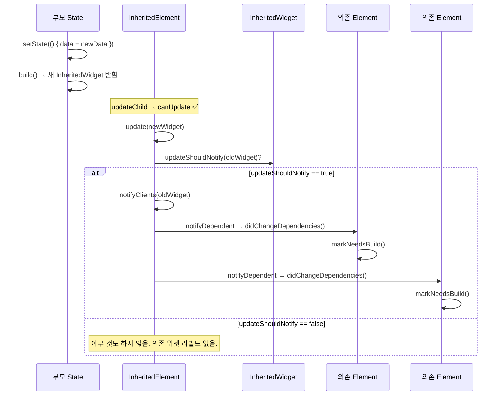

# Ch 07. BuildContext와 InheritedWidget — 데이터 전파의 비밀

> 📁 분석 대상: `_sources/flutter/packages/flutter/lib/src/widgets/framework.dart`
> 📌 버전: Flutter 3.41.1

---

## 📌 이 챕터의 목표

Flutter 개발에서 `BuildContext`는 모든 곳에 등장합니다. `Theme.of(context)`, `MediaQuery.of(context)`, `Navigator.of(context)`... 이 챕터에서는:

1. **BuildContext = Element**라는 사실을 소스코드로 증명
2. `of(context)` 패턴이 왜 O(1)인지 내부 구조를 분석
3. `InheritedWidget`이 어떻게 의존 위젯들에게 변경을 알리는지 추적
4. `dependOnInheritedWidgetOfExactType` vs `getInheritedWidgetOfExactType` 차이의 설계 의도

---

## 🔵 기초 — BuildContext는 Element이다

### 인터페이스 정의

```dart
// framework.dart — BuildContext 정의
abstract class BuildContext {
  Widget get widget;
  BuildOwner? get owner;
  
  // 조상 탐색
  T? findAncestorWidgetOfExactType<T extends Widget>();
  T? findAncestorStateOfType<T extends State>();
  T? findRootAncestorStateOfType<T extends State>();
  T? findAncestorRenderObjectOfType<T extends RenderObject>();
  
  // InheritedWidget 관련
  T? dependOnInheritedWidgetOfExactType<T extends InheritedWidget>();
  T? getInheritedWidgetOfExactType<T extends InheritedWidget>();
  InheritedWidget dependOnInheritedElement(InheritedElement ancestor);
  InheritedElement? getElementForInheritedWidgetOfExactType<T>();
  
  // 방문
  void visitAncestorElements(ConditionalElementVisitor visitor);
  void visitChildElements(ElementVisitor visitor);
  
  // ...더 많은 메서드
}
```

### Element이 BuildContext를 구현

```dart
// framework.dart — Element 클래스 선언
abstract class Element extends DiagnosticableTree implements BuildContext {
  // BuildContext의 메서드들을 모두 구현
}
```

> 💡 `BuildContext`는 인터페이스이고, `Element`가 이를 구현합니다. `State.build(BuildContext context)`에서 받는 `context`는 실제로는 `StatefulElement` 인스턴스입니다. 이것은 `StatefulElement.build()`에서 확인됩니다:

```dart
// framework.dart L5933-5934
@override
Widget build() => state.build(this);
// 'this' = StatefulElement 자체를 BuildContext로 전달
```

---

## 🔵 기초 — 조상 탐색 메서드들

### `findAncestorWidgetOfExactType` — O(n) 선형 탐색

```dart
// framework.dart L5124-5132
@override
T? findAncestorWidgetOfExactType<T extends Widget>() {
  Element? ancestor = _parent;
  while (ancestor != null && ancestor.widget.runtimeType != T) {
    ancestor = ancestor._parent;  // 부모를 따라 위로 올라감
  }
  return ancestor?.widget as T?;
}
```

> ⚠️ **O(n)**: `_parent` 체인을 따라 루트까지 올라가며 검색합니다. 트리가 깊으면 느립니다.

### `findAncestorStateOfType` — 마찬가지로 O(n)

```dart
// framework.dart L5134-5146
@override
T? findAncestorStateOfType<T extends State<StatefulWidget>>() {
  Element? ancestor = _parent;
  while (ancestor != null) {
    if (ancestor is StatefulElement && ancestor.state is T) {
      break;
    }
    ancestor = ancestor._parent;
  }
  final StatefulElement? statefulAncestor = ancestor as StatefulElement?;
  return statefulAncestor?.state as T?;
}
```

### `findRootAncestorStateOfType` — 가장 먼 조상 찾기

```dart
// framework.dart L5148-5160
@override
T? findRootAncestorStateOfType<T extends State<StatefulWidget>>() {
  Element? ancestor = _parent;
  StatefulElement? statefulAncestor;
  while (ancestor != null) {
    if (ancestor is StatefulElement && ancestor.state is T) {
      statefulAncestor = ancestor;  // 찾아도 멈추지 않음!
    }
    ancestor = ancestor._parent;    // 루트까지 계속 감
  }
  return statefulAncestor?.state as T?;
}
```

> 💡 `findAncestorStateOfType`은 가장 가까운 조상을, `findRootAncestorStateOfType`은 가장 먼 조상을 찾습니다. 전자는 일찍 break할 수 있지만, 후자는 항상 루트까지 순회합니다.

### 성능 비교표

| 메서드 | 시간복잡도 | 의존 등록 | 사용 사례 |
|--------|-----------|-----------|-----------|
| `findAncestorWidgetOfExactType` | O(n) | ❌ | 조상 위젯 직접 접근 |
| `findAncestorStateOfType` | O(n) | ❌ | 조상 State 직접 접근 |
| `findRootAncestorStateOfType` | O(n) ★ 항상 전체 순회 | ❌ | Navigator, Overlay 등 |
| `dependOnInheritedWidgetOfExactType` | **O(1)** | ✅ | Theme, MediaQuery 등 |
| `getInheritedWidgetOfExactType` | **O(1)** | ❌ | 변경 알림 없이 값만 읽기 |

---

## 🟡 중급 — InheritedWidget의 데이터 전파

### InheritedWidget 기본 구조

```dart
// framework.dart L1694-1710 — InheritedWidget
abstract class InheritedWidget extends ProxyWidget {
  const InheritedWidget({super.key, required super.child});
  
  @override
  InheritedElement createElement() => InheritedElement(this);
  
  /// 새 데이터가 이전과 다른지 판단
  /// true를 반환하면 의존 위젯들이 리빌드됨
  @protected
  bool updateShouldNotify(covariant InheritedWidget oldWidget);
}
```

### 직접 만들어보는 InheritedWidget

```dart
class AppTheme extends InheritedWidget {
  const AppTheme({
    super.key,
    required this.primaryColor,
    required super.child,
  });
  
  final Color primaryColor;
  
  @override
  bool updateShouldNotify(AppTheme oldWidget) {
    return primaryColor != oldWidget.primaryColor;
  }
  
  // of 패턴 — 의존 등록 + 값 반환
  static AppTheme of(BuildContext context) {
    final result = context.dependOnInheritedWidgetOfExactType<AppTheme>();
    assert(result != null, 'No AppTheme found in context');
    return result!;
  }
  
  // maybeOf 패턴 — nullable 버전
  static AppTheme? maybeOf(BuildContext context) {
    return context.dependOnInheritedWidgetOfExactType<AppTheme>();
  }
}
```

---

## 🔴 심화 — `_inheritedElements` 맵: O(1)의 비밀

### `_inheritedElements` — 영속 해시맵

모든 Element는 `_inheritedElements`라는 맵을 갖고 있습니다:

```dart
// Element 클래스 내부
PersistentHashMap<Type, InheritedElement>? _inheritedElements;
```

이 맵의 **key = InheritedWidget의 runtimeType**, **value = 해당 InheritedElement**입니다.

### 일반 Element의 `_updateInheritance()` — 부모 참조 공유

```dart
// framework.dart L5119-5122
void _updateInheritance() {
  assert(_lifecycleState == _ElementLifecycle.active);
  _inheritedElements = _parent?._inheritedElements;
  // 부모의 맵을 그대로 참조! (복사 아님)
}
```

### InheritedElement의 `_updateInheritance()` — 자신을 맵에 추가

```dart
// framework.dart L6261-6267 — InheritedElement._updateInheritance()
@override
void _updateInheritance() {
  assert(_lifecycleState == _ElementLifecycle.active);
  final PersistentHashMap<Type, InheritedElement> incomingWidgets =
      _parent?._inheritedElements ??
      const PersistentHashMap<Type, InheritedElement>.empty();
  _inheritedElements = incomingWidgets.put(widget.runtimeType, this);
  // ↑ PersistentHashMap.put()은 새 맵을 반환 (불변)
}
```

> 💡 **PersistentHashMap**: 함수형 자료구조로, `put`이 기존 맵을 수정하지 않고 새 맵을 반환합니다. 이 덕분에 형제 노드들은 부모의 원본 맵을 공유하면서, 자기 자신만 추가한 새 맵을 자손에게 전달합니다.

### 동작 시각화

```
         MaterialApp (InheritedWidget: Theme, MediaQuery)
             │
      _inheritedElements = {Theme: ●, MediaQuery: ●}
             │
        ─────┴─────
       │           │
    Scaffold    Dialog
       │           │
  _inheritedElements    _inheritedElements
  = 부모 맵 그대로 공유   = 부모 맵 그대로 공유
       │
    MyInherited (InheritedWidget)
       │
  _inheritedElements = {Theme: ●, MediaQuery: ●, MyInherited: ●}
       │                                         ↑ 자신 추가
    MyWidget
       │
  _inheritedElements = 부모(MyInherited)의 맵 공유
```

### `dependOnInheritedWidgetOfExactType` — O(1) 조회 + 의존 등록

```dart
// framework.dart L5084-5092
@override
T? dependOnInheritedWidgetOfExactType<T extends InheritedWidget>(
    {Object? aspect}) {
  assert(_debugCheckStateIsActiveForAncestorLookup());
  
  // ① O(1) 해시맵 조회!
  final InheritedElement? ancestor = _inheritedElements?[T];
  
  if (ancestor != null) {
    // ② 의존 관계 등록
    return dependOnInheritedElement(ancestor, aspect: aspect) as T;
  }
  
  _hadUnsatisfiedDependencies = true;
  return null;
}
```

### `dependOnInheritedElement` — 양방향 의존 등록

```dart
// framework.dart L5077-5081
@override
InheritedWidget dependOnInheritedElement(
    InheritedElement ancestor, {Object? aspect}) {
  // ① 이 Element → InheritedElement 방향 등록
  (_dependencies ??= HashSet<InheritedElement>()).add(ancestor);
  
  // ② InheritedElement → 이 Element 방향 등록
  ancestor.updateDependencies(this, aspect);
  
  return ancestor.widget as InheritedWidget;
}
```

```mermaid
graph LR
    subgraph MyWidget Element
      deps["_dependencies: HashSet"]
    end
    subgraph InheritedElement
      dependents["_dependents: HashMap"]
    end
    
    deps -->|contains| InheritedElement
    dependents -->|contains| MyWidget Element
    
    style deps fill:#4FC3F7
    style dependents fill:#FFB74D
```

> 📌 **양방향 등록**: Element은 `_dependencies`에 자신이 의존하는 `InheritedElement`들을 기록하고, `InheritedElement`은 `_dependents`에 자신에게 의존하는 Element들을 기록합니다.

---

## 🔴 심화 — InheritedWidget 업데이트 흐름

### `updateShouldNotify` → `notifyClients` 경로

InheritedWidget이 새 데이터로 갱신될 때의 흐름:

```dart
// framework.dart L6398-6403 — InheritedElement.updated()
@override
void updated(InheritedWidget oldWidget) {
  if ((widget as InheritedWidget).updateShouldNotify(oldWidget)) {
    super.updated(oldWidget);  // → notifyClients() 호출
  }
}
```

```dart
// framework.dart L6417-6432 — InheritedElement.notifyClients()
@override
void notifyClients(InheritedWidget oldWidget) {
  for (final Element dependent in _dependents.keys) {
    // 의존 위젯이 정말 자손인지 assert로 검증 후
    notifyDependent(oldWidget, dependent);
  }
}
```

```dart
// framework.dart L6374-6377 — InheritedElement.notifyDependent()
@protected
void notifyDependent(covariant InheritedWidget oldWidget, Element dependent) {
  dependent.didChangeDependencies();
  // → Element.didChangeDependencies() → markNeedsBuild()
}
```

### 전체 경로



---

## 🔴 심화 — `dependOn` vs `getInherited`: 등록의 차이

### `getInheritedWidgetOfExactType` — 의존 등록 없이 읽기만

```dart
// framework.dart L5094-5097
@override
T? getInheritedWidgetOfExactType<T extends InheritedWidget>() {
  return getElementForInheritedWidgetOfExactType<T>()?.widget as T?;
}

// framework.dart L5099-5103
@override
InheritedElement? getElementForInheritedWidgetOfExactType<T extends InheritedWidget>() {
  assert(_debugCheckStateIsActiveForAncestorLookup());
  return _inheritedElements?[T];
  // 의존 등록 없이 맵에서 조회만!
}
```

### 차이 요약

| | `dependOnInheritedWidgetOfExactType` | `getInheritedWidgetOfExactType` |
|------|------|------|
| **O(1) 조회** | ✅ | ✅ |
| **의존 등록** | ✅ `_dependencies` + `_dependents` 등록 | ❌ 등록 안 함 |
| **값 변경 시 리빌드** | ✅ `didChangeDependencies` 호출됨 | ❌ 리빌드 안 됨 |
| **사용 사례** | `Theme.of(context)` — 테마 변경 시 리빌드 필요 | 초기화 시 값만 한 번 읽고 싶을 때 |

### 사용 가이드

```dart
// ✅ 값이 바뀌면 리빌드해야 하는 경우
@override
Widget build(BuildContext context) {
  final theme = Theme.of(context);  // dependOn → 테마 변경 시 리빌드
  return Container(color: theme.primaryColor);
}

// ✅ 초기화 시 값만 읽으면 되는 경우 (리빌드 불필요)
@override
void initState() {
  super.initState();
  // getInherited는 의존 등록을 안 하지만,
  // initState에서는 어차피 dependOn도 못 씀 (Ch06 참고)
}

@override
void didChangeDependencies() {
  super.didChangeDependencies();
  // 여기서 dependOn 호출 → InheritedWidget 변경 시 다시 호출됨
  final locale = Localizations.of(context, LocalizationsDelegate);
}
```

---

## 🟡 중급 — deactivate 시 의존 해제

### Element가 트리에서 제거될 때

Element가 deactivate하면 자신이 등록했던 모든 InheritedElement에서 의존을 해제합니다:

```dart
// Element.deactivate() 내부 (간략화)
void deactivate() {
  // 자신이 의존하던 InheritedElement들에서 제거
  if (_dependencies != null) {
    for (final InheritedElement dependency in _dependencies!) {
      dependency.removeDependent(this);
    }
  }
  // _dependencies 자체는 null로 돌리지 않음 (activate 시 재등록)
}
```

```dart
// framework.dart L6386-6390 — InheritedElement.removeDependent()
@protected
@mustCallSuper
void removeDependent(Element dependent) {
  _dependents.remove(dependent);  // HashMap에서 제거
}
```

이 메커니즘 덕분에 트리에서 제거된 위젯이 InheritedWidget의 `_dependents`에 남아 메모리 누수가 되는 것을 방지합니다.

---

## 🟡 중급 — InheritedModel: 선택적 리빌드

기본 `InheritedWidget`은 값이 바뀌면 모든 의존 위젯을 리빌드합니다. `InheritedModel`은 **aspect**를 사용해 특정 부분만 변경된 경우 해당 부분에 의존하는 위젯만 리빌드합니다.

### `updateDependencies` 오버라이드

```dart
// InheritedElement의 기본 구현
@protected
void updateDependencies(Element dependent, Object? aspect) {
  setDependencies(dependent, null);
  // 기본값: null = "모든 변화에 반응"
}
```

```dart
// InheritedModel의 InheritedModelElement에서 오버라이드
void updateDependencies(Element dependent, Object? aspect) {
  final Set<T>? dependencies = getDependencies(dependent) as Set<T>?;
  if (dependencies != null && dependencies.isEmpty) {
    return; // 이미 전체 의존 → 추가 등록 불필요
  }
  if (aspect == null) {
    setDependencies(dependent, HashSet<T>());
    // aspect null = 전체 의존
  } else {
    setDependencies(dependent,
      (dependencies ?? HashSet<T>())..add(aspect as T));
    // 특정 aspect만 의존
  }
}
```

### InheritedModel 사용 예시

```dart
class UserModel extends InheritedModel<String> {
  const UserModel({
    super.key,
    required this.name,
    required this.email,
    required super.child,
  });
  
  final String name;
  final String email;
  
  @override
  bool updateShouldNotify(UserModel oldWidget) {
    return name != oldWidget.name || email != oldWidget.email;
  }
  
  @override
  bool updateShouldNotifyDependent(
      UserModel oldWidget, Set<String> dependencies) {
    if (dependencies.contains('name') && name != oldWidget.name) return true;
    if (dependencies.contains('email') && email != oldWidget.email) return true;
    return false;
  }
  
  static String nameOf(BuildContext context) {
    // 'name' aspect만 의존
    return InheritedModel.inheritFrom<UserModel>(
      context, aspect: 'name'
    )!.name;
  }
  
  static String emailOf(BuildContext context) {
    // 'email' aspect만 의존
    return InheritedModel.inheritFrom<UserModel>(
      context, aspect: 'email'
    )!.email;
  }
}
```

```dart
// NameDisplay는 name이 바뀔 때만 리빌드
class NameDisplay extends StatelessWidget {
  @override
  Widget build(BuildContext context) {
    final name = UserModel.nameOf(context);  // aspect: 'name'
    return Text(name);
  }
}

// EmailDisplay는 email이 바뀔 때만 리빌드  
class EmailDisplay extends StatelessWidget {
  @override
  Widget build(BuildContext context) {
    final email = UserModel.emailOf(context);  // aspect: 'email'
    return Text(email);
  }
}
```

> 💡 `email`만 바뀌면 `NameDisplay`는 리빌드되지 않습니다. 이것이 `InheritedModel`의 성능 이점입니다.

---

## 🟡 중급 — of(context) 패턴과 Builder 패턴

### 흔한 실수: 같은 build에서 of(context) 호출

```dart
// ❌ 잘못 — Scaffold.of(context)가 Scaffold 자체의 BuildContext를 사용
@override
Widget build(BuildContext context) {
  return Scaffold(
    body: ElevatedButton(
      onPressed: () {
        Scaffold.of(context).openDrawer();
        // 💥 Scaffold ancestor 못 찾음!
        // context는 Scaffold의 "부모" Element이므로
      },
    ),
  );
}

// ✅ 올바른 — Builder로 Scaffold 아래의 context 획득
@override
Widget build(BuildContext context) {
  return Scaffold(
    body: Builder(
      builder: (innerContext) {
        return ElevatedButton(
          onPressed: () {
            Scaffold.of(innerContext).openDrawer();
            // ✅ innerContext는 Scaffold의 "자손" Element
          },
        );
      },
    ),
  );
}
```

### 왜 이런 일이 일어나나?

```
Widget 트리:       Element 트리:
                   
MyPage             MyPageElement ← context는 여기!
  └─ Scaffold      └─ ScaffoldElement
       └─ Button        └─ ButtonElement
```

`build(context)`의 `context`는 `MyPageElement`입니다. `Scaffold`는 이 Element의 **자식**이지 조상이 아닙니다. `findAncestorWidgetOfExactType`은 부모 방향으로만 탐색하므로 찾을 수 없습니다.

---

## 🎯 면접 Q&A

### Q1. `BuildContext`는 무엇인가요?

**A**: `BuildContext`는 인터페이스이고, `Element`가 이를 구현합니다. `State.build(BuildContext context)`에서 받는 `context`는 실제로 `StatefulElement` 인스턴스입니다. 소스코드에서 `StatefulElement.build()`가 `state.build(this)`를 호출하므로, `this`(Element 자신)가 BuildContext로 전달됩니다.

BuildContext를 통해 트리 탐색(`findAncestor*`), InheritedWidget 의존 등록(`dependOnInherited*`), 크기/위치 정보 접근 등이 가능합니다. Element가 구현하므로 트리 내 위치 정보를 모두 갖고 있습니다.

---

### Q2. `Theme.of(context)`는 어떻게 동작하고, 왜 O(1)인가요?

**A**: 내부적으로 `context.dependOnInheritedWidgetOfExactType<Theme>()`을 호출합니다. 이 메서드는 Element의 `_inheritedElements`라는 `PersistentHashMap<Type, InheritedElement>`에서 `Type` 키로 해시맵 조회를 합니다. 따라서 O(1)입니다.

이 맵은 `_updateInheritance()` 메서드로 유지됩니다. 일반 Element는 부모의 맵을 그대로 참조하고, `InheritedElement`만 `PersistentHashMap.put()`으로 자신을 추가한 새 맵을 만듭니다. 이 불변 해시맵 구조 덕분에 형제 노드들은 맵을 안전하게 공유할 수 있습니다.

반면 `findAncestorWidgetOfExactType`은 `_parent` 체인을 순회하므로 O(n)입니다.

---

### Q3. `dependOnInheritedWidgetOfExactType`과 `getInheritedWidgetOfExactType`의 차이는?

**A**: 둘 다 O(1)로 `_inheritedElements` 맵에서 값을 조회합니다. 하지만 핵심 차이는 **의존 등록** 여부입니다.

`dependOn`은 양방향 의존을 등록합니다: ①Element의 `_dependencies`에 InheritedElement을 추가하고, ②InheritedElement의 `_dependents`에 Element를 추가합니다. InheritedWidget이 `updateShouldNotify`에서 true를 반환하면, `_dependents`의 모든 Element에 `didChangeDependencies()`를 호출해 리빌드를 트리거합니다.

`getInherited`는 조회만 하고 등록하지 않으므로, 값이 변경되어도 리빌드되지 않습니다. 초기화 시 값을 한 번만 읽고 나중에 변경을 추적할 필요 없을 때 유용합니다.

---

### Q4. 같은 build 메서드 안에서 `Scaffold.of(context)`가 실패하는 이유는?

**A**: `build(BuildContext context)`의 `context`는 현재 위젯의 Element입니다. `Scaffold`는 이 Element의 **자식**으로 생성됩니다. `of(context)`는 내부적으로 `findAncestorStateOfType` 또는 `dependOnInheritedWidgetOfExactType`을 호출하는데, 이들은 `_parent` 방향으로만 탐색합니다. 자식 방향은 검색하지 않습니다.

**해결**: `Builder` 위젯으로 `Scaffold` 아래에 새 Element(= BuildContext)를 만들거나, `GlobalKey`를 통해 직접 접근합니다.

---

### Q5. `InheritedWidget`의 `updateShouldNotify`가 false를 반환하면 어떻게 되나요?

**A**: `InheritedElement.updated()` 소스를 보면, `updateShouldNotify(oldWidget)`이 false를 반환하면 `notifyClients()`를 호출하지 않습니다. 따라서 `_dependents`에 등록된 어떤 Element도 `didChangeDependencies()`를 받지 않으며, 리빌드되지 않습니다.

이는 중요한 성능 최적화입니다. 예를 들어 부모가 리빌드되어 `InheritedWidget`의 새 인스턴스가 생기더라도, 데이터가 동일하면 `updateShouldNotify`에서 false를 반환하여 하위 트리 전체의 불필요한 리빌드를 방지합니다.

추가적으로, `InheritedModel`은 `updateShouldNotifyDependent`를 통해 "어떤 aspect가 바뀌었는지"를 기준으로 개별 의존 위젯에 대해 선택적 리빌드를 할 수 있어 더 세밀한 최적화가 가능합니다.
