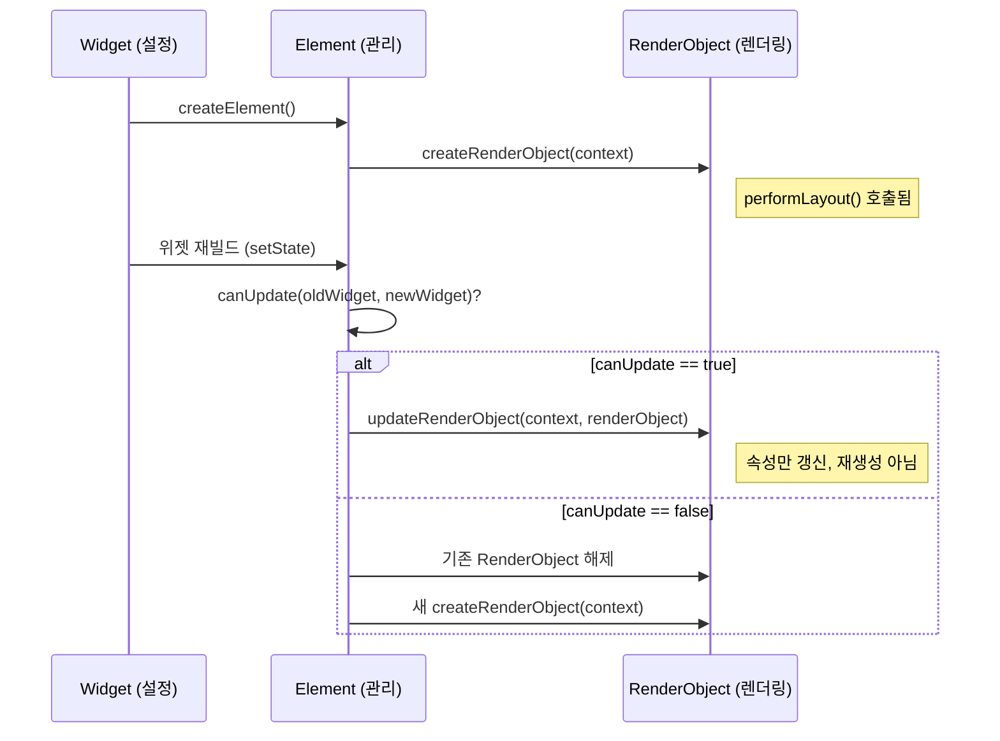

# Ch 08. 레이아웃 시스템과 RenderObject — 직접 다루기

## 8.1 왜 RenderObject를 직접 다뤄야 하는가

Flutter의 위젯 시스템은 **두 개의 추상화 레벨**이 있다:

```
추상화 레벨 높음 ───────────────────────────────── 낮음

  StatelessWidget          RenderObjectWidget         RenderObject
  StatefulWidget           (Leaf/SingleChild/Multi)   (RenderBox)
     │                          │                          │
     └── build() 오버라이드     └── createRenderObject()   └── performLayout()
                                    updateRenderObject()       paint()
                                                               hitTest()

  ✅ 대부분의 UI                ⚠️ 커스텀 레이아웃          ❌ 프레임워크 수준
  → 95%의 코드                  → 4%의 코드                → 1%의 코드
```

99%의 Flutter 코드는 `StatelessWidget`/`StatefulWidget`으로 충분한다. 하지만 다음 상황에서는 `RenderObject`를 직접 다뤄야 한다:

| 상황 | 예시 | 이유 |
|------|------|------|
| **커스텀 레이아웃** | 원형 배치, 대각선 배치 | 기존 `Row`/`Column`/`Stack`으로 표현 불가 |
| **커스텀 페인팅** | 차트, 그래프, 게임 렌더링 | `CustomPaint`보다 정밀한 제어 필요 |
| **성능 최적화** | 대량 아이템 렌더링 | Widget→Element 변환 비용 제거 |
| **프레임워크 확장** | 새로운 Sliver 타입 | Flutter 자체를 확장 |

---

## 8.2 Constraints 프로토콜

### Flutter 레이아웃의 3대 원칙

> **"Constraints go down. Sizes go up. Parent sets position."**
>
> — Flutter 공식 문서

```
         ┌─── 부모 ───┐
         │            │
    ① Constraints    ③ position
    (BoxConstraints) (Offset)
         │    │       │
         ▼    │       ▼
    ┌─── 자식 ───┐   parentData.offset
    │            │
    ② Size       │
    (Size)       │
    └────────────┘
```

### BoxConstraints — 제약의 표현

> 📁 `_sources/flutter/packages/flutter/lib/src/rendering/box.dart` (Line 100~159)

```dart
class BoxConstraints extends Constraints {
  const BoxConstraints({
    this.minWidth = 0.0,          // 최소 너비
    this.maxWidth = double.infinity,  // 최대 너비
    this.minHeight = 0.0,         // 최소 높이
    this.maxHeight = double.infinity, // 최대 높이
  });

  // ═══════ 자주 사용되는 팩토리 ═══════

  // Tight: min == max → 정확히 그 크기만 가능
  BoxConstraints.tight(Size size)
    : minWidth = size.width, maxWidth = size.width,
      minHeight = size.height, maxHeight = size.height;

  // Loose: min == 0, max == size → 0부터 size까지 자유
  BoxConstraints.loose(Size size)
    : minWidth = 0.0, maxWidth = size.width,
      minHeight = 0.0, maxHeight = size.height;

  // Expand: min == max == infinity → 가능한 한 크게
  const BoxConstraints.expand({double? width, double? height})
    : minWidth = width ?? double.infinity,
      maxWidth = width ?? double.infinity,
      minHeight = height ?? double.infinity,
      maxHeight = height ?? double.infinity;
}
```

### Constraints 시각화

```
                      maxWidth
            ┌──────────────────────────────┐
            │         maxHeight            │
            │    ┌──────────────────┐      │
            │    │                  │      │
 minWidth ──┤    │  가능한 크기     │      │
            │    │  영역            │      │
            │    │                  │      │
            │    └──────────────────┘      │
            │         minHeight            │
            └──────────────────────────────┘

  tight:   min == max    → 점 (선택지 없음)
  loose:   min == 0      → 사각형 영역 (자유)
  bounded: 0 < min < max → 제한된 영역
```

### Constraints 전파 예시 — Padding이 하는 일

```dart
// SizedBox(width: 200, height: 100, child: Padding(padding: 20, child: Text))

// 1️⃣ SizedBox가 자식에게 tight constraints 전달:
//    BoxConstraints.tight(Size(200, 100))
//    → minWidth=200, maxWidth=200, minHeight=100, maxHeight=100

// 2️⃣ Padding(EdgeInsets.all(20))의 performLayout():
//    자식에게 전달할 constraints = 부모 constraints에서 padding을 뺌
//    → BoxConstraints.tight(Size(200-40, 100-40))
//    → BoxConstraints.tight(Size(160, 60))
//    → Text는 160×60 영역 안에서 렌더링

// 3️⃣ Text가 Size를 결정하여 부모에게 보고
// 4️⃣ Padding이 자식 위치를 offset(20, 20)으로 설정
```

---

## 8.3 RenderObjectWidget 계층 구조

### 위젯 ↔ RenderObject 연결

> 📁 `_sources/flutter/packages/flutter/lib/src/widgets/framework.dart` (Line 1891~2040)

```dart
// RenderObjectWidget — Widget과 RenderObject를 연결하는 추상 클래스
abstract class RenderObjectWidget extends Widget {
  const RenderObjectWidget({super.key});

  // ⭐ 핵심 메서드 3개

  // 1. Element 생성 — 트리 관리 담당
  @override
  RenderObjectElement createElement();

  // 2. RenderObject 생성 — 최초 1번만 호출
  @protected
  RenderObject createRenderObject(BuildContext context);

  // 3. RenderObject 업데이트 — 위젯이 변경될 때마다 호출
  @protected
  void updateRenderObject(BuildContext context, covariant RenderObject renderObject) {}

  // 4. RenderObject 해제 — 트리에서 제거될 때
  @protected
  void didUnmountRenderObject(covariant RenderObject renderObject) {}
}
```

### 3가지 RenderObjectWidget 서브클래스

```dart
// ═══════ 1. LeafRenderObjectWidget — 자식 없음 ═══════
// 📄 framework.dart (Line 1938~1945)
abstract class LeafRenderObjectWidget extends RenderObjectWidget {
  const LeafRenderObjectWidget({super.key});

  @override
  LeafRenderObjectElement createElement() => LeafRenderObjectElement(this);
  // 자식 관리 불필요 → 가장 단순
}
// 사용 예: RawImage, Texture, ErrorWidget, SizedBox(child 없을 때)

// ═══════ 2. SingleChildRenderObjectWidget — 자식 1개 ═══════
// 📄 framework.dart (Line 1956~1968)
abstract class SingleChildRenderObjectWidget extends RenderObjectWidget {
  const SingleChildRenderObjectWidget({super.key, this.child});
  final Widget? child;

  @override
  SingleChildRenderObjectElement createElement() =>
      SingleChildRenderObjectElement(this);
}
// 사용 예: Padding, Align, DecoratedBox, SizedBox(child 있을 때), Opacity

// ═══════ 3. MultiChildRenderObjectWidget — 자식 여러 개 ═══════
// 📄 framework.dart (Line 1992~2040)
abstract class MultiChildRenderObjectWidget extends RenderObjectWidget {
  const MultiChildRenderObjectWidget({super.key, this.children = const []});
  final List<Widget> children;

  @override
  MultiChildRenderObjectElement createElement() =>
      MultiChildRenderObjectElement(this);
}
// 사용 예: Stack, Row, Column, Wrap, Flow
```

### 위젯 생명주기 흐름



---

## 8.4 커스텀 RenderObject 만들기

### 예제 1: LeafRenderObjectWidget — 원형 도트

가장 단순한 형태 — 자식 없이 직접 그리는 위젯:

```dart
// ═══════ Widget 레이어 ═══════
class ColorDot extends LeafRenderObjectWidget {
  const ColorDot({
    super.key,
    required this.color,
    required this.radius,
  });

  final Color color;
  final double radius;

  @override
  RenderObject createRenderObject(BuildContext context) {
    return RenderColorDot(color: color, radius: radius);
  }

  @override
  void updateRenderObject(BuildContext context, RenderColorDot renderObject) {
    // 위젯 속성이 변경되면 RenderObject에 반영
    renderObject
      ..color = color
      ..radius = radius;
  }
}

// ═══════ RenderObject 레이어 ═══════
class RenderColorDot extends RenderBox {
  RenderColorDot({
    required Color color,
    required double radius,
  }) : _color = color, _radius = radius;

  Color get color => _color;
  Color _color;
  set color(Color value) {
    if (_color == value) return;  // 같으면 무시
    _color = value;
    markNeedsPaint();  // ⚡ 색상만 바뀌면 → paint만 다시
  }

  double get radius => _radius;
  double _radius;
  set radius(double value) {
    if (_radius == value) return;
    _radius = value;
    markNeedsLayout();  // ⚡ 크기가 바뀌면 → layout부터 다시
  }

  // ═══════ Layout ═══════
  @override
  void performLayout() {
    // constraints를 받아서 자신의 size 결정
    final diameter = _radius * 2;
    size = constraints.constrain(Size(diameter, diameter));
    //                 ↑ constraints 범위 안에서 원하는 크기 적용
  }

  // ═══════ Paint ═══════
  @override
  void paint(PaintingContext context, Offset offset) {
    final canvas = context.canvas;
    final paint = Paint()
      ..color = _color
      ..style = PaintingStyle.fill;

    canvas.drawCircle(
      offset + Offset(size.width / 2, size.height / 2),  // 중심점
      _radius,
      paint,
    );
  }

  // ═══════ Hit Test ═══════
  @override
  bool hitTestSelf(Offset position) {
    // 원형 영역 내부만 터치 가능
    final center = Offset(size.width / 2, size.height / 2);
    return (position - center).distance <= _radius;
  }
}
```

> **설계 포인트**:
> - `color` setter는 `markNeedsPaint()` — 크기 변경 없이 색상만 변경
> - `radius` setter는 `markNeedsLayout()` — 크기가 바뀌므로 레이아웃부터 재실행
> - 이 구분이 **성능 최적화의 핵심** — 불필요한 레이아웃을 건너뜀

### 예제 2: SingleChildRenderObjectWidget — 커스텀 Padding

자식 1개를 가지고 레이아웃을 조정하는 위젯:

```dart
// ═══════ Widget 레이어 ═══════
class CircularPadding extends SingleChildRenderObjectWidget {
  const CircularPadding({
    super.key,
    required this.padding,
    super.child,
  });

  final double padding;

  @override
  RenderObject createRenderObject(BuildContext context) {
    return RenderCircularPadding(padding: padding);
  }

  @override
  void updateRenderObject(BuildContext context, RenderCircularPadding renderObject) {
    renderObject.padding = padding;
  }
}

// ═══════ RenderObject 레이어 ═══════
class RenderCircularPadding extends RenderShiftedBox {
  // RenderShiftedBox: 자식 1개, 자식 위치를 offset으로 관리
  RenderCircularPadding({
    required double padding,
    RenderBox? child,
  }) : _padding = padding, super(child);

  double get padding => _padding;
  double _padding;
  set padding(double value) {
    if (_padding == value) return;
    _padding = value;
    markNeedsLayout();
  }

  @override
  void performLayout() {
    final child = this.child;
    if (child != null) {
      // 1️⃣ 자식에게 줄 constraints 계산
      //    부모의 constraints에서 padding만큼 줄임
      final innerConstraints = constraints.deflate(
        EdgeInsets.all(_padding),
      );

      // 2️⃣ 자식의 layout 실행 → 자식의 size 확정
      child.layout(innerConstraints, parentUsesSize: true);
      //                              ↑ 자식 크기를 사용할 것임을 명시

      // 3️⃣ 자식 위치 설정 (Parent sets position!)
      final childParentData = child.parentData! as BoxParentData;
      childParentData.offset = Offset(_padding, _padding);

      // 4️⃣ 자신의 size = 자식 size + padding
      size = constraints.constrain(Size(
        child.size.width + _padding * 2,
        child.size.height + _padding * 2,
      ));
    } else {
      // 자식 없으면 최소 크기
      size = constraints.constrain(Size.zero);
    }
  }
}
```

### 예제 3: MultiChildRenderObjectWidget — 방사형 배치

여러 자식을 원형으로 배치하는 커스텀 레이아웃:

```dart
import 'dart:math' as math;

// ═══════ Widget 레이어 ═══════
class RadialLayout extends MultiChildRenderObjectWidget {
  const RadialLayout({
    super.key,
    required this.radius,
    super.children,
  });

  final double radius;

  @override
  RenderObject createRenderObject(BuildContext context) {
    return RenderRadialLayout(radius: radius);
  }

  @override
  void updateRenderObject(BuildContext context, RenderRadialLayout renderObject) {
    renderObject.radius = radius;
  }
}

// ═══════ ParentData — 자식별 추가 데이터 ═══════
class RadialParentData extends ContainerBoxParentData<RenderBox> {
  // ContainerBoxParentData는 이미 offset + 연결 리스트 포함
}

// ═══════ RenderObject 레이어 ═══════
class RenderRadialLayout extends RenderBox
    with ContainerRenderObjectMixin<RenderBox, RadialParentData>,
         RenderBoxContainerDefaultsMixin<RenderBox, RadialParentData> {

  RenderRadialLayout({required double radius}) : _radius = radius;

  double get radius => _radius;
  double _radius;
  set radius(double value) {
    if (_radius == value) return;
    _radius = value;
    markNeedsLayout();
  }

  @override
  void setupParentData(RenderBox child) {
    if (child.parentData is! RadialParentData) {
      child.parentData = RadialParentData();
    }
  }

  @override
  void performLayout() {
    // 1️⃣ 자식 수 카운트
    int childCount = 0;
    visitChildren((_) => childCount++);

    // 2️⃣ 각 자식의 layout 수행
    final angleStep = 2 * math.pi / childCount;
    int index = 0;
    RenderBox? child = firstChild;

    while (child != null) {
      // 자식에게 loose constraints 전달 (자유롭게 크기 결정)
      child.layout(
        BoxConstraints.loose(Size(_radius, _radius)),
        parentUsesSize: true,
      );

      // 3️⃣ 자식 위치를 원형으로 계산
      final angle = angleStep * index;
      final childParentData = child.parentData! as RadialParentData;
      childParentData.offset = Offset(
        _radius + _radius * math.cos(angle) - child.size.width / 2,
        _radius + _radius * math.sin(angle) - child.size.height / 2,
      );

      child = childParentData.nextSibling;  // 연결 리스트 순회
      index++;
    }

    // 4️⃣ 자신의 크기 = 반지름 * 2
    size = constraints.constrain(Size(_radius * 2, _radius * 2));
  }

  @override
  void paint(PaintingContext context, Offset offset) {
    // defaultPaint: 각 자식을 자신의 offset 위치에 그림
    defaultPaint(context, offset);
  }

  @override
  bool hitTestChildren(BoxHitTestResult result, {required Offset position}) {
    return defaultHitTestChildren(result, position: position);
  }
}
```

### 해부 — Mixin 구조와 역할

```dart
// RenderObject에서 자식 관리를 위한 Mixin 계층:

// 1. RenderObjectWithChildMixin<ChildType>
//    → 단일 자식: child 필드 + attach/detach 자동화
//    → SingleChildRenderObjectWidget과 짝

// 2. ContainerRenderObjectMixin<ChildType, ParentDataType>
//    → 다중 자식: 연결 리스트 (firstChild, lastChild, nextSibling)
//    → insert(), remove(), move() 등 유틸리티
//    → MultiChildRenderObjectWidget과 짝

// 3. RenderBoxContainerDefaultsMixin<ChildType, ParentDataType>
//    → RenderBox 전용 유틸: defaultPaint(), defaultHitTestChildren()
//    → ContainerRenderObjectMixin 위에 추가

// 📄 box.dart의 RenderBox 문서에서:
// "When using ContainerRenderObjectMixin in a RenderBox,
//  consider mixing in RenderBoxContainerDefaultsMixin,
//  which provides utility methods that implement common parts
//  of the RenderBox protocol (such as painting the children)."
```

---

## 8.5 `performLayout()` 프로토콜 소스코드 분석

### layout() 메서드 — 엔트리 포인트

> 📁 `_sources/flutter/packages/flutter/lib/src/rendering/object.dart`

```dart
// ⚠️ layout()은 부모가 호출한다 — 절대 직접 호출하지 않음
void layout(Constraints constraints, { bool parentUsesSize = false }) {
  // 1️⃣ Relayout Boundary 판단
  final bool isRelayoutBoundary =
      !parentUsesSize              // 부모가 자식 크기 안 씀
      || sizedByParent             // 크기가 constraints에만 의존
      || constraints.isTight       // tight constraints
      || !isRepaintBoundary;       // repaint 경계가 아님

  // 2️⃣ 이전 layout과 constraints가 동일하면 → 건너뜀! (핵심 최적화)
  if (!_needsLayout && constraints == _constraints) {
    // relayoutBoundary만 업데이트하고 반환
    return;
  }

  _constraints = constraints;

  // 3️⃣ sizedByParent이면 → performResize() 먼저
  if (sizedByParent) {
    performResize();
  }

  // 4️⃣ performLayout() 실행
  performLayout();

  // 5️⃣ layout 완료 → paint 필요 표시
  _needsLayout = false;
  markNeedsPaint();
}
```

### parentUsesSize — 왜 중요한가?

```dart
// parentUsesSize가 성능에 미치는 영향:

// ✅ parentUsesSize: false → Relayout Boundary 생성 가능
child.layout(constraints, parentUsesSize: false);
// → 자식의 layout이 변해도 부모는 re-layout 안 함!
// → 예: Align(child: Text("변경됨"))
//   Text의 크기가 변해도 Align은 항상 부모 크기를 사용하므로
//   parentUsesSize: false → Relayout Boundary

// ⚠️ parentUsesSize: true → 자식 변경 시 부모도 re-layout
child.layout(constraints, parentUsesSize: true);
// → 자식의 size가 바뀌면 부모도 다시 layout
// → 예: IntrinsicWidth(child: Text("변경됨"))
//   Text의 intrinsic width에 따라 자신의 크기가 변하므로
//   parentUsesSize: true 필수

// 🔑 실무 규칙:
// "자식의 size를 읽지 않는다면, parentUsesSize: false로 두세요"
// → layout 전파가 차단되어 성능 향상
```

### sizedByParent와 computeDryLayout

```dart
// sizedByParent == true인 RenderObject:
// → 크기가 오직 constraints에만 의존 (자식 무관)
// → performResize()에서 크기를 결정하고,
//   performLayout()에서는 자식 배치만 담당

// 📄 box.dart (Line 1407~1415)
@override
bool get sizedByParent => true;  // 크기는 constraints만으로 결정!

@override
Size computeDryLayout(BoxConstraints constraints) {
  return constraints.smallest;   // 가능한 가장 작은 크기
}

// WHY: sizedByParent가 true이면
// → 부모가 constraints를 안 바꾸면 → performResize()도 건너뜀
// → layout 연산 최소화 → 성능 ⬆️
```

---

## 8.6 `paint()` 프로토콜

### PaintingContext와 Canvas

```dart
@override
void paint(PaintingContext context, Offset offset) {
  // context.canvas — 실제 그리기 API (Skia/Impeller)
  final canvas = context.canvas;

  // offset — 이 RenderObject의 화면상 위치
  // ⚠️ 절대 좌표가 아님! 부모 기준 상대 좌표
  final rect = offset & size;  // Rect(offset.dx, offset.dy, size.width, size.height)

  // 자기 자신 그리기
  canvas.drawRect(rect, Paint()..color = Colors.blue);

  // 자식 그리기 — 반드시 paintChild() 사용
  if (child != null) {
    final childParentData = child!.parentData! as BoxParentData;
    context.paintChild(child!, childParentData.offset + offset);
    //       ↑ context.paintChild()을 통해 자식에게 페인팅 위임
    //         직접 child.paint() 호출하면 안 됨!
  }
}
```

### markNeedsPaint vs markNeedsLayout

```
markNeedsLayout()              markNeedsPaint()
       │                              │
       ▼                              ▼
  layout() 재실행                paint() 재실행
       │                              │
       ├── performResize()        ┌── 같은 크기/위치
       ├── performLayout()        │   → 색상, 투명도 등
       └── markNeedsPaint()       │   → paint()만 다시 호출
            │                     │
            ▼                     ▼
       paint() 재실행          화면 갱신

💡 규칙:
- 크기나 위치가 변하면 → markNeedsLayout()
- 시각적 속성만 변하면 → markNeedsPaint() (더 저렴)
- markNeedsLayout()은 항상 markNeedsPaint()를 포함
```

---

## 8.7 Relayout Boundary 소스코드 분석

### Relayout Boundary란?

레이아웃 변경의 **전파를 차단하는 경계**이다. 자식의 layout이 변해도 이 경계를 넘어 부모에게 전파되지 않는다.

```dart
// Relayout Boundary가 되는 4가지 조건 (유사 코드):
_isRelayoutBoundary =
    !parentUsesSize          // ① 부모가 자식 크기를 사용하지 않음
    || sizedByParent         // ② 크기가 constraints에 의해서만 결정됨
    || constraints.isTight   // ③ constraints가 고정 크기 (선택지 없음)
    || !isRepaintBoundary;   // ④ repaint 경계가 아님
```

```
            App
             │
        ┌────┴────┐
     Scaffold   ← Relayout Boundary (tight constraints)
        │
     Column
      ┌──┴──┐
    Text   ListView ← Relayout Boundary (tight constraints from Expanded)
             │
          ListTile   ← layout 변경이 여기서 멈춤!
```

### 생성하는 위젯 예시

```dart
// 📌 이 위젯들은 자식에게 tight constraints를 전달한다:
SizedBox(width: 100, height: 100, child: ...)      // 고정 크기
ConstrainedBox(constraints: BoxConstraints.tight()) // 강제 tight
Expanded(child: ...)                                // Flex가 tight로 줌

// → 자식은 자동으로 Relayout Boundary가 됨
// → 자식의 내부 layout이 변해도 부모에게 전파 안 됨

// 📌 항상 Relayout Boundary인 위젯:
ListView()  // 내부적으로 sizedByParent = true
GridView()  // 내부적으로 sizedByParent = true
// → 목록 내용이 변해도 목록의 크기는 변하지 않음
```

---

## 8.8 CustomPaint vs 커스텀 RenderObject

### 언제 무엇을 쓸까?

```dart
// ═══════ CustomPaint — 간단한 그리기 ═══════
// 별도의 RenderObject 없이도 Canvas에 그릴 수 있음
CustomPaint(
  painter: MyPainter(),  // ← CustomPainter 구현체
  size: Size(200, 200),
  child: child,          // 자식 위에 그리기
)

class MyPainter extends CustomPainter {
  @override
  void paint(Canvas canvas, Size size) {
    // Canvas API로 직접 그리기
    canvas.drawCircle(Offset(100, 100), 50, Paint()..color = Colors.red);
  }

  @override
  bool shouldRepaint(MyPainter oldDelegate) => false;
}

// ═══════ 커스텀 RenderObject — 정밀 제어 ═══════
// Layout + Paint + HitTest 모두 커스텀
class MyCustomWidget extends LeafRenderObjectWidget {
  @override
  RenderObject createRenderObject(BuildContext context) {
    return RenderMyCustom();  // Layout 프로토콜부터 직접 구현
  }
}
```

| 비교 항목 | `CustomPaint` | 커스텀 `RenderObject` |
|-----------|--------------|---------------------|
| **난이도** | 낮음 (Canvas만 다룸) | 높음 (Layout+Paint+HitTest) |
| **레이아웃 제어** | ❌ (부모가 결정) | ✅ 직접 결정 |
| **자식 관리** | 1개 (foreground/background) | 자유 (Leaf/Single/Multi) |
| **히트 테스트** | 기본 사각형 | 커스텀 가능 (원형 등) |
| **성능** | 좋음 | 최적 (불필요한 레이어 없음) |
| **사용 빈도** | 차트, 그래프, 간단한 그리기 | 커스텀 레이아웃, 프레임워크 확장 |

> **실무 규칙**: 기존 레이아웃 위에 그림만 그리면 → `CustomPaint`. 레이아웃 자체를 바꿔야 하면 → 커스텀 `RenderObject`.

---

## 8.9 실무 패턴

### Flutter 내장 위젯이 RenderObject를 쓰는 방법

실제로 Flutter의 기본 위젯들도 모두 `RenderObjectWidget`이다. 소스를 보면:

```dart
// Padding → SingleChildRenderObjectWidget
// 📄 basic.dart
class Padding extends SingleChildRenderObjectWidget {
  @override
  RenderObject createRenderObject(BuildContext context) {
    return RenderPadding(padding: padding, textDirection: ...);
  }
}
// → RenderPadding은 RenderShiftedBox를 상속
// → performLayout()에서 constraints.deflate(padding) 수행

// SizedBox → SingleChildRenderObjectWidget
class SizedBox extends SingleChildRenderObjectWidget {
  @override
  RenderObject createRenderObject(BuildContext context) {
    return RenderConstrainedBox(
      additionalConstraints: BoxConstraints.tightFor(width: width, height: height),
    );
  }
}

// Stack → MultiChildRenderObjectWidget
class Stack extends MultiChildRenderObjectWidget {
  @override
  RenderObject createRenderObject(BuildContext context) {
    return RenderStack(alignment: alignment, fit: fit, ...);
  }
}
// → RenderStack.performLayout()에서 각 자식을 Positioned에 따라 배치
```

### 디버깅 팁

```dart
// 1. Flutter Inspector에서 RenderObject 트리 확인
// → "Render Tree" 탭에서 각 RenderObject의 constraints, size, offset 확인

// 2. debugPaintSizeEnabled로 레이아웃 시각화
import 'package:flutter/rendering.dart';
void main() {
  debugPaintSizeEnabled = true;  // 모든 RenderBox의 크기를 화면에 표시
  runApp(MyApp());
}

// 3. RenderObject.debugDescribeChildren()으로 트리 정보 출력
// 커스텼 RenderObject에서:
@override
List<DiagnosticsNode> debugDescribeChildren() {
  return <DiagnosticsNode>[
    child!.toDiagnosticsNode(name: 'child'),
  ];
}
```

---

## 8.10 면접 Q&A

### Q1. Flutter의 Constraints 프로토콜을 설명하세요.

**모범 답변**: Flutter의 레이아웃은 "Constraints go down, Sizes go up, Parent sets position"이라는 단방향 흐름을 따릅니다. 부모는 자식에게 `BoxConstraints`(minWidth, maxWidth, minHeight, maxHeight)를 전달하고, 자식은 그 범위 내에서 자신의 `Size`를 결정하여 부모에게 보고한다. 최종적으로 부모가 `parentData.offset`을 설정하여 자식의 위치를 결정한다. 이 프로토콜 덕분에 레이아웃은 항상 O(n) — 트리를 두 번(down → up) 순회하면 완료된다. 비교하면 CSS의 레이아웃은 여러 패스가 필요할 수 있어 비효율적이다.

### Q2. `markNeedsLayout()`과 `markNeedsPaint()`의 차이는?

**모범 답변**: `markNeedsLayout()`은 크기나 위치가 변경되었을 때 호출하며, `performLayout()` → `paint()` 순서로 다시 실행된다. `markNeedsPaint()`는 시각적 속성만 변경되었을 때(색상, 투명도 등) 호출하며 `paint()`만 다시 실행된다. `markNeedsLayout()`은 항상 `markNeedsPaint()`를 포함하므로, 불필요하게 `markNeedsLayout()`을 호출하면 성능이 떨어집니다. 실무에서 커스텀 RenderObject의 setter를 작성할 때, 어떤 속성이 size에 영향을 주는지 판단하여 적절한 mark 메서드를 호출하는 것이 성능 최적화의 핵심이다.

### Q3. Relayout Boundary가 생성되는 조건과 그 의미는?

**모범 답변**: Relayout Boundary는 4가지 조건 중 하나를 만족할 때 생성된다: ① `parentUsesSize: false` (부모가 자식 크기를 사용하지 않음), ② `sizedByParent: true` (크기가 constraints에만 의존), ③ `constraints.isTight` (tight constraints), ④ repaint boundary가 아닌 경우. 이 경계가 형성되면 자식의 layout 변경이 부모에게 전파되지 않는다. 실무에서는 `SizedBox`나 `Expanded`로 고정 크기를 지정하거나, `ListView`/`GridView`가 내부적으로 `sizedByParent`를 사용하여 자동으로 Relayout Boundary가 된다.

### Q4. `RenderObjectWidget`의 `Leaf`, `SingleChild`, `MultiChild` 차이를 설명하세요.

**모범 답변**: 세 가지 모두 `RenderObjectWidget`의 서브클래스로, 자식 수에 따라 Element 관리 방식이 다릅니다. `LeafRenderObjectWidget`은 자식이 없으며(예: `RawImage`), `SingleChildRenderObjectWidget`은 자식 하나를 가지며(예: `Padding`, `Opacity`) RenderObject는 `RenderObjectWithChildMixin`을 사용한다. `MultiChildRenderObjectWidget`은 여러 자식을 가지며(예: `Stack`, `Row`) RenderObject는 `ContainerRenderObjectMixin`으로 연결 리스트를 관리한다. 이 분류가 중요한 이유는, Element가 자식의 mount/unmount를 자동 처리해주므로 개발자는 `createRenderObject()`와 `updateRenderObject()`만 구현하면 된다.

### Q5. `CustomPaint`와 커스텀 `RenderObject`의 차이는?

**모범 답변**: `CustomPaint`는 `Canvas` API로 그리기만 하는 간편한 방식이고, 레이아웃은 부모가 결정한다. 커스텀 `RenderObject`는 `performLayout()`, `paint()`, `hitTest()` 모두를 직접 구현하는 저수준 방식이다. 기존 레이아웃 위에 시각적 요소만 추가한다면 `CustomPaint`로 충분하지만(예: 차트, 그래프), 레이아웃 로직 자체를 커스텀해야 한다면(예: 방사형 배치, 겹침 레이아웃) `RenderObject`를 직접 작성해야 한다. 성능 면에서는 커스텀 `RenderObject`가 불필요한 레이어를 제거할 수 있어 최적이지만, 복잡도가 훨씬 높다.

---

## 8.11 핵심 정리

| 개념 | 핵심 | 소스 근거 |
|------|------|-----------|
| Constraints 프로토콜 | Down→Up→Position, 항상 O(n) | `RenderObject.layout()` |
| `BoxConstraints` | tight/loose/expand, 4개의 double 값 | `box.dart` L100~159 |
| `RenderObjectWidget` | `createRenderObject` + `updateRenderObject` | `framework.dart` L1891~1932 |
| Leaf/Single/Multi | 자식 수에 따른 Element 관리 자동화 | `framework.dart` L1938~2040 |
| `performLayout()` | constraints 받고 → 자식 layout → size 결정 → 자식 position 설정 | `box.dart` RenderBox 문서 |
| `paint()` | PaintingContext + Offset, 자식은 `paintChild()` | RenderBox painting 프로토콜 |
| `markNeedsLayout` vs `markNeedsPaint` | size 변경 vs 시각 변경, 적절한 선택이 성능 핵심 | `object.dart` |
| Relayout Boundary | `!parentUsesSize \|\| sizedByParent \|\| isTight` | `object.dart` layout() |
