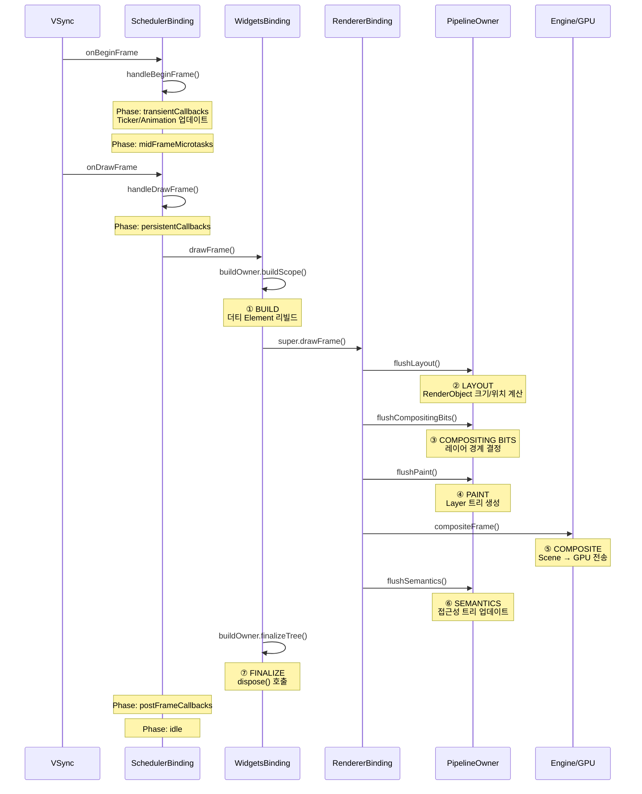

# Ch 09. 렌더링 파이프라인 — 프레임이 화면에 그려지기까지

> 📁 분석 대상: `_sources/flutter/packages/flutter/lib/src/scheduler/binding.dart`, `rendering/binding.dart`, `widgets/binding.dart`
> 📌 버전: Flutter 3.41.1

---

## 📌 이 챕터의 목표

`setState()`을 호출하면 화면에 변화가 나타납니다. 그 사이에 무슨 일이 일어나는 걸까요? 이 챕터에서는:

1. **VSync 신호**에서 **GPU 전송**까지의 전체 프레임 처리 과정 추적
2. **SchedulerPhase** 5단계의 의미와 순서
3. **WidgetsBinding.drawFrame**의 Build → Layout → Paint → Composite 파이프라인 분석
4. `setState` → `markNeedsBuild` → 실제 리빌드까지의 정확한 타이밍

---

## 🔵 기초 — 프레임 처리의 큰 그림

Flutter의 렌더링은 **VSync** 신호에 의해 구동됩니다. VSync가 오면 엔진이 프레임워크에 "지금 프레임을 만들어"라고 요청하며, 프레임워크는 두 단계에 걸쳐 프레임을 처리합니다:

```
VSync 신호 (OS)
    ↓
┌─────────────────────────────────┐
│  handleBeginFrame                │  ← Phase 1: 애니메이션
│  ├─ transientCallbacks (Ticker)  │
│  └─ midFrameMicrotasks           │
├─────────────────────────────────┤
│  handleDrawFrame                 │  ← Phase 2: 렌더링
│  ├─ persistentCallbacks          │
│  │  └─ drawFrame()               │
│  │     ├─ BUILD  (위젯 → 엘리먼트) │
│  │     ├─ LAYOUT (크기/위치 계산)   │
│  │     ├─ PAINT  (Layer 트리 생성)  │
│  │     ├─ COMPOSITE (GPU 전송)     │
│  │     └─ SEMANTICS (접근성)       │
│  └─ postFrameCallbacks           │
└─────────────────────────────────┘
```

---

## 🟡 중급 — SchedulerPhase: 5단계의 상태 관리

### SchedulerPhase enum

```dart
// scheduler/binding.dart L160-199
enum SchedulerPhase {
  /// 프레임 처리 중이 아닌 유휴 상태
  /// Task, Timer, 이벤트 핸들러 등이 실행됨
  idle,
  
  /// scheduleFrameCallback으로 등록한 일시적 콜백 실행 중
  /// AnimationController의 Ticker가 여기서 업데이트됨
  transientCallbacks,
  
  /// transientCallbacks 중 스케줄된 microtask 처리 중
  /// Ticker에서 resolve된 Future의 콜백 등
  midFrameMicrotasks,
  
  /// addPersistentFrameCallback으로 등록한 영구 콜백 실행 중
  /// Build/Layout/Paint 파이프라인이 여기서 동작
  persistentCallbacks,
  
  /// addPostFrameCallback으로 등록한 후처리 콜백 실행 중
  /// 정리 작업, 다음 프레임 스케줄링 등
  postFrameCallbacks,
}
```

### `handleBeginFrame` — 애니메이션 업데이트

```dart
// scheduler/binding.dart L1228-1276
void handleBeginFrame(Duration? rawTimeStamp) {
  _currentFrameTimeStamp = _adjustForEpoch(rawTimeStamp ?? _lastRawTimeStamp);
  _hasScheduledFrame = false;
  
  try {
    // TRANSIENT FRAME CALLBACKS — 애니메이션 처리
    _schedulerPhase = SchedulerPhase.transientCallbacks;
    final Map<int, _FrameCallbackEntry> callbacks = _transientCallbacks;
    _transientCallbacks = <int, _FrameCallbackEntry>{};  // 클리어
    callbacks.forEach((int id, _FrameCallbackEntry callbackEntry) {
      if (!_removedIds.contains(id)) {
        _invokeFrameCallback(callbackEntry.callback, _currentFrameTimeStamp!);
      }
    });
    _removedIds.clear();
  } finally {
    _schedulerPhase = SchedulerPhase.midFrameMicrotasks;
    // ← microtask가 여기서 자동 실행됨
  }
}
```

> 💡 **Transient vs Persistent**: `transientCallbacks`는 한 번 실행되면 자동 제거됩니다 (= Ticker). `persistentCallbacks`는 매 프레임마다 영구적으로 실행됩니다 (= drawFrame).

### `handleDrawFrame` — 렌더링 파이프라인

```dart
// scheduler/binding.dart L1340-1380
void handleDrawFrame() {
  assert(_schedulerPhase == SchedulerPhase.midFrameMicrotasks);
  
  try {
    // PERSISTENT FRAME CALLBACKS — 렌더링 파이프라인
    _schedulerPhase = SchedulerPhase.persistentCallbacks;
    for (final FrameCallback callback in
        List<FrameCallback>.of(_persistentCallbacks)) {
      _invokeFrameCallback(callback, _currentFrameTimeStamp!);
      // ↑ 여기서 drawFrame()이 호출됨
    }
    
    // POST-FRAME CALLBACKS — 후처리
    _schedulerPhase = SchedulerPhase.postFrameCallbacks;
    final List<FrameCallback> localPostFrameCallbacks =
        List<FrameCallback>.of(_postFrameCallbacks);
    _postFrameCallbacks.clear();
    for (final FrameCallback callback in localPostFrameCallbacks) {
      _invokeFrameCallback(callback, _currentFrameTimeStamp!);
    }
  } finally {
    _schedulerPhase = SchedulerPhase.idle;
    _currentFrameTimeStamp = null;
  }
}
```

---

## 🔴 심화 — `drawFrame()`: Build → Layout → Paint → Composite

Flutter의 Binding 계층은 mixin 체인으로 구성됩니다:

```
WidgetsFlutterBinding
    with GestureBinding
    with SchedulerBinding
    with ServicesBinding
    with SemanticsBinding  
    with PaintingBinding
    with RendererBinding
    with WidgetsBinding     ← drawFrame() 오버라이드
```

### `RendererBinding._handlePersistentFrameCallback`

```dart
// rendering/binding.dart L494-497
void _handlePersistentFrameCallback(Duration timeStamp) {
  drawFrame();
  _scheduleMouseTrackerUpdate();
}
```

persistentCallback으로 등록된 이 메서드가 `drawFrame()`을 호출합니다.

### `WidgetsBinding.drawFrame()` — Build 추가

```dart
// widgets/binding.dart L1227-1288
@override
void drawFrame() {
  // ① BUILD — 더티 엘리먼트 리빌드
  if (rootElement != null) {
    buildOwner!.buildScope(rootElement!);
  }
  
  // ② LAYOUT → PAINT → COMPOSITE → SEMANTICS
  super.drawFrame();  // → RendererBinding.drawFrame()
  
  // ③ FINALIZE — 위젯 트리 정리 (dispose 호출)
  buildOwner!.finalizeTree();
}
```

### `RendererBinding.drawFrame()` — Flush 파이프라인

```dart
// rendering/binding.dart L628-639
@protected
void drawFrame() {
  rootPipelineOwner.flushLayout();           // ② Layout
  rootPipelineOwner.flushCompositingBits();   // ③ Compositing bits
  rootPipelineOwner.flushPaint();             // ④ Paint
  
  if (sendFramesToEngine) {
    for (final RenderView renderView in renderViews) {
      renderView.compositeFrame();            // ⑤ GPU 전송
    }
    rootPipelineOwner.flushSemantics();       // ⑥ 접근성
    _firstFrameSent = true;
  }
}
```

### 전체 파이프라인 시퀀스



---

## 🔴 심화 — `BuildOwner.buildScope`: 더티 리스트 처리

### 더티 엘리먼트가 처리되는 과정

```dart
// framework.dart L3056-3111
void buildScope(Element context, [VoidCallback? callback]) {
  final BuildScope buildScope = context.buildScope;
  
  // 더티 리스트가 비어있고 콜백도 없으면 아무것도 안 함
  if (callback == null && buildScope._dirtyElements.isEmpty) {
    return;  // ← 최적화: 아무 변화 없으면 스킵
  }
  
  _scheduledFlushDirtyElements = true;
  buildScope._building = true;
  
  if (callback != null) {
    callback();  // 초기 빌드 등에서 사용
  }
  
  // 더티 엘리먼트들을 depth 순으로 정렬하여 리빌드
  buildScope._flushDirtyElements(debugBuildRoot: context);
  
  buildScope._building = false;
}
```

> 💡 **depth 기준 정렬**: 부모를 먼저 빌드하면 자식의 더티 플래그가 자연스럽게 해소될 수 있습니다. 불필요한 자식 리빌드를 회피하는 핵심 최적화입니다.

---

## 🟡 중급 — `setState`에서 화면 갱신까지의 전체 경로

```
setState(() { counter++ })
    │
    ↓
State.setState(fn)
    │ fn() 실행 → counter 변경
    ↓
element.markNeedsBuild()
    │ _dirty = true
    │ BuildOwner._dirtyElements.add(element)
    ↓
BuildOwner.onBuildScheduled() → WidgetsBinding._handleBuildScheduled()
    │
    ↓
SchedulerBinding.ensureVisualUpdate()
    │ schedulerPhase가 idle이면 scheduleFrame() 호출
    ↓
PlatformDispatcher.scheduleFrame()
    │ 엔진에 "다음 VSync에 프레임 요청" 등록
    ↓
... (다음 VSync 대기) ...
    ↓
handleBeginFrame() → handleDrawFrame() → drawFrame()
    │
    ↓
buildOwner.buildScope(rootElement)
    │ _dirtyElements에서 해당 element를 찾아 rebuild()
    │ → element.performRebuild() → state.build(context) 호출
    ↓
flushLayout() → flushPaint() → compositeFrame()
    │
    ↓
🖥️ 화면 갱신!
```

> ⚠️ `setState()`은 **즉시** 화면을 갱신하지 않습니다. element를 dirty로 표시하고, **다음 VSync**에서 일괄 처리됩니다. 이것이 Flutter가 60fps를 유지할 수 있는 이유입니다.

---

## 🟡 중급 — `scheduleFrame` vs `scheduleWarmUpFrame`

### `scheduleFrame` — 일반 프레임 스케줄링

```dart
// scheduler/binding.dart L948-961
void scheduleFrame() {
  if (_hasScheduledFrame || !framesEnabled) {
    return;  // 이미 스케줄됨 또는 프레임 비활성화
  }
  ensureFrameCallbacksRegistered();
  platformDispatcher.scheduleFrame();  // 엔진에 VSync 요청
  _hasScheduledFrame = true;
}
```

### `scheduleWarmUpFrame` — 즉시 프레임 (앱 시작용)

```dart
// scheduler/binding.dart L1039-1082
void scheduleWarmUpFrame() {
  if (_warmUpFrame || schedulerPhase != SchedulerPhase.idle) {
    return;
  }
  _warmUpFrame = true;
  
  PlatformDispatcher.instance.scheduleWarmUpFrame(
    beginFrame: () {
      handleBeginFrame(null);  // timeStamp null → "warm-up frame"
    },
    drawFrame: () {
      handleDrawFrame();
      resetEpoch();            // 시간 기준점 리셋
      _warmUpFrame = false;
    },
  );
  
  // 이벤트 잠금 — warm-up 프레임 완료까지 터치 입력 차단
  lockEvents(() async {
    await endOfFrame;
  });
}
```

> 💡 `scheduleWarmUpFrame`은 VSync를 기다리지 않고 즉시 프레임을 처리합니다. `runApp()`이 호출된 직후 첫 프레임을 빠르게 렌더링하는 데 사용됩니다. Hot reload에서도 사용됩니다.

---

## 🟡 중급 — `runApp()` 부터 첫 프레임까지

```dart
// widgets/binding.dart L1574-1577
void runApp(Widget app) {
  final WidgetsBinding binding = WidgetsFlutterBinding.ensureInitialized();
  _runWidget(binding.wrapWithDefaultView(app), binding, 'runApp');
}
```

### 초기화 흐름

```
runApp(MyApp())
    │
    ↓
WidgetsFlutterBinding.ensureInitialized()
    │ ├─ SchedulerBinding: onBeginFrame/onDrawFrame 등록
    │ ├─ RendererBinding: persistentCallback으로 drawFrame 등록
    │ └─ WidgetsBinding: BuildOwner 생성
    ↓
wrapWithDefaultView(app)
    │ View(child: MyApp()) 감싸기
    ↓
attachRootWidget(rootWidget)
    │ RootWidget 생성 → rootElement inflate
    ↓
attachToBuildOwner(widget)
    │ widget.attach(buildOwner) → rootElement 생성
    │ ensureVisualUpdate()
    ↓
scheduleWarmUpFrame()
    │ VSync 없이 즉시 프레임 시작
    ↓
handleBeginFrame(null) → handleDrawFrame()
    │ drawFrame() → Build → Layout → Paint → Composite
    ↓
🖥️ 첫 프레임 표시!
```

---

## 🔴 심화 — 파이프라인 각 단계의 최적화

### flushLayout — RelayoutBoundary

`flushLayout()`은 `_nodesNeedingLayout` 리스트의 RenderObject만 처리합니다. `RelayoutBoundary` (Ch08 참고)가 변경 전파를 차단하여 불필요한 연쇄 레이아웃을 방지합니다.

### flushPaint — RepaintBoundary

`flushPaint()`는 `_nodesNeedingPaint` 리스트의 RenderObject만 처리합니다. `RepaintBoundary`가 페인팅 범위를 제한합니다. 별도 Layer를 생성하여 자식의 페인팅이 부모에 영향을 주지 않습니다.

### compositeFrame — Scene 생성

```dart
// RenderView.compositeFrame() 내부 (간략화)
void compositeFrame() {
  final ui.SceneBuilder builder = RendererBinding.instance.createSceneBuilder();
  final ui.Scene scene = layer!.buildScene(builder);
  _view.render(scene);  // → 엔진으로 전송
  scene.dispose();
}
```

Layer 트리를 `Scene`으로 변환하고, `FlutterView.render(scene)`으로 엔진/GPU에 전달합니다.

---

## 🟡 중급 — SchedulerPhase별 안전한 작업

| SchedulerPhase | 허용 | 금지 |
|---|---|---|
| `idle` | `setState`, `scheduleFrame`, 이벤트 처리 | — |
| `transientCallbacks` | 애니메이션 값 업데이트 | `setState` (assert 실패) |
| `midFrameMicrotasks` | microtask 처리 | — |
| `persistentCallbacks` | Build/Layout/Paint 진행 | `setState` (assert 실패) |
| `postFrameCallbacks` | 정리, 다음 프레임 스케줄링, `setState` | — |

> ⚠️ `persistentCallbacks` 도중 `setState`를 호출하면 assert 에러가 발생합니다:
> *"Build scheduled during frame."* 이것은 무한 루프를 방지하기 위한 설계입니다.

```dart
// widgets/binding.dart L1121-1151
void _handleBuildScheduled() {
  assert(() {
    if (debugBuildingDirtyElements) {
      throw FlutterError.fromParts([
        ErrorSummary('Build scheduled during frame.'),
        ErrorHint(
          'This might be because setState() was called from a layout or '
          'paint callback. ...'
        ),
      ]);
    }
    return true;
  }());
  ensureVisualUpdate();
}
```

---

## 🎯 면접 Q&A

### Q1. `setState()`을 호출하면 즉시 화면이 갱신되나요?

**A**: 아닙니다. `setState()`는 element를 dirty로 표시하고 `markNeedsBuild()`를 호출합니다. 이는 `BuildOwner`의 dirty list에 해당 element를 추가하고, `SchedulerBinding.ensureVisualUpdate()`를 통해 다음 VSync에서 프레임을 스케줄합니다.

실제 리빌드는 다음 프레임의 `handleDrawFrame()` → `drawFrame()` → `buildOwner.buildScope()` 단계에서 일괄 처리됩니다. 이 배치 처리 방식 덕분에 같은 프레임 내에서 `setState`가 여러 번 호출되어도 리빌드는 한 번만 발생합니다.

---

### Q2. Flutter의 프레임 처리 파이프라인을 설명해주세요.

**A**: VSync 신호를 받으면 두 단계로 처리됩니다:

1. **handleBeginFrame**: `transientCallbacks`를 실행합니다. AnimationController의 Ticker가 여기서 새 값으로 업데이트됩니다.
2. **handleDrawFrame**: `persistentCallbacks`를 실행하며, 핵심은 `drawFrame()`입니다:
   - **Build**: `buildOwner.buildScope()`로 dirty element들을 depth 순서로 리빌드
   - **Layout**: `flushLayout()`으로 dirty RenderObject의 크기/위치 계산
   - **Compositing bits**: `flushCompositingBits()`로 레이어 경계 결정
   - **Paint**: `flushPaint()`로 Layer 트리 생성
   - **Composite**: `compositeFrame()`으로 Scene을 GPU에 전송
   - **Semantics**: `flushSemantics()`로 접근성 트리 갱신
   - **Finalize**: `finalizeTree()`로 제거된 element의 `dispose()` 호출
3. 마지막으로 `postFrameCallbacks`를 실행하고 idle로 돌아갑니다.

---

### Q3. `transientCallbacks`와 `persistentCallbacks`의 차이는?

**A**: `transientCallbacks`는 `scheduleFrameCallback()`으로 등록되며, 한 번 실행되면 자동으로 제거됩니다. AnimationController의 Ticker가 대표적입니다. 매 프레임 `Ticker.scheduleTick()`이 새로운 콜백을 등록합니다.

`persistentCallbacks`는 `addPersistentFrameCallback()`으로 등록되며, 앱 수명 동안 매 프레임 호출됩니다. 해제할 수 없습니다. `RendererBinding`이 `drawFrame()`을 persistent callback으로 등록하여 매 프레임 Build/Layout/Paint가 실행될 수 있도록 합니다.

---

### Q4. `postFrameCallback`은 언제 사용하나요?

**A**: `addPostFrameCallback()`으로 등록하며, 현재 프레임의 렌더링 파이프라인이 완료된 직후에 한 번 실행됩니다. 주요 사용 사례:

1. **레이아웃 완료 후 크기 확인**: `WidgetsBinding.instance.addPostFrameCallback((_) { final size = context.size; })`
2. **빌드 완료 후 스크롤 위치 조정**
3. **SnackBar나 Dialog 표시** (빌드 중에는 `setState`를 호출할 수 없으므로)

`postFrameCallback`은 `SchedulerPhase.postFrameCallbacks` 단계에서 실행되므로, 이 안에서 `setState`를 호출하면 다음 프레임이 스케줄됩니다 (즉시 실행이 아님).

---

### Q5. `scheduleWarmUpFrame`은 왜 존재하나요?

**A**: 일반 `scheduleFrame()`은 엔진에 VSync를 요청하고, OS가 VSync 신호를 보낼 때까지 기다립니다. 이는 몇 ms의 지연이 생길 수 있습니다. `scheduleWarmUpFrame()`은 VSync를 기다리지 않고 즉시 `handleBeginFrame()` + `handleDrawFrame()`을 실행합니다.

`runApp()` 직후 첫 프레임을 가능한 빨리 렌더링하고, Hot reload 후 변경 사항을 즉시 반영하는 데 사용됩니다. 소스코드를 보면 warm-up 프레임 동안에는 `lockEvents()`로 터치 입력을 차단하여, 불완전한 상태에서 사용자 상호작용을 방지합니다.
