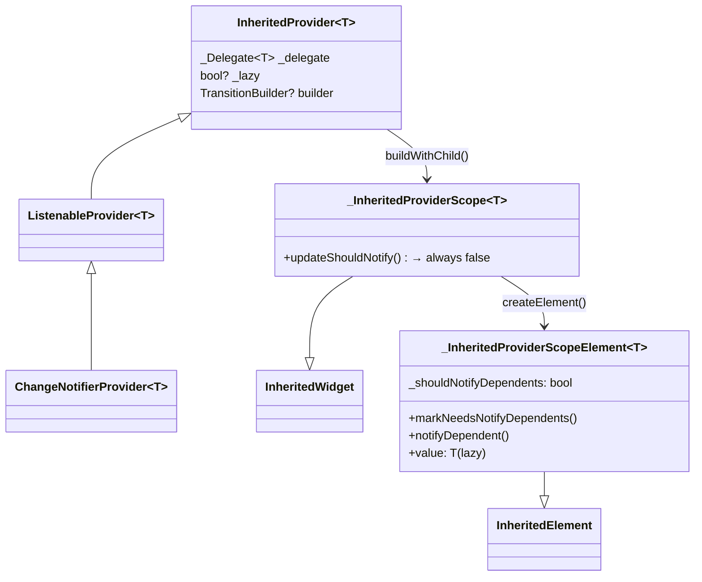

# Ch 10. 상태 관리, 왜 어려운가

> 📁 분석 대상: `_sources/flutter/packages/flutter/lib/src/widgets/framework.dart`, `_sources/provider/packages/provider/lib/src/`
> 📌 버전: Flutter 3.38.0 / Provider 6.x

---

## 10.1 "상태"란 무엇인가 — 정의부터 정확히

### 상태의 분류

```
┌─────────────────────────────────────────────────┐
│                    App State                    │
│  ┌────────────────────┬────────────────────────┐ │
│  │   Ephemeral State  │   Application State    │ │
│  │  (UI/Local State)  │   (Shared/Global)      │ │
│  ├────────────────────┼────────────────────────┤ │
│  │ TextField 입력값   │ 로그인 사용자 정보      │ │
│  │ 현재 선택된 탭     │ 장바구니 아이템 목록     │ │
│  │ 애니메이션 진행률  │ API 응답 데이터         │ │
│  │ 폼 유효성 상태     │ 앱 설정 (테마, 언어)    │ │
│  └────────────────────┴────────────────────────┘ │
└─────────────────────────────────────────────────┘
```

**Ephemeral State**는 하나의 위젯 내부에서만 쓰인다. `setState()`로 충분하다.

**Application State**는 여러 위젯이 공유해야 한다. 여기서 문제가 시작된다.

---

## 10.2 setState()의 한계 — 소스코드로 증명

### setState()의 실제 동작

Ch06에서 분석했듯, `setState()`는 내부적으로 단 한 줄이다:

```dart
// framework.dart — State.setState()
@protected
void setState(VoidCallback fn) {
  // ... assertions 생략 ...
  final Object? result = fn() as dynamic;
  _element!.markNeedsBuild();  // ← 핵심: Element를 dirty로 표시
}
```

`markNeedsBuild()`는 **해당 Element만** dirty로 표시한다:

```dart
// framework.dart — Element.markNeedsBuild()
void markNeedsBuild() {
  if (_lifecycleState != _ElementLifecycle.active) return;
  if (dirty) return;
  _dirty = true;
  owner!.scheduleBuildFor(this);  // BuildOwner의 dirty list에 추가
}
```

### 문제 1: 리빌드 범위가 너무 넓다

```dart
// ❌ 문제 시나리오: 거대한 StatefulWidget
class ProductPage extends StatefulWidget { ... }

class _ProductPageState extends State<ProductPage> {
  int _quantity = 1;
  
  @override
  Widget build(BuildContext context) {
    return Column(
      children: [
        ProductHeader(),        // 변경 없음 — 그래도 rebuild
        ProductImage(),         // 변경 없음 — 그래도 rebuild  
        ProductDescription(),   // 변경 없음 — 그래도 rebuild
        QuantitySelector(       // _quantity만 변경됨
          quantity: _quantity,
          onChanged: (v) => setState(() => _quantity = v),
        ),
        PriceCalculator(quantity: _quantity),
        RelatedProducts(),      // 변경 없음 — 그래도 rebuild
      ],
    );
  }
}
```

`setState()`가 호출되면 `_ProductPageState`의 **build() 전체가 다시 실행**된다. Flutter의 diffing 알고리즘(canUpdate)이 불필요한 Element 재생성은 막아주지만, **build() 함수 자체의 실행**은 피할 수 없다.

> 💡 **핵심 통찰**: `setState()`의 리빌드 단위는 **StatefulWidget의 build() 전체**다. 부분 리빌드가 불가능하다.

### 문제 2: Prop Drilling — 데이터 전달의 지옥

```dart
// 데이터가 3단계만 거쳐도 이렇게 된다
class App extends StatefulWidget { ... }
class _AppState extends State<App> {
  ThemeMode _themeMode = ThemeMode.light;
  User? _currentUser;
  
  @override
  Widget build(BuildContext context) {
    return MaterialApp(
      home: HomePage(
        themeMode: _themeMode,           // ← 전달 시작
        currentUser: _currentUser,
        onThemeChanged: (mode) => setState(() => _themeMode = mode),
      ),
    );
  }
}

class HomePage extends StatelessWidget {
  final ThemeMode themeMode;    // ← 중간 경유: 여기선 안 쓰는데 받아야 함
  final User? currentUser;
  final ValueChanged<ThemeMode> onThemeChanged;
  
  @override
  Widget build(BuildContext context) {
    return Scaffold(
      body: ProfileSection(
        themeMode: themeMode,       // ← 또 전달
        currentUser: currentUser,
        onThemeChanged: onThemeChanged,
      ),
    );
  }
}

class ProfileSection extends StatelessWidget {
  final ThemeMode themeMode;    // ← 또 중간 경유
  final User? currentUser;
  final ValueChanged<ThemeMode> onThemeChanged;
  
  @override
  Widget build(BuildContext context) {
    return Column(
      children: [
        UserAvatar(user: currentUser),
        ThemeToggle(
          themeMode: themeMode,         // ← 드디어 실제 사용
          onChanged: onThemeChanged,
        ),
      ],
    );
  }
}
```

**Prop Drilling의 문제점:**
1. **중간 위젯의 오염** — `HomePage`는 `themeMode`를 사용하지 않지만 생성자에서 받아야 한다
2. **리팩토링 비용** — 새 데이터를 추가하면 경로상 모든 위젯 수정 필요
3. **테스트 복잡도** — 중간 위젯 테스트에도 불필요한 데이터를 넘겨야 한다

### 문제 3: 상태 동기화

```dart
// 장바구니 수량이 여러 곳에서 보여야 하는 경우
class CartPage extends StatefulWidget { ... }
class _CartPageState extends State<CartPage> {
  int _itemCount = 0;  // ← 이 값을 아래 AppBar 배지에도 보여야 한다면?
  //   AppBar는 완전히 다른 위젯 트리에 있다!
}
```

`setState()`는 **해당 위젯의 하위 트리만** 갱신한다. 완전히 다른 트리 분기에 있는 위젯을 갱신하려면, 공통 조상까지 상태를 끌어올려야(**Lifting State Up**) 한다.

---

## 10.3 InheritedWidget — Flutter의 1차 해결책

### InheritedWidget의 원리 (Ch07 복습)

Ch07에서 분석했듯, `InheritedWidget`은 O(1) 조회를 제공한다:

```dart
// Element의 _inheritedElements: PersistentHashMap<Type, InheritedElement>
// → 트리 깊이와 무관하게 O(1)으로 조회 가능
T dependOnInheritedWidgetOfExactType<T extends InheritedWidget>() {
  final ancestor = _inheritedElements[T];
  if (ancestor != null) {
    return dependOnInheritedElement(ancestor) as T;
  }
  return null;
}
```

### 그런데 왜 직접 안 쓰나?

```dart
// InheritedWidget을 직접 쓰면 이렇게 된다 — 보일러플레이트 지옥

// 1. 데이터를 정의하고
class CartData {
  final List<CartItem> items;
  final void Function(CartItem) addItem;
  final void Function(CartItem) removeItem;
  
  CartData({required this.items, required this.addItem, required this.removeItem});
}

// 2. InheritedWidget을 만들고
class CartInherited extends InheritedWidget {
  final CartData data;
  
  const CartInherited({
    required this.data,
    required Widget child,
  }) : super(child: child);
  
  static CartData of(BuildContext context) {
    return context.dependOnInheritedWidgetOfExactType<CartInherited>()!.data;
  }
  
  @override
  bool updateShouldNotify(CartInherited oldWidget) {
    return data.items != oldWidget.data.items;  // ← 직접 비교 로직 작성
  }
}

// 3. 상태를 관리할 StatefulWidget도 만들어야 한다!
class CartProvider extends StatefulWidget {
  final Widget child;
  const CartProvider({required this.child});
  
  @override
  State<CartProvider> createState() => _CartProviderState();
}

class _CartProviderState extends State<CartProvider> {
  final List<CartItem> _items = [];
  
  void _addItem(CartItem item) {
    setState(() => _items.add(item));
  }
  
  void _removeItem(CartItem item) {
    setState(() => _items.remove(item));
  }
  
  @override
  Widget build(BuildContext context) {
    return CartInherited(
      data: CartData(
        items: List.unmodifiable(_items),
        addItem: _addItem,
        removeItem: _removeItem,
      ),
      child: widget.child,
    );
  }
}
```

**하나의 공유 상태를 위해 3개의 클래스가 필요하다.** 이런 상태가 10개면? 30개의 클래스다.

> 💡 **핵심**: InheritedWidget은 **데이터 전달 메커니즘**이지 **상태 관리 솔루션**이 아니다. 상태의 생성·변경·폐기를 직접 관리해야 한다.

---

## 10.4 Provider — InheritedWidget의 래퍼

### Provider의 설계 철학

Provider의 핵심 아이디어는 간단하다:

> "InheritedWidget의 보일러플레이트를 자동화하자"

위의 CartProvider 예시를 Provider로 다시 쓰면:

```dart
// 1. ChangeNotifier만 정의
class CartNotifier extends ChangeNotifier {
  final List<CartItem> _items = [];
  List<CartItem> get items => List.unmodifiable(_items);
  
  void addItem(CartItem item) {
    _items.add(item);
    notifyListeners();  // ← 이것만 호출하면 된다
  }
  
  void removeItem(CartItem item) {
    _items.remove(item);
    notifyListeners();
  }
}

// 2. 위젯 트리에 제공
ChangeNotifierProvider(
  create: (_) => CartNotifier(),
  child: MyApp(),
)

// 3. 어디서든 사용
// 읽기 + 구독 (리빌드)
final cart = context.watch<CartNotifier>();

// 읽기만 (리빌드 없음)
final cart = context.read<CartNotifier>();

// 선택적 구독
final itemCount = context.select((CartNotifier c) => c.items.length);
```

**3개 클래스 → 1개 클래스.** 나머지는 Provider가 내부적으로 만들어준다.

---

## 10.5 Provider는 내부에서 무엇을 하는가

> 📁 분석 대상: `_sources/provider/packages/provider/lib/src/inherited_provider.dart`, `provider.dart`, `listenable_provider.dart`
> 📌 버전: Provider 6.x (Remi Rousselet)

### 계층 구조



### 핵심 발견 1: `updateShouldNotify`는 항상 `false`

```dart
// inherited_provider.dart L340-364
class _InheritedProviderScope<T> extends InheritedWidget {
  @override
  bool updateShouldNotify(InheritedWidget oldWidget) {
    return false;  // ← 항상 false!
  }
}
```

**왜?** Provider는 `updateShouldNotify` (Pull 모델)을 쓰지 않는다. 대신 `markNeedsNotifyDependents()` (Push 모델)를 사용한다:

```dart
// inherited_provider.dart L585-592
@override
void markNeedsNotifyDependents() {
  if (!_isNotifyDependentsEnabled) return;
  
  markNeedsBuild();                  // Element를 dirty로 표시
  _shouldNotifyDependents = true;    // 플래그 설정
}

// inherited_provider.dart L555-568
@override
Widget build() {
  if (widget.owner._lazy == false) {
    value;  // lazy가 아니면 강제로 값 생성
  }
  _delegateState.build(isBuildFromExternalSources: _isBuildFromExternalSources);
  _isBuildFromExternalSources = false;
  if (_shouldNotifyDependents) {          // ← 플래그 확인
    _shouldNotifyDependents = false;
    notifyClients(widget);                // ← 의존 위젯들에게 알림
  }
  return super.build();
}
```

### 핵심 발견 2: ChangeNotifier → InheritedWidget 연결 고리

```dart
// listenable_provider.dart L57-63
static VoidCallback _startListening(
  InheritedContext<Listenable?> e,
  Listenable? value,
) {
  value?.addListener(e.markNeedsNotifyDependents);   // ← 핵심!
  return () => value?.removeListener(e.markNeedsNotifyDependents);
}
```

**이 한 줄이 Provider의 핵심이다:**

```
notifyListeners()                          // ChangeNotifier
    ↓ Listenable.addListener()에 의해
markNeedsNotifyDependents()                // _InheritedProviderScopeElement  
    ↓ markNeedsBuild() + _shouldNotifyDependents = true
scheduleBuildFor(this)                     // BuildOwner
    ↓ 다음 프레임
build()                                   // _InheritedProviderScopeElement
    ↓ _shouldNotifyDependents == true
notifyClients(widget)                     // InheritedElement
    ↓ 각 dependent에 대해
notifyDependent(oldWidget, dependent)     // selector 체크
    ↓ shouldNotify == true인 경우
dependent.didChangeDependencies()         // 구독 위젯 rebuild
```

### 핵심 발견 3: `Provider.of`의 listen 분기

```dart
// provider.dart L306-347
static T of<T>(BuildContext context, {bool listen = true}) {
  final inheritedElement = _inheritedElementOf<T>(context);
  
  if (listen) {
    // 의존성 등록 → 값 변경 시 이 context의 위젯이 rebuild됨
    context.dependOnInheritedWidgetOfExactType<_InheritedProviderScope<T?>>();
  }
  
  // listen이 false면 의존성 등록 없이 값만 읽음
  final value = inheritedElement?.value;
  return value as T;
}
```

```dart
// _inheritedElementOf — listen과 무관하게 Element 찾기
static _InheritedProviderScopeElement<T?>? _inheritedElementOf<T>(
  BuildContext context,
) {
  // getElementForInheritedWidgetOfExactType은 의존성을 등록하지 않는다!
  final inheritedElement = context.getElementForInheritedWidgetOfExactType<
      _InheritedProviderScope<T?>>() as _InheritedProviderScopeElement<T?>?;
  
  if (inheritedElement == null && null is! T) {
    throw ProviderNotFoundException(T, context.widget.runtimeType);
  }
  return inheritedElement;
}
```

**listen 파라미터는 결국 `dependOnInheritedWidgetOfExactType` (의존성 등록) vs `getElementForInheritedWidgetOfExactType` (의존성 없이 조회)의 차이다.** 이것이 바로 Ch07에서 분석한 InheritedWidget의 두 가지 조회 모드다.

| Extension | 내부 호출 | 용도 |
|-----------|----------|------|
| `context.watch<T>()` | `Provider.of<T>(context, listen: true)` | build() 안에서 구독 |
| `context.read<T>()` | `Provider.of<T>(context, listen: false)` | 이벤트 핸들러에서 읽기 |
| `context.select<T, R>()` | `dependOnInheritedElement` + aspect | 부분 구독 |

### 핵심 발견 4: select의 세밀한 리빌드 — aspect 기반

```dart
// inherited_provider.dart L250-313
R select<T, R>(R Function(T value) selector) {
  final inheritedElement = Provider._inheritedElementOf<T>(this);
  final value = inheritedElement?.value;
  final selected = selector(value as T);
  
  if (inheritedElement != null) {
    dependOnInheritedElement(
      inheritedElement,
      aspect: (T? newValue) {
        // 새 값으로 selector를 실행하고, 이전 결과와 비교
        return !const DeepCollectionEquality()
            .equals(selector(newValue as T), selected);
      },
    );
  }
  return selected;
}
```

```dart
// inherited_provider.dart L474-516 — notifyDependent
@override
void notifyDependent(InheritedWidget oldWidget, Element dependent) {
  final dependencies = getDependencies(dependent);
  
  var shouldNotify = false;
  if (dependencies is _Dependency<T>) {
    if (dependent.dirty) return;  // 이미 dirty면 selector 실행 불필요
    
    for (final updateShouldNotify in dependencies.selectors) {
      shouldNotify = updateShouldNotify(value);  // aspect 클로저 실행
      if (shouldNotify) break;
    }
  } else {
    shouldNotify = true;  // watch()로 전체 구독한 경우
  }
  
  if (shouldNotify) {
    dependent.didChangeDependencies();  // rebuild 예약
  }
}
```

**`select()`의 핵심 메커니즘:**
1. selector 함수의 결과를 **클로저에 캡처** (selected)
2. 값이 변경될 때 selector를 **다시 실행**
3. 이전 결과와 **DeepCollectionEquality로 비교**
4. 결과가 다를 때만 해당 위젯 **rebuild**

---

## 10.6 Lazy Initialization — 값은 언제 생성되는가

```dart
// inherited_provider.dart L711-796 — _CreateInheritedProviderState
class _CreateInheritedProviderState<T>
    extends _DelegateState<T, _CreateInheritedProvider<T>> {
  bool _didInitValue = false;
  T? _value;
  
  @override
  T get value {
    if (!_didInitValue) {
      _didInitValue = true;
      if (delegate.create != null) {
        _value = delegate.create!(element!);  // ← 최초 접근 시 create 실행
      }
      if (delegate.update != null) {
        _value = delegate.update!(element!, _value);
      }
    }
    _removeListener ??= delegate.startListening?.call(element!, _value as T);
    return _value as T;
  }
}
```

**Provider는 기본적으로 Lazy다.** `Provider.of`나 `context.watch/read`로 **처음 접근할 때** create 콜백이 실행된다. `lazy: false`를 명시하면 Element의 build()에서 강제 생성:

```dart
// inherited_provider.dart L555-557
Widget build() {
  if (widget.owner._lazy == false) {
    value;  // getter 호출 → _didInitValue == false이면 초기화
  }
  ...
}
```

---

## 10.7 상태 관리 방법론 비교

| 접근 방식 | 보일러플레이트 | 리빌드 범위 | 상태 공유 | 적합 규모 |
|-----------|:---:|:---:|:---:|:---:|
| **setState** | 최소 | build() 전체 | ❌ 불가 | 단일 위젯 |
| **InheritedWidget** | 매우 많음 | 의존 위젯만 | ✅ | 프로토타입 |
| **Provider** | 적음 | watch/select | ✅ | 중소 규모 |
| **Riverpod** | 적음 | ref.watch | ✅ + 컴파일 안전 | 모든 규모 |
| **Bloc/Cubit** | 중간 | BlocBuilder | ✅ | 대규모 |

---

## 10.8 언제 무엇을 쓸 것인가 — 실전 가이드

### setState()가 적합한 경우
```dart
// ✅ 적합: UI-only 상태, 해당 위젯에서만 사용
class _ExpandableTileState extends State<ExpandableTile> {
  bool _isExpanded = false;  // ← 다른 위젯과 공유할 필요 없음
  
  @override
  Widget build(BuildContext context) {
    return GestureDetector(
      onTap: () => setState(() => _isExpanded = !_isExpanded),
      child: AnimatedContainer(/* ... */),
    );
  }
}
```

### Provider/Riverpod가 필요한 경우
```dart
// ✅ 적합: 여러 위젯이 동일 상태를 구독
// - 로그인 사용자 정보
// - 장바구니
// - 테마 설정
// - API에서 가져온 데이터
```

### 판단 기준 플로우차트

```
상태가 하나의 위젯에서만 쓰이는가?
├── Yes → setState()
└── No → 부모-자식 1단계만 전달하는가?
    ├── Yes → 생성자 파라미터 (prop)
    └── No → 상태 관리 도구 필요
        ├── 팀 규모 작고 빠른 개발 → Provider
        ├── 테스트 중요 + 컴파일 안전 → Riverpod
        └── 복잡한 이벤트 흐름 → Bloc
```

---

## 10.9 면접 Q&A

### Q1. setState()의 내부 동작을 설명하고, 한계가 무엇인지 말해주세요.

**A:** `setState()`는 전달받은 콜백을 실행한 뒤 `_element!.markNeedsBuild()`를 호출한다. 이는 해당 Element를 BuildOwner의 dirty list에 추가하고, 다음 프레임에서 build()가 다시 실행된다.

한계는 세 가지이다:
1. **리빌드 범위** — build() 전체가 다시 실행되므로, StatefulWidget이 크면 불필요한 연산 발생
2. **상태 공유 불가** — setState()는 해당 위젯의 하위 트리만 갱신하므로, 다른 트리 분기의 위젯을 갱신할 수 없음
3. **Prop Drilling** — 공유 상태를 위해 공통 조상까지 끌어올리면 중간 위젯들이 불필요한 파라미터를 전달해야 함

### Q2. Provider가 내부적으로 InheritedWidget을 어떻게 활용하는지 설명해주세요.

**A:** Provider의 핵심 클래스인 `InheritedProvider`는 `buildWithChild()`에서 `_InheritedProviderScope`라는 InheritedWidget을 생성한다. 이 위젯의 `updateShouldNotify`는 항상 false를 반환한다.

대신 Push 모델을 사용한다: `ChangeNotifierProvider`의 경우 `ListenableProvider._startListening`에서 `value.addListener(element.markNeedsNotifyDependents)`를 호출하여, ChangeNotifier의 `notifyListeners()`가 호출되면 `markNeedsNotifyDependents()`가 실행된다. 이 메서드는 `markNeedsBuild()`로 Element를 dirty로 표시하고 `_shouldNotifyDependents` 플래그를 설정한다. 다음 프레임의 build()에서 이 플래그를 확인하고 `notifyClients()`를 호출하여 의존 위젯들을 갱신한다.

### Q3. `context.watch`와 `context.read`의 차이를 내부 구현 관점에서 설명해주세요.

**A:** 둘 다 `Provider.of<T>(context)`를 호출하지만, `listen` 파라미터가 다릅니다.

- `watch<T>()` → `Provider.of<T>(context, listen: true)` → `context.dependOnInheritedWidgetOfExactType()`를 호출하여 **의존성을 등록**한다. 값이 변경되면 이 context의 위젯이 rebuild된다.
- `read<T>()` → `Provider.of<T>(context, listen: false)` → 의존성 등록 없이 `getElementForInheritedWidgetOfExactType()`으로 Element를 찾고 값만 읽는다.

`watch`를 이벤트 핸들러(onPressed 등)에서 사용하면 불필요한 리빌드가 발생하므로, 이벤트 핸들러에서는 반드시 `read`를 사용해야 한다.

### Q4. `context.select()`는 어떻게 부분적인 리빌드를 구현하나요?

**A:** `select<T, R>(selector)`는 현재 값으로 selector를 실행하여 결과를 캡처한 후, `dependOnInheritedElement()`에 **aspect 클로저**를 전달한다. 이 클로저는 `(T newValue) => !DeepCollectionEquality().equals(selector(newValue), capturedResult)`이다.

`_InheritedProviderScopeElement.notifyDependent()`에서 각 dependent의 selectors를 순회하며, 이 aspect 클로저를 실행한다. selector의 반환값이 이전과 같으면 해당 위젯의 `didChangeDependencies()`를 호출하지 않는다. 이를 통해 ChangeNotifier의 40개 필드 중 하나만 변경되었을 때, 해당 필드를 select하는 위젯만 rebuild된다.

### Q5. Provider의 Lazy Initialization은 어떻게 동작하나요?

**A:** `_CreateInheritedProviderState.value` getter에서 `_didInitValue` 플래그를 확인한다. 최초 접근 시에만 `delegate.create!(element!)`를 실행하여 값을 생성한다. 이후에는 캐시된 `_value`를 반환한다.

이는 Provider가 위젯 트리에 삽입되는 시점이 아닌, **실제로 `Provider.of`나 `context.watch/read`로 접근하는 시점**에 create가 실행된다는 것을 의미한다. 이를 통해 화면에 표시되지 않는 Provider의 값 생성 비용을 절약한다. `lazy: false`를 명시하면 Element의 build() 시점에 강제로 getter를 호출하여 즉시 생성한다.
